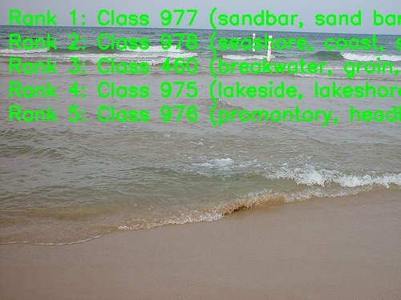

[English](./README.md) | 简体中文

# HGNetV2 模型说明

本目录给出 HGNetV2 sample 在 Model Zoo 中的完整使用说明，包括算法概览、模型转换、运行时推理、模型文件管理和评测说明。

## 算法介绍

HGNetV2 是一款专为在 NVIDIA GPU 上实现精度与延迟的最佳平衡而设计的下一代卷积神经网络（CNN）骨干网络。基于原始的 HGNet，HGNetV2 在保持高精度的同时实现了快速的推理速度，并在图像分类、目标检测和分割等任务中表现出色，因此成为基于 GPU 的计算机视觉应用的理想选择。

- **详细介绍**: [docs/zh_CN/models/ImageNet1k/PP-HGNetV2.md](https://github.com/PaddlePaddle/PaddleClas/blob/develop/docs/zh_CN/models/ImageNet1k/PP-HGNetV2.md)

### 算法功能

HGNetV2 支持以下任务：

- ImageNet 1000 类图像分类

### 算法特点

- **聚合多种感受野**：HG-Block 结合了多尺度特征，能够捕获从浅层到深层、不同大小的特征信息，对小物体的检测和识别友好。
- **更优的 Stem 模块**：改进了网络的初始预处理层，堆叠了更多的 \(2 \times 2\) 卷积核以学习丰富的局部特征，同时使用更小的通道数，提升了大分辨率任务的性能。
- **可学习的下采样（LDS）**：融合了能够自适应调整的下采样层，在减少计算冗余的同时保留了更多有用的空间细节.

## 目录结构

```text
.
|-- conversion
|   |-- HGNetV2_medium.yaml
|   |-- HGNetV2_small.yaml
|   |-- README.md
|   `-- README_cn.md
|-- evaluator
|   |-- README.md
|   `-- README_cn.md
|-- model
|   |-- download.sh
|   |-- README.md
|   `-- README_cn.md
|-- runtime
|   `-- python
|       |-- main.py
|       |-- HGNetV2.py
|       |-- README.md
|       |-- README_cn.md
|       `-- run.sh
|-- test_data
|   |-- sandbar.JPEG
|   |-- classname.txt
|   `-- result.png
|-- README.md
`-- README_cn.md
```

## 快速体验

### Python

- Python 详细说明请参考 [runtime/python/README_cn.md](./runtime/python/README_cn.md)。
- 快速体验命令：

```bash
cd runtime/python
bash run.sh
```

## 模型转换

- 预编译 `.bin` 模型通过 [model](./model/README_cn.md) 目录提供。
- 转换说明请参考 [conversion/README_cn.md](./conversion/README_cn.md)。

## 模型推理

本 sample 当前维护的推理路径为 Python。

- Python 推理说明: [runtime/python/README_cn.md](./runtime/python/README_cn.md)

## 模型评估

评测说明、性能数据和验证结果请参考 [evaluator/README_cn.md](./evaluator/README_cn.md)。

## 性能数据

下表为 `RDK X5` 上发布的 HGNetV2 性能数据。

| 模型 | 输入尺寸 | 参数量 (M) | 浮点 Top-1 | 量化 Top-1 | 单线程时延 (ms) | 多线程时延 (ms) | FPS |
| --- | --- | --- | --- | --- | --- | --- | --- |
| HGNetv2_b0 | 224x224 | 6.0 | 77.342 | 72.17 | 1.96 | 3.29 | 902.09 |
| HGNetv2_b1 | 224x224 | 6.34 | 78.872 | 73.47 | 2.41 | 3.60 | 760.13 |
| HGNetv2_b2 | 224x224 | 11.2 | 81.578 | 73.57 | 1.87 | 5.30 | 743.56 |
| HGNetv2_b3 | 224x224 | 16.3 | 82.916 | 71.25 | 1.71 | 4.47 | 881.19 |
| HGNetv2_b4 | 224x224 | 19.8 | 83.694 | 72.25 | 1.55 | 4.08 | 964.69 |



## License

遵循 Model Zoo 顶层 License。
