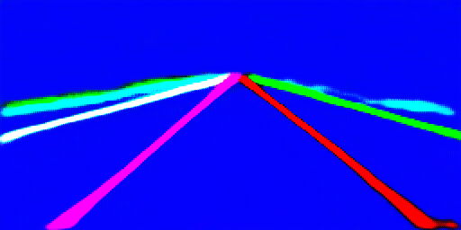
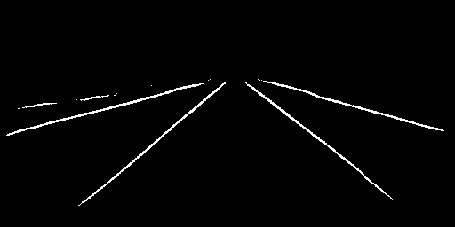

# LaneNet 模型说明

本目录描述 LaneNet 在本 Model Zoo 中的完整使用流程，包括：算法介绍、模型转换、运行时推理（Python）、前后处理接口说明，以及模型评估步骤。

> ⚠️ **平台说明**：本模型仅支持 **RDK S100** 平台。若使用 RDK S600，请参阅[平台兼容性说明](#平台兼容性)。

---

## 算法介绍（Algorithm Overview）

LaneNet 是一种基于实例分割的车道线检测算法，采用端到端的多任务网络架构，具有以下特性：

- **双分支输出**：同时输出实例分割嵌入（instance embedding）和二值分割掩码（binary segmentation），能够有效区分多条车道线
- **端到端训练**：无需手动设计后处理流程，直接从图像预测车道线实例
- **轻量化设计**：适合嵌入式平台部署，在 BPU 上高效运行
- **适合端侧部署**：已针对 RDK S100 平台完成量化与编译适配

### 算法功能

LaneNet 能完成以下任务：

- 多车道线实例分割（输出带颜色编码的实例掩码）
- 二值车道线分割（输出前景/背景二值掩码）

### 原始资料

- LaneNet 论文：[Towards End-to-End Lane Detection: an Instance Segmentation Approach](https://arxiv.org/abs/1802.05591)
- 参考实现：[MaybeShewill-CV/lanenet-lane-detection](https://github.com/MaybeShewill-CV/lanenet-lane-detection)

---

## 平台兼容性

| 平台       | 是否支持 | 说明                                         |
|-----------|---------|----------------------------------------------|
| RDK S100  | ✅ 支持  | 模型已针对 S100 BPU 编译，推荐使用              |
| RDK S600  | ❌ 不支持 | 当前无 S600 编译版本，不可直接使用本目录下的模型 |

> 若需在 RDK S600 上运行车道线检测，需重新使用 S600 工具链对原始 ONNX/浮点模型进行量化编译。

---

## 目录结构（Directory Structure）

本目录包含：

```bash
.
|-- conversion                              # 模型转换流程
|   `-- README.md                           # 模型转换使用说明
|-- evaluator                               # 模型评估相关内容
|   `-- README.md                           # 模型评估说明
|-- model                                   # 模型文件及下载脚本
|   |-- download_model.sh                   # HBM 模型下载脚本（仅 S100）
|   `-- README.md                           # 模型下载说明
|-- runtime                                 # 模型推理示例
|   |-- cpp                                 # C++ 推理工程
|   |   |-- inc                             # C++ 头文件
|   |   |   `-- lanenet.hpp                 # LaneNet 模型封装接口
|   |   |-- src                             # C++ 源码
|   |   |   |-- main.cpp                    # 推理入口程序
|   |   |   `-- lanenet.cpp                 # LaneNet 推理实现
|   |   |-- CMakeLists.txt                  # CMake 构建配置
|   |   |-- README.md                       # C++ 推理示例使用说明
|   |   `-- run.sh                          # C++ 示例运行脚本
|   `-- python                              # Python 推理示例
|       |-- README.md                       # Python 推理示例使用说明
|       |-- main.py                         # Python 推理入口脚本
|       |-- run.sh                          # Python 示例运行脚本
|       `-- lanenet.py                      # LaneNet 推理与后处理实现
|-- test_data                               # 测试数据与推理结果
|   `-- lane.jpg                            # 示例测试图片（路面场景）
`-- README.md                               # LaneNet 示例整体说明与快速指引
```

---

## 快速体验（QuickStart）

为了便于用户快速上手体验，每个模型均提供了 `run.sh` 脚本，用户运行此脚本即可一键运行相应模型，此脚本主要进行如下操作：
- 检测系统环境是否满足要求，若不满足则自动安装相应包；
- 检测推理所需的 hbm 模型文件是否存在，不存在则自动下载；
- 创建 build 目录，编译 C++ 项目（仅 C++ 项目）；
- 运行编译好的可执行文件或相应的 Python 脚本；

### C++

- 进入 `runtime` 目录下的 `cpp` 目录，运行 `run.sh` 脚本，即可快速体验

    ```bash
    cd runtime/cpp/
    ./run.sh
    ```

- 若想了解 C++ 代码的详细使用方法，或 step by step 运行模型请参考 `runtime/cpp/README.md`；

### Python

- 进入 `runtime` 目录下的 `python` 目录，运行 `run.sh` 脚本，即可快速体验

    ```bash
    cd runtime/python/
    ./run.sh
    ```

- 若想了解 Python 代码的详细使用方法，或 step by step 运行模型请参考 `runtime/python/README.md`；

---

## 模型转换（Model Conversion）

- ModelZoo 已提供适配完成的 HBM 模型文件（仅 S100），用户可直接运行 `model` 目录下的 `download_model.sh` 脚本下载并使用，如不关心模型转换流程，**可跳过本小节**。

- 如需自定义模型转换参数，或了解完整的模型转换流程，请参考 `conversion/README.md`。

---

## 模型推理（Runtime）

LaneNet 模型推理示例同时提供 C++ 和 Python 两种实现方式，分别面向不同的使用场景与开发需求。两种版本在模型能力与推理结果上保持一致，但在使用方式和工程形态上有所区别。

### C++ 版本

- 提供完整的工程化示例，适合集成到实际应用中；
- 包含模型封装类、参数解析、推理流程及构建方式说明；
- 具体编译、运行方式及接口说明请参考 `runtime/cpp/README.md`；

### Python 版本

- 以脚本形式提供，适合快速验证模型效果与算法流程；
- 示例中展示了模型加载、推理执行、后处理以及结果保存的完整过程；
- 具体使用方法、参数说明及接口说明请参考 `runtime/python/README.md`；

---

## 模型评估（Evaluator）

`evaluator/` 用于模型精度、性能及数值一致性评估，详细说明请参考该目录。

---

## 推理结果

推理完成后，将在 `runtime/python/` 目录下生成以下结果文件：

- `instance_pred.png`：彩色实例分割掩码，不同车道线以不同颜色区分
- `binary_pred.png`：二值车道线分割掩码，白色区域为检测到的车道线

### 实例分割结果



### 二值分割结果



---

## License

遵循 Model Zoo 顶层 License。
