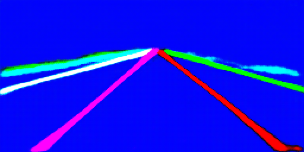
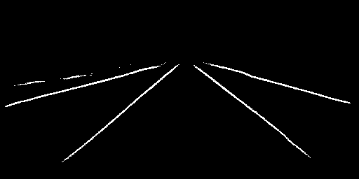

[English](README.md) | [简体中文](README_cn.md)

# LaneNet: binary lane labels and embeddings

<a id="overview"></a>
## Overview

LaneNet predicts lane pixels with a binary segmentation branch and learns embedding features for lane-instance separation. This sample exposes binary labels and raw embeddings through Python and C++ inference on RDK S100.

References: [Towards End-to-End Lane Detection: an Instance Segmentation Approach](https://arxiv.org/abs/1802.05591), [MaybeShewill-CV/lanenet-lane-detection](https://github.com/MaybeShewill-CV/lanenet-lane-detection).

<a id="directory"></a>
## Directory structure

```text
lanenet/
├── conversion/  # Export and quantization configuration
├── evaluator/  # Evaluation commands and metrics
├── model/  # Model files and download scripts
├── runtime/  # Python and native inference implementations
├── test_data/  # Example inputs
├── tests/  # Automated tests
├── README.md  # English instructions
└── README_cn.md  # Chinese instructions
```

<a id="support-matrix"></a>
## Support matrix

| Target | Published model | Python / C++ | Status |
| --- | --- | --- | --- |
| S100 | `s100/lanenet256x512.hbm` | Python and C++ | supported |
| X5 / S100P / S600 | None for LaneNet | Explicit rejection | No silent S100 fallback |

Select `s100` for the published HBM. `auto` selects that artifact; execution requires an S100 board with the matching SDK.

<a id="prerequisites"></a>
## Prerequisites

Use a matching S100 runtime and a prepared HBM for real inference. Python needs NumPy, OpenCV and the board's `hbm_runtime` runtime; C++ needs matching DNN/UCP development headers/libraries, CMake, a C++17 compiler and OpenCV development libraries. See the [Python environment](runtime/python/README.md#environment) and [native dependencies](runtime/cpp/README.md#dependencies).

Downloads and native builds are explicit. Runtime helpers do not install packages or fetch assets. Conversion is optional for the published model; the source export code is incomplete, as described in [conversion](conversion/README.md).

<a id="quickstart"></a>
## Quickstart

Run from the repository root. These two commands inspect the manifest and selection without a board, SDK import or download:

```bash
python3 -m samples.vision.lanenet.runtime.python.main --list-models
python3 -m samples.vision.lanenet.runtime.python.main --target s100 --dry-run
```

Explicitly download the model when network access is available:

```bash
bash samples/vision/lanenet/model/download.sh --target s100
```

On the S100 runtime environment, run Python with a new output directory:

```bash
bash samples/vision/lanenet/runtime/python/run.sh --target s100 --output outputs/lanenet_python_first
```

For native inference, prepare the development dependencies first, then explicitly build and run:

```bash
bash samples/vision/lanenet/runtime/cpp/run.sh --target s100 --build --output outputs/lanenet_cpp_first
```

<a id="expected-results"></a>
## Expected results

Input preparation stretches the image to 512×256 with INTER_AREA, converts BGR to RGB, divides by 255 and applies ImageNet mean/std normalization. The physical model input is float32 NCHW `[1,3,256,512]`. Results remain on that model grid, not the input image's resolution.

Both entries write `embedding.npy` (float32 CHW), `binary.npy` (uint8 labels 0/1), `instance_pred.png`, `binary_pred.png` and `report.json`. Python preserves every named raw output in `raw_outputs.npz` with a name/key map. C++ writes `raw_output_N.npy` and records actual metadata and role indices; its launcher additionally records digests and full output streams. See each runtime README before comparing results.

The embedding PNG clips features to [0,1] and rounds after multiplying by 255. This intentionally replaces the source Python's wrapping/truncation behavior; raw embeddings remain unchanged. The binary PNG displays labels as 0/255. No clustering, lane IDs, tracking, curve fitting, dataset accuracy or latency is produced.

Example LaneNet visualizations:

| Python embedding display (source record) | Python binary display (source record) |
| --- | --- |
|  |  |

[Source native embedding display](test_data/cpp_instance_pred.png) and [native binary display](test_data/cpp_binary_pred.png) are also retained. Display differences do not by themselves establish raw numerical differences or distinct lane instances.

Lane-instance IDs and fitted curves require a clustering and curve-fitting algorithm applied to the embeddings. Display colors alone do not identify individual lanes.

<a id="entry-points"></a>
## Entry points for users and agents

For application integration, construct `LaneNetSegmenter` from a model selection, then call `predict`. Its `preprocess`, `infer` and `postprocess` methods expose the individual stages. Model initialization owns runtime loading; downloading, file output and rendering belong to the CLI. `lanenet.py` validates model semantics and uses the shared named-array runtime. Native code similarly separates task stages, tensor contracts, SDK ownership, visualization and CLI IO.

Read the [stage IO contract](runtime/python/README.md#stage-io) before changing preprocessing or introducing instance clustering. Clustering would be a new algorithmic capability, requiring its own validation; renaming the current display as an instance mask does not implement it.

<a id="license"></a>
## License

This sample follows the repository [Apache-2.0 license](../../../LICENSE). Algorithm references, upstream checkpoints and externally downloaded artifacts retain their own applicable terms; an artifact filename grants no additional rights or provenance.
