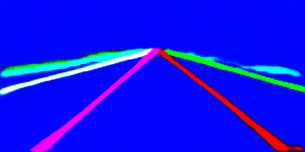
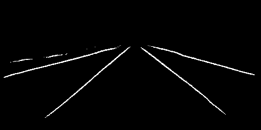

[English](README.md) | [简体中文](README_cn.md)

# LaneNet：车道二值标签与嵌入特征

<a id="overview"></a>
## 概述

LaneNet 通过二值分割分支区分车道像素与背景，通过嵌入分支为后续实例分离提供特征。本 sample 保留 S 分支的 Python 和 C++ 推理能力。实际实现的结果是**原始嵌入特征与二值标签**：两份源实现均未执行嵌入聚类或车道曲线拟合，显示颜色本身不代表不同车道。

原文档引用 [Towards End-to-End Lane Detection: an Instance Segmentation Approach](https://arxiv.org/abs/1802.05591) 和 [MaybeShewill-CV/lanenet-lane-detection](https://github.com/MaybeShewill-CV/lanenet-lane-detection)。它们是算法参考资料，不能证明已发布 HBM 来自某个具体上游提交；源分支未提供该提交或模型校验和。

<a id="support-matrix"></a>
## 支持矩阵

| 目标 | 已发布模型 | Python / C++ | 本次迁移验证 |
| --- | --- | --- | --- |
| S100 | `s100/lanenet256x512.hbm` | 两种入口均保留 | 仅主机夹具；板端推理与完整原生 SDK 构建 not-run |
| X5 / S100P / S600 | 无 LaneNet 资产 | 显式拒绝 | 不静默回退至 S100 |

目标名称只选择契约，不转换 HBM，也不能认证当前板卡。`auto` 因唯一已发布资产而解析到 S100，实际执行仍检查物理身份。主机准备、文档与测试不能证明板端数值等价。

<a id="prerequisites"></a>
## 前置条件

实际推理需要匹配的 S100 运行环境与已准备好的 HBM。Python 需要 NumPy、OpenCV 和板端 `hbm_runtime`；C++ 需要匹配的 DNN/UCP 开发头文件与库、CMake、C++17 编译器以及 OpenCV 开发库。详见 [Python 环境](runtime/python/README_cn.md#environment)和[原生依赖](runtime/cpp/README_cn.md#dependencies)。

下载与原生构建均需显式执行，运行包装入口不自动安装依赖或拉取资产。使用已发布模型无需自行转换；源导出代码不完整，详见[转换说明](conversion/README_cn.md)。

<a id="quickstart"></a>
## 快速开始

从仓库根目录执行。以下命令检查清单与选择结果，不需要板卡，不导入 SDK，也不下载：

```bash
python3 -m samples.vision.lanenet.runtime.python.main --list-models
python3 -m samples.vision.lanenet.runtime.python.main --target s100 --dry-run
```

网络可用时显式下载模型：

```bash
bash samples/vision/lanenet/model/download.sh --target s100
```

在 S100 运行环境中使用新目录执行 Python 推理：

```bash
bash samples/vision/lanenet/runtime/python/run.sh --target s100 --output outputs/lanenet_python_first
```

原生推理需要先准备开发依赖，再显式构建并运行：

```bash
bash samples/vision/lanenet/runtime/cpp/run.sh --target s100 --build --output outputs/lanenet_cpp_first
```

<a id="expected-results"></a>
## 预期结果

输入图像通过 INTER_AREA 拉伸到 512×256，BGR 转 RGB，除以 255 后按 ImageNet 均值与标准差归一化。模型物理输入为 float32 NCHW `[1,3,256,512]`。输出保持模型网格，不恢复到输入图像分辨率。

两种入口均写出 `embedding.npy`（float32 CHW）、`binary.npy`（uint8，标签 0/1）、`instance_pred.png`、`binary_pred.png` 和 `report.json`。Python 在 `raw_outputs.npz` 中保留全部具名原始输出，并记录名称与归档键的对应关系；C++ 写出 `raw_output_N.npy` 并记录实际元数据和角色索引，其启动器额外记录摘要与完整输出流。比较结果前请阅读相应运行说明。

嵌入 PNG 将特征裁剪至 [0,1]，乘 255 后舍入。它明确替换源 Python 的溢出回绕/截断显示行为，原始嵌入不变。二值 PNG 用 0/255 显示标签。不输出聚类结果、车道 ID、跟踪、曲线拟合、数据集精度或延迟。

以下图片逐字节保留自原 S sample，**不是本次迁移重新运行的证据**：

| 历史 Python 嵌入显示图 | 历史 Python 二值显示图 |
| --- | --- |
|  |  |

另保留[源原生嵌入显示图](test_data/cpp_instance_pred.png)和[原生二值显示图](test_data/cpp_binary_pred.png)。显示差异本身不能证明原始数值不同，也不能证明已分离出不同车道实例。

<a id="directory"></a>
## 目录职责

| 路径 | 职责 |
| --- | --- |
| [model](model/README_cn.md) | 精确资产身份、显式下载与校验和边界 |
| [runtime/python](runtime/python/README_cn.md) | Python 命令行、三阶段 API、具名原始输出 |
| [runtime/cpp](runtime/cpp/README_cn.md) | 原生构建、资源管理、保留类型的原始输出 |
| [conversion](conversion/README_cn.md) | 保留 YAML、新校准/配置准备工具、缺失的导出前提 |
| [evaluator](evaluator/README_cn.md) | 主机检查与评估证据的明确边界 |
| [test_data](test_data) | 原道路图像及四幅历史显示图 |
| [tests](tests) | 主机数值、CLI、转换与原生故障注入夹具 |

<a id="entry-points"></a>
## 用户与 Agent 的入口

应用集成使用 `LaneNetTask.pre_process`、`forward`、`post_process` 或其组合 `predict`。下载、文件系统操作、绘图与资源管理放在任务类之外。`model_binding.py` 负责模型语义校验，共享具名数组 runner 负责传输；原生代码同样分离任务阶段、张量契约、SDK 资源管理、可视化和 CLI 读写。

修改前处理或增加实例聚类前先阅读[阶段 IO 契约](runtime/python/README_cn.md#stage-io)。聚类属于新的算法能力，需要单独验证；将当前显示图改名为实例掩码并不等于实现聚类。原 S 实现保留在 `platforms/s/samples/vision/lanenet`，可用于源对照。

<a id="license"></a>
## 许可证

本 sample 遵循仓库 [Apache-2.0 许可证](../../../LICENSE)。算法参考、上游 checkpoint 和外部下载资产仍受各自适用条款约束；本次迁移不会依据文件名推定额外授权或来源。
