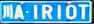

English | [简体中文](./README_cn.md)

# LPRNet Model Description

This directory provides the complete usage guide for the LPRNet sample in Model Zoo, including algorithm overview, model conversion, runtime inference, model file management, and evaluation notes.

## Algorithm Overview

LPRNet is a lightweight end-to-end license plate recognition network. It directly predicts a character sequence from a cropped plate image without an explicit character segmentation stage.

- **Paper**: [LPRNet: License Plate Recognition via Deep Neural Networks](https://arxiv.org/abs/1806.10447)

## Directory Structure

```text
.
├── conversion
├── evaluator
├── model
├── runtime
├── test_data
├── README.md
└── README_cn.md
```

## QuickStart

```bash
cd runtime/python
bash run.sh
```

For runtime details, refer to [runtime/python/README.md](./runtime/python/README.md).

## Model Conversion

This sample ships with a ready-to-run `.bin` model. For conversion-side notes, refer to [conversion/README.md](./conversion/README.md).

## Runtime Inference

This sample currently provides a Python runtime implementation on RDK X5.

- runtime entry: [runtime/python/main.py](./runtime/python/main.py)
- runtime guide: [runtime/python/README.md](./runtime/python/README.md)

## Evaluator

Benchmark and validation notes are provided in [evaluator/README.md](./evaluator/README.md).

## Performance Data

| Model | Input Size | Input Type | Board Performance |
| --- | --- | --- | --- |
| `lpr.bin` | `1x3x24x94` | `float32` binary tensor | `266 FPS / 3.75 ms` |

Reference plate image:



## License

Follows the Model Zoo top-level license.
