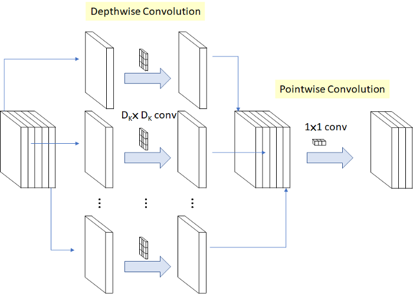
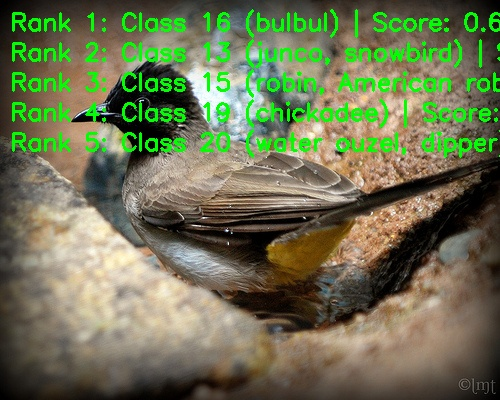

English | [简体中文](./README_cn.md)

# MobileNetV1 Model Description

This directory provides the complete usage guide for the MobileNetV1 sample in Model Zoo, including algorithm overview, model conversion, runtime inference, model file management, and evaluation notes.

## Algorithm Overview

MobileNetV1 is a lightweight convolutional neural network designed for efficient image classification on embedded and mobile devices.

- **Paper**: [MobileNets: Efficient Convolutional Neural Networks for Mobile Vision Applications](https://arxiv.org/abs/1704.04861)
- **Reference Implementation**: [tensorflow/models MobileNetV1](https://github.com/tensorflow/models/blob/master/research/slim/nets/mobilenet_v1.md)

### Algorithm Functionality

MobileNetV1 supports the following task:

- ImageNet 1000-class image classification

### Algorithm Features

- **Depthwise Separable Convolution**: Decomposes standard convolution into depthwise convolution and 1x1 pointwise convolution.
- **Lightweight Design**: Reduces computation and parameter count for embedded deployment.
- **Classification Output**: Outputs Top-K class IDs and confidence scores for ImageNet-1k labels.



## Directory Structure

```text
.
|-- conversion
|   |-- README.md
|   `-- README_cn.md
|-- evaluator
|   |-- README.md
|   `-- README_cn.md
|-- model
|   |-- download.sh
|   |-- README.md
|   `-- README_cn.md
|-- runtime
|   `-- python
|       |-- main.py
|       |-- mobilenetv1.py
|       |-- README.md
|       |-- README_cn.md
|       `-- run.sh
|-- test_data
|   |-- bulbul.JPEG
|   |-- depthwise&pointwise.png
|   |-- ImageNet_1k.json
|   `-- inference.png
|-- README.md
`-- README_cn.md
```

## QuickStart

### Python

- Go to [runtime/python/README.md](./runtime/python/README.md) for detailed Python usage.
- For a quick experience:

```bash
cd runtime/python
bash run.sh
```

## Model Conversion

- Prebuilt `.bin` model files are provided through the [model](./model/README.md) directory.
- Conversion guidance is provided in [conversion/README.md](./conversion/README.md).

## Runtime Inference

The maintained inference path for this sample is Python.

- Python runtime guide: [runtime/python/README.md](./runtime/python/README.md)

## Evaluator

Evaluation notes, performance data, and validation summary are provided in [evaluator/README.md](./evaluator/README.md).

## Performance Data

The following table shows the published MobileNetV1 performance on `RDK X5`.

| Model | Size | Classes | Params (M) | Float Top-1 | Quant Top-1 | Latency (ms) | FPS |
| --- | --- | --- | --- | --- | --- | --- | --- |
| MobileNetV1 | 224x224 | 1000 | 4.2 | 71.7% | 65.4% | 0.58 | 2800+ |



## License

Follows the Model Zoo top-level License.
