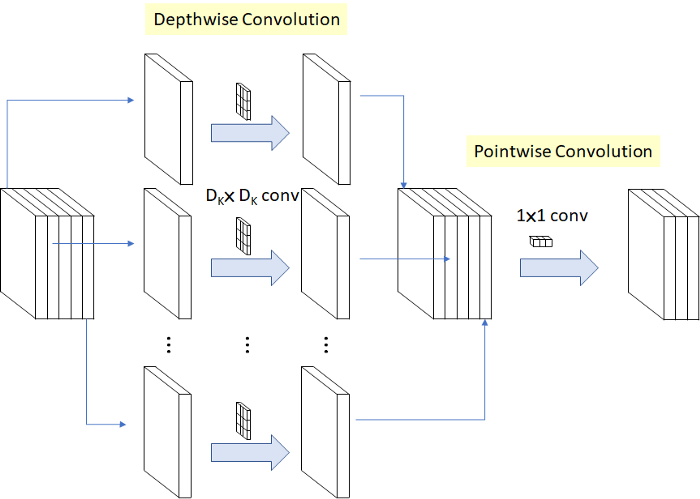
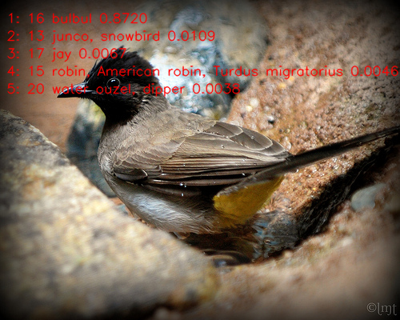

English | [简体中文](README_cn.md)

# MobileNetV1 image classification

MobileNetV1 uses depthwise separable convolution for lightweight image classification.

Sources: [tensorflow/models MobileNetV1](https://github.com/tensorflow/models/blob/master/research/slim/nets/mobilenet_v1.md) · [MobileNets: Efficient Convolutional Neural Networks for Mobile Vision Applications](https://arxiv.org/abs/1704.04861)

[中文说明](README_cn.md)

<a id="overview"></a>

## Overview

The sample ships one Python runtime for all targets. The `MobileNetV1Classifier` class runs a `preprocess → infer → postprocess` flow chained by `predict`: it resolves one exact artifact reference from the platform release manifest for the detected board, verifies the board identity, loads `hbm_runtime` lazily, and returns a typed Top-K result
([runtime/python/README.md](runtime/python/README.md)).

### Algorithm background

MobileNetV1 targets efficient image classification on embedded and mobile
devices. Its efficiency comes from the depthwise separable convolution,
which factorizes a standard convolution into a per-channel depthwise
filter and a 1×1 pointwise projection that combines the channel outputs
([paper](https://arxiv.org/abs/1704.04861),
[tensorflow/models MobileNetV1](https://github.com/tensorflow/models/blob/master/research/slim/nets/mobilenet_v1.md)).

Feature summary:

- **Depthwise separable convolution**: decomposes a standard convolution into depthwise convolution and a 1×1 pointwise convolution.
- **Lightweight design**: reduces computation and parameter count for embedded deployment.
- **Classification output**: Top-K class IDs and confidence scores for ImageNet-1k labels.
- **Model variants**: this sample ships the MobileNetV1-100 and MobileNetV1-125 deployment models (timm checkpoints, INT8).



*Depthwise separable convolution: each input channel is filtered by its own D_K×D_K depthwise
kernel; the following 1×1 pointwise convolution mixes the per-channel
results.*

<a id="directory"></a>
## Directory structure

```text
mobilenetv1/
├── conversion/  # Export and quantization configuration
├── evaluator/  # Evaluation commands and metrics
├── model/  # Model files and download scripts
├── runtime/  # Python inference
├── test_data/  # Example inputs
├── tests/  # Automated tests
├── README.md  # English instructions
├── README_cn.md  # Chinese instructions
└── requirements-host.txt  # Python dependencies
```

<a id="support-matrix"></a>
## Support matrix

| Target | Variant | Language | Status |
| --- | --- | --- | --- |
| x5 | 100 | python | supported |
| x5 | 125 | python | supported |
| s100 | 100 | python | supported |
| s100 | 125 | python | supported |
| s100p | 100 | python | supported |
| s100p | 125 | python | supported |
| s600 | 100 | python | supported |
| s600 | 125 | python | supported |

<a id="prerequisites"></a>
## Prerequisites

Board Python execution needs the board image's matching `hbm_runtime`,
NumPy, OpenCV-Python, and Pillow (the published models expect an antialiased
bicubic shorter-edge resize, which Pillow performs); the SDK is imported only
when a model executes
(`--help`, `--list-models`, `--dry-run`, and host tests need no SDK).
Manifest reading also needs PyYAML. On a development host, install the
user-space dependencies from `requirements-host.txt`:

```bash
# cwd: repository root — success: "host dependencies: ok"
python3 -m venv .venv-mobilenetv1
source .venv-mobilenetv1/bin/activate
python3 -m pip install -r samples/vision/mobilenetv1/requirements-host.txt
python3 -c "import cv2, numpy, yaml, PIL; print('host dependencies: ok')"
```

<a id="quickstart"></a>
## Quick start

One complete path on an X5 board, commands run from the repository root.
Prerequisite: the board image with `hbm_runtime` and network access to the
manifest's model server.

```bash
# 1. Prepare the artifact (input: manifest row x5:mobilenetv1:mobilenetv1_100_bayese_224x224_nv12.bin)
#    output: samples/vision/mobilenetv1/model/mobilenetv1_100_bayese_224x224_nv12.bin
#    success: downloader exits 0 and prints the observed digest
bash samples/vision/mobilenetv1/model/download.sh x5 100

# 2. Run classification (input: the artifact above plus the bundled test image)
#    output: Top-5 class ids, scores, labels on stdout
#    success: exit code 0 and a printed Top-5 list
python3 samples/vision/mobilenetv1/runtime/python/main.py \
  --target x5 \
  --asset-id x5:mobilenetv1:mobilenetv1_100_bayese_224x224_nv12.bin \
  --model-path samples/vision/mobilenetv1/model/mobilenetv1_100_bayese_224x224_nv12.bin \
  --test-img samples/vision/mobilenetv1/test_data/bulbul.JPEG \
  --label-file datasets/imagenet/imagenet_classes.names
```

For S100, S100P and S600 use the matching `s:` reference (see `--list-models`) and the
same root `datasets/imagenet/` labels. Full commands:
[runtime/python/README.md](runtime/python/README.md).

<a id="expected-results"></a>
## Expected results

The Python run prints a stable Top-K (default 5) of class IDs, scores, and
labels and exits 0; Pass `--img-save-path` to save a visualization; otherwise results are printed to stdout. With the bundled `bulbul.JPEG` the Top-1 is class 16 (`bulbul`)
and with `zebra_cls.jpg` it is class 340 (`zebra`), for both variants on X5, S100, S100P
and S600 (checked on each board with the published builds). Select a target and variant listed in the [Support matrix](#support-matrix), prepare that exact manifest artifact with the model downloader, and run the sample on the matching board.

<a id="performance"></a>
## Performance data

All numbers were measured on real boards with the published artifacts
(INT8, 224x224, batch 1). The models are 4.23 M parameters / 1.14 GFLOPs (100) and 6.27 M parameters / 1.76 GFLOPs (125);
GFLOPs counts Conv and Gemm multiply-accumulates as two operations.

**Accuracy.** Top-1 / Top-5 over the complete ImageNetV2 MatchedFrequency set
(10,000 images, 1,000 classes). This is not the ILSVRC2012 validation set, so
the values are not comparable with ImageNet-1k validation figures. "FP32" is
the ONNX export of the same checkpoint evaluated on the same crops; "Board" is
the compiled model on the matching board.

| Model | Target | FP32 Top-1 | Board Top-1 | FP32 Top-5 | Board Top-5 |
| --- | --- | --- | --- | --- | --- |
| MobileNetV1-100 | X5 | 62.86% | 59.45%* | 84.37% | 81.53% |
| MobileNetV1-100 | S100 | 62.86% | 62.00% | 84.37% | 83.51% |
| MobileNetV1-100 | S100P | 62.86% | 62.00% | 84.37% | 83.51% |
| MobileNetV1-100 | S600 | 62.86% | 62.04% | 84.37% | 83.66% |
| MobileNetV1-125 | X5 | 64.25% | 63.14% | 85.23% | 84.17% |
| MobileNetV1-125 | S100 | 64.25% | 63.19% | 85.23% | 84.27% |
| MobileNetV1-125 | S100P | 64.25% | 63.19% | 85.23% | 84.27% |
| MobileNetV1-125 | S600 | 64.25% | 62.95% | 85.23% | 84.12% |

\* MobileNetV1-100 on X5 loses 5.4% of its FP32 Top-1 (relative), more than the
5% acceptance target; it is published as a documented exception. The S-series builds of
MobileNetV1-100 use the toolchain's weight bias correction (still INT8), which brings
their loss to 1.3-1.4%; the X5 toolchain's bias correction made the X5 build worse.

**Speed.** Runtime numbers come from `hrt_model_exec perf` on BPU core 0 (the
model only: no preprocessing or postprocessing); FPS is the total completed
frames divided by the common wall time of 3 runs x 200 frames after a 20-frame
warmup. The C++ pipeline column times one frame from an in-memory BGR image to
a Top-5 list, including resize, crop, NV12 packing, input upload, inference,
and ranking (file reading and decoding excluded), for 1 and 2 independent
streams.

| Model | Target | Runtime latency, 1 thread (ms) | Runtime FPS, 1 / 2 threads | C++ pipeline FPS, 1 / 2 streams | CPU / BPU (GHz) | CPU threads |
| --- | --- | --- | --- | --- | --- | --- |
| MobileNetV1-100 | X5 | 1.146 | 867 / 1,178 | 106 / 118 | 1.5 / 1.0 | 8 |
| MobileNetV1-100 | S100 | 0.431 | 2,217 / 3,762 | 371 / 432 | 1.5 / 1.0 | 6 |
| MobileNetV1-100 | S100P | 0.361 | 2,645 / 4,426 | 479 / 559 | 2.0 / 1.5 | 6 |
| MobileNetV1-100 | S600 | 0.311 | 3,081 / 5,980 | 744 / 942 | 2.1 / 1.5 | 18 |
| MobileNetV1-125 | X5 | 1.690 | 589 / 718 | 102 / 115 | 1.5 / 1.0 | 8 |
| MobileNetV1-125 | S100 | 0.485 | 1,993 / 3,366 | 371 / 433 | 1.5 / 1.0 | 6 |
| MobileNetV1-125 | S100P | 0.432 | 2,230 / 3,854 | 473 / 564 | 2.0 / 1.5 | 6 |
| MobileNetV1-125 | S600 | 0.335 | 2,879 / 5,502 | 729 / 972 | 2.1 / 1.5 | 18 |

The CPU governor was `performance` and the CPUs ran at the clock listed (all
online cores) during each measurement; the boards differ in CPU and BPU clocks,
so compare targets with care. The C++ pipeline uses a scalar, bit-exact
reimplementation of Pillow's bicubic resize, which dominates its preprocessing
time; it is not an upper bound for an optimized pipeline. To reproduce the accuracy numbers see the
[evaluator](evaluator/README.md); the C++ timing tool is described in the
[benchmark instructions](../../../utils/tools/mobilenet/cpp/README.md).



*Reference inference result of the MobileNetV1-100 model on an RDK X5, written with
`--img-save-path`: the bundled
[bulbul.JPEG](test_data/bulbul.JPEG) ranks `bulbul` first (score 0.872), followed by junco, jay, robin, and water ouzel.*

<a id="entry-points"></a>
## Entry points

- Model preparation: [model/README.md](model/README.md)
- Python runtime: [runtime/python/README.md](runtime/python/README.md)
- Conversion: [conversion/README.md](conversion/README.md)
- Evaluation: [evaluator/README.md](evaluator/README.md)

<a id="license"></a>
## License

Sample code follows the repository top-level LICENSE (Apache-2.0). The
source model is the upstream MobileNetV1 distribution; upstream model/weights
licensing is governed by that distribution (see the reference-implementation
link above). Published artifacts follow the platform release manifests; the
manifests carry no separate license field, and no additional license is
claimed here.
