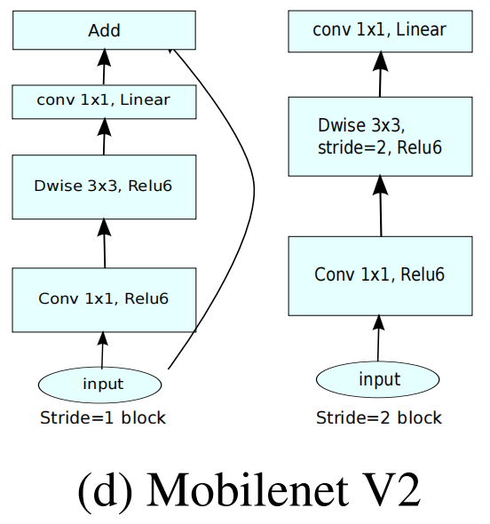
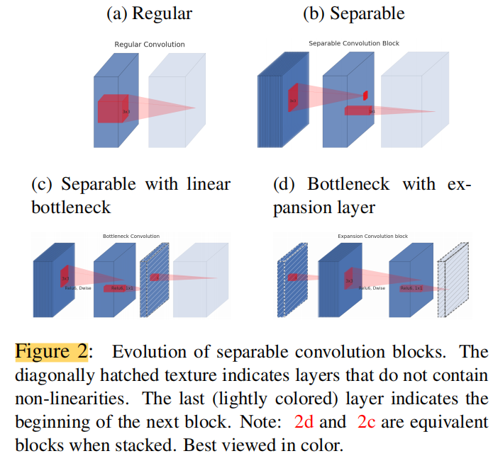
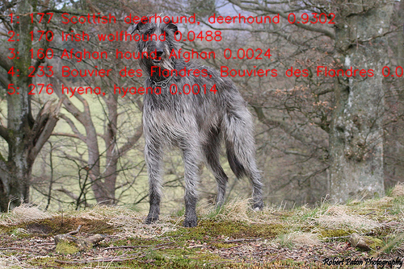

English | [简体中文](README_cn.md)

# MobileNetV2 image classification

MobileNetV2 uses inverted residual blocks and linear bottlenecks for lightweight image classification.

Sources: [timm/models/mobilenetv2](https://github.com/huggingface/pytorch-image-models/blob/main/timm/models/mobilenetv2.py) · [MobileNetV2: Inverted Residuals and Linear Bottlenecks](https://arxiv.org/abs/1801.04381)

[中文说明](README_cn.md)

<a id="overview"></a>

## Overview

The sample ships one Python runtime for all targets plus one S-series C++
runtime. The `MobileNetV2Classifier` class runs a `preprocess → infer →
postprocess` flow chained by `predict`: it resolves one exact artifact
reference from the platform release manifest for the detected board,
verifies the board identity, loads `hbm_runtime` lazily, and returns a
typed Top-K result
([runtime/python/README.md](runtime/python/README.md)). The C++ flow is
the S-series `hbDNNInferV2` implementation
([runtime/cpp/README.md](runtime/cpp/README.md)).

### Algorithm background

MobileNetV2 introduces inverted residual blocks with linear bottlenecks:
each block expands the channels with a 1×1 convolution, applies a 3×3
depthwise convolution, and projects back through a linear (non-ReLU) 1×1
bottleneck; stride-2 blocks drop the shortcut. The linear bottleneck
keeps information that ReLU would discard in low-dimensional spaces
([paper](https://arxiv.org/abs/1801.04381),
[timm/models/mobilenetv2](https://github.com/huggingface/pytorch-image-models/blob/main/timm/models/mobilenetv2.py)).

Feature summary:

- **Inverted residuals**: expand channels before the depthwise convolution and project back through a linear bottleneck.
- **Depthwise separable convolution**: reduces computation compared with standard convolution.
- **Classification output**: Top-K class IDs and confidence scores for ImageNet-1k labels.
- **Model variants**: this sample ships the MobileNetV2-100 and MobileNetV2-140 deployment models (timm checkpoints, INT8).



*Inverted residual blocks: the stride-1 block (left) keeps the additive shortcut; the
stride-2 block (right) downsamples without it, and only the final 1×1
projection is linear.*

The source tree also shipped the paper's block-evolution figure
(`test_data/seperated_conv.png`):



*Figure 2 of the MobileNetV2 paper: from a regular convolution (a) to a
separable block (b), a separable block with linear bottleneck (c), and a
bottleneck with expansion layer (d); hatched layers carry no
non-linearity.*

<a id="directory"></a>
## Directory structure

```text
mobilenetv2/
├── conversion/  # Export and quantization configuration
├── evaluator/  # Evaluation commands and metrics
├── model/  # Model files and download scripts
├── runtime/  # Python and native inference implementations
├── test_data/  # Example inputs
├── tests/  # Automated tests
├── README.md  # English instructions
├── README_cn.md  # Chinese instructions
└── requirements-host.txt  # Python dependencies
```

<a id="support-matrix"></a>
## Support matrix

| Target | Variant | Language | Status |
| --- | --- | --- | --- |
| x5 | 100 | python | supported |
| x5 | 140 | python | supported |
| s100 | 100 | python | supported |
| s100 | 140 | python | supported |
| s100p | 100 | python | supported |
| s100p | 140 | python | supported |
| s600 | 100 | python | supported |
| s600 | 140 | python | supported |
| s100 | 100 | cpp | supported |
| s100 | 140 | cpp | supported |
| s100p | 100 | cpp | supported |
| s100p | 140 | cpp | supported |
| s600 | 100 | cpp | supported |
| s600 | 140 | cpp | supported |

<a id="prerequisites"></a>
## Prerequisites

Board Python execution needs the board image's matching `hbm_runtime`,
NumPy, OpenCV-Python, and Pillow (the published models expect an antialiased
bicubic shorter-edge resize, which Pillow performs); the SDK is imported only
when a model executes
(`--help`, `--list-models`, `--dry-run`, and host tests need no SDK).
Manifest reading also needs PyYAML. On a development host, install the
user-space dependencies from `requirements-host.txt`:

```bash
# cwd: repository root — success: "host dependencies: ok"
python3 -m venv .venv-mobilenetv2
source .venv-mobilenetv2/bin/activate
python3 -m pip install -r samples/vision/mobilenetv2/requirements-host.txt
python3 -c "import cv2, numpy, yaml, PIL; print('host dependencies: ok')"
```

The C++ build needs CMake, a C++17 compiler, OpenCV and gflags
development packages, and the Horizon DNN headers/libraries — see
[runtime/cpp/README.md](runtime/cpp/README.md).

<a id="quickstart"></a>
## Quick start

One complete path on an X5 board, commands run from the repository root.
Prerequisite: the board image with `hbm_runtime` and network access to the
manifest's model server.

```bash
# 1. Prepare the artifact (input: manifest row x5:mobilenetv2:mobilenetv2_100_bayese_224x224_nv12.bin)
#    output: samples/vision/mobilenetv2/model/mobilenetv2_100_bayese_224x224_nv12.bin
#    success: downloader exits 0 and prints the observed digest
bash samples/vision/mobilenetv2/model/download.sh x5 100

# 2. Run classification (input: the artifact above plus the bundled test image)
#    output: Top-5 class ids, scores, labels on stdout
#    success: exit code 0 and a printed Top-5 list
python3 samples/vision/mobilenetv2/runtime/python/main.py \
  --target x5 \
  --asset-id x5:mobilenetv2:mobilenetv2_100_bayese_224x224_nv12.bin \
  --model-path samples/vision/mobilenetv2/model/mobilenetv2_100_bayese_224x224_nv12.bin \
  --test-img samples/vision/mobilenetv2/test_data/Scottish_deerhound.JPEG \
  --label-file datasets/imagenet/imagenet_classes.names
```

For S100, S100P and S600 use the matching `s:` reference (see `--list-models`) and the
same root `datasets/imagenet/` labels. Full commands:
[runtime/python/README.md](runtime/python/README.md).
For the C++ flow (S100, S100P, S600) use `bash samples/vision/mobilenetv2/runtime/cpp/run.sh`.

<a id="expected-results"></a>
## Expected results

The Python run prints a stable Top-K (default 5) of class IDs, scores, and
labels and exits 0; Pass `--img-save-path` to save a visualization; otherwise results are printed to stdout. With the bundled `Scottish_deerhound.JPEG` the Top-1 is class 177 (`Scottish deerhound`)
and with `zebra_cls.jpg` it is class 340 (`zebra`), for both variants on X5, S100, S100P
and S600 (checked on each board with the published builds). Select a target and variant listed in the [Support matrix](#support-matrix), prepare that exact manifest artifact with the model downloader, and run the sample on the matching board.

<a id="performance"></a>
## Performance data

All numbers were measured on real boards with the published artifacts
(INT8, 224x224, batch 1). The models are 3.50 M parameters / 0.60 GFLOPs (100) and 6.11 M parameters / 1.16 GFLOPs (140);
GFLOPs counts Conv and Gemm multiply-accumulates as two operations.

**Accuracy.** Top-1 / Top-5 over the complete ImageNetV2 MatchedFrequency set
(10,000 images, 1,000 classes). This is not the ILSVRC2012 validation set, so
the values are not comparable with ImageNet-1k validation figures. "FP32" is
the ONNX export of the same checkpoint evaluated on the same crops; "Board" is
the compiled model on the matching board.

| Model | Target | FP32 Top-1 | Board Top-1 | FP32 Top-5 | Board Top-5 |
| --- | --- | --- | --- | --- | --- |
| MobileNetV2-100 | X5 | 60.18% | 59.55% | 82.05% | 81.48% |
| MobileNetV2-100 | S100 | 60.18% | 59.61% | 82.05% | 81.61% |
| MobileNetV2-100 | S100P | 60.18% | 59.61% | 82.05% | 81.61% |
| MobileNetV2-100 | S600 | 60.18% | 59.55% | 82.05% | 81.42% |
| MobileNetV2-140 | X5 | 63.71% | 63.11% | 84.68% | 84.44% |
| MobileNetV2-140 | S100 | 63.71% | 63.13% | 84.68% | 84.41% |
| MobileNetV2-140 | S100P | 63.71% | 63.13% | 84.68% | 84.41% |
| MobileNetV2-140 | S600 | 63.71% | 63.09% | 84.68% | 84.51% |

**Speed.** Runtime numbers come from `hrt_model_exec perf` on BPU core 0 (the
model only: no preprocessing or postprocessing); FPS is the total completed
frames divided by the common wall time of 3 runs x 200 frames after a 20-frame
warmup. The C++ pipeline column times one frame from an in-memory BGR image to
a Top-5 list, including resize, crop, NV12 packing, input upload, inference,
and ranking (file reading and decoding excluded), for 1 and 2 independent
streams.

| Model | Target | Runtime latency, 1 thread (ms) | Runtime FPS, 1 / 2 threads | C++ pipeline FPS, 1 / 2 streams | CPU / BPU (GHz) | CPU threads |
| --- | --- | --- | --- | --- | --- | --- |
| MobileNetV2-100 | X5 | 1.039 | 957 / 1,347 | 108 / 119 | 1.5 / 1.0 | 8 |
| MobileNetV2-100 | S100 | 0.457 | 2,102 / 3,748 | 370 / 428 | 1.5 / 1.0 | 6 |
| MobileNetV2-100 | S100P | 0.373 | 2,588 / 4,254 | 464 / 551 | 2.0 / 1.5 | 6 |
| MobileNetV2-100 | S600 | 0.325 | 2,953 / 5,758 | 732 / 963 | 2.1 / 1.5 | 18 |
| MobileNetV2-140 | X5 | 1.642 | 607 / 742 | 101 / 113 | 1.5 / 1.0 | 8 |
| MobileNetV2-140 | S100 | 0.528 | 1,836 / 3,181 | 358 / 421 | 1.5 / 1.0 | 6 |
| MobileNetV2-140 | S100P | 0.452 | 2,132 / 3,589 | 451 / 541 | 2.0 / 1.5 | 6 |
| MobileNetV2-140 | S600 | 0.366 | 2,634 / 5,086 | 710 / 927 | 2.1 / 1.5 | 18 |

The CPU governor was `performance` and the CPUs ran at the clock listed (all
online cores) during each measurement; the boards differ in CPU and BPU clocks,
so compare targets with care. The C++ pipeline uses a scalar, bit-exact
reimplementation of Pillow's bicubic resize, which dominates its preprocessing
time; it is not an upper bound for an optimized pipeline. To reproduce the accuracy numbers see the
[evaluator](evaluator/README.md); the C++ timing tool is described in the
[benchmark instructions](../../../utils/tools/mobilenet/cpp/README.md).



*Reference inference result of the MobileNetV2-100 model on an RDK X5, written with
`--img-save-path`: the bundled
[Scottish_deerhound.JPEG](test_data/Scottish_deerhound.JPEG) ranks `Scottish deerhound` first (score 0.930), followed by Irish wolfhound, Afghan hound, Bouvier des Flandres, and hyena.*

<a id="entry-points"></a>
## Entry points

- Model preparation: [model/README.md](model/README.md)
- Python runtime: [runtime/python/README.md](runtime/python/README.md)
- Conversion: [conversion/README.md](conversion/README.md)
- Evaluation: [evaluator/README.md](evaluator/README.md)
- C++ runtime (S100/S100P/S600): [runtime/cpp/README.md](runtime/cpp/README.md)

<a id="license"></a>
## License

Sample code follows the repository top-level LICENSE (Apache-2.0). The
source model is the upstream MobileNetV2 distribution; upstream model/weights
licensing is governed by that distribution (see the reference-implementation
link above). Published artifacts follow the platform release manifests; the
manifests carry no separate license field, and no additional license is
claimed here.
