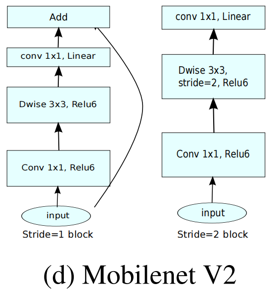
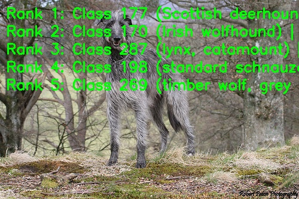

[English](./README.md) | 简体中文

# MobileNetV2 模型说明

本目录给出 MobileNetV2 sample 在 Model Zoo 中的完整使用说明，包括算法概览、模型转换、运行时推理、模型文件管理和评测说明。

## 算法介绍

MobileNetV2 是一种轻量级卷积神经网络，通过倒残差结构和线性瓶颈结构实现高效图像分类。

- **论文**: [MobileNetV2: Inverted Residuals and Linear Bottlenecks](https://arxiv.org/abs/1801.04381)
- **参考实现**: [timm/models/mobilenetv2](https://github.com/huggingface/pytorch-image-models/blob/main/timm/models/mobilenetv2.py)

### 算法功能

MobileNetV2 支持以下任务：

- ImageNet 1000 类图像分类

### 算法特点

- **倒残差结构**：先扩展通道，再进行 depthwise 卷积，最后通过线性瓶颈投影回低维空间。
- **深度可分离卷积**：相比标准卷积显著降低计算量。
- **分类输出**：模型输出 Top-K 类别 ID 及对应置信度。



## 目录结构

```text
.
|-- conversion
|   |-- README.md
|   `-- README_cn.md
|-- evaluator
|   |-- README.md
|   `-- README_cn.md
|-- model
|   |-- download.sh
|   |-- README.md
|   `-- README_cn.md
|-- runtime
|   `-- python
|       |-- main.py
|       |-- mobilenetv2.py
|       |-- README.md
|       |-- README_cn.md
|       `-- run.sh
|-- test_data
|   |-- ImageNet_1k.json
|   |-- inference.png
|   |-- mobilenetv2_architecture.png
|   |-- Scottish_deerhound.JPEG
|   `-- seperated_conv.png
|-- README.md
`-- README_cn.md
```

## 快速体验

### Python

- Python 详细说明请参考 [runtime/python/README_cn.md](./runtime/python/README_cn.md)。
- 快速体验命令：

```bash
cd runtime/python
bash run.sh
```

## 模型转换

- 预编译 `.bin` 模型通过 [model](./model/README_cn.md) 目录提供。
- 转换说明请参考 [conversion/README_cn.md](./conversion/README_cn.md)。

## 模型推理

本 sample 当前维护的推理路径为 Python。

- Python 推理说明: [runtime/python/README_cn.md](./runtime/python/README_cn.md)

## 模型评估

评测说明、性能数据和验证结果请参考 [evaluator/README_cn.md](./evaluator/README_cn.md)。

## 性能数据

下表为 `RDK X5` 上发布的 MobileNetV2 性能数据。

| 模型 | 尺寸 | 类别数 | 参数量 (M) | 浮点 Top-1 | 量化 Top-1 | 延迟 (ms) | FPS |
| --- | --- | --- | --- | --- | --- | --- | --- |
| MobileNetV2 | 224x224 | 1000 | 3.4 | 72.0% | 68.17% | 1.42 | 1152.07 |



## License

遵循 Model Zoo 顶层 License。
