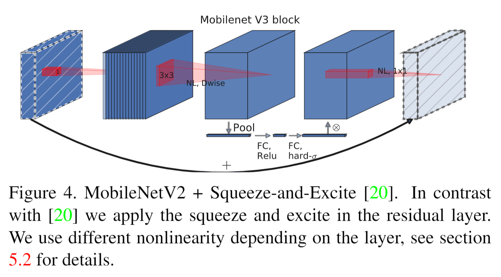
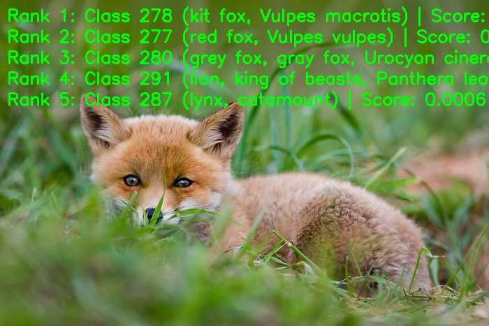

English | [简体中文](./README_cn.md)

# MobileNetV3 Model Description

This directory provides the complete usage guide for the MobileNetV3 sample in Model Zoo, including algorithm overview, model conversion, runtime inference, model file management, and evaluation notes.

## Algorithm Overview

MobileNetV3 is a lightweight convolutional neural network optimized through Network Architecture Search and NetAdapt for efficient image classification.

- **Paper**: [Searching for MobileNetV3](https://arxiv.org/abs/1905.02244)
- **Reference Implementation**: [timm/models/mobilenetv3.py](https://github.com/huggingface/pytorch-image-models/blob/main/timm/models/mobilenetv3.py)

### Algorithm Functionality

MobileNetV3 supports the following task:

- ImageNet 1000-class image classification

### Algorithm Features

- **Depthwise Separable Convolution**: Retains the efficient convolution structure used by MobileNet models.
- **Inverted Residual Blocks**: Uses expansion-depthwise-projection blocks for efficient feature extraction.
- **SE Attention Module**: Recalibrates channel weights to improve feature representation.
- **H-Swish Activation**: Uses a hardware-friendly activation function for embedded deployment.



## Directory Structure

```text
.
|-- conversion
|   |-- MobileNetV3_config.yaml
|   |-- README.md
|   `-- README_cn.md
|-- evaluator
|   |-- README.md
|   `-- README_cn.md
|-- model
|   |-- download.sh
|   |-- README.md
|   `-- README_cn.md
|-- runtime
|   `-- python
|       |-- main.py
|       |-- mobilenetv3.py
|       |-- README.md
|       |-- README_cn.md
|       `-- run.sh
|-- test_data
|   |-- ImageNet_1k.json
|   |-- inference.png
|   |-- kit_fox.JPEG
|   `-- MobileNetV3_architecture.png
|-- README.md
`-- README_cn.md
```

## QuickStart

### Python

- Go to [runtime/python/README.md](./runtime/python/README.md) for detailed Python usage.
- For a quick experience:

```bash
cd runtime/python
bash run.sh
```

## Model Conversion

- Prebuilt `.bin` model files are provided through the [model](./model/README.md) directory.
- Conversion guidance is provided in [conversion/README.md](./conversion/README.md).

## Runtime Inference

The maintained inference path for this sample is Python.

- Python runtime guide: [runtime/python/README.md](./runtime/python/README.md)

## Evaluator

Evaluation notes, performance data, and validation summary are provided in [evaluator/README.md](./evaluator/README.md).

## Performance Data

The following table shows the published MobileNetV3-Large performance on `RDK X5`.

| Model | Size | Classes | Params (M) | Float Top-1 | Quant Top-1 | Latency (ms) | FPS |
| --- | --- | --- | --- | --- | --- | --- | --- |
| MobileNetV3-Large | 224x224 | 1000 | 5.5 | 74.8% | 64.8% | 2.02 | 714+ |



## License

Follows the Model Zoo top-level License.
