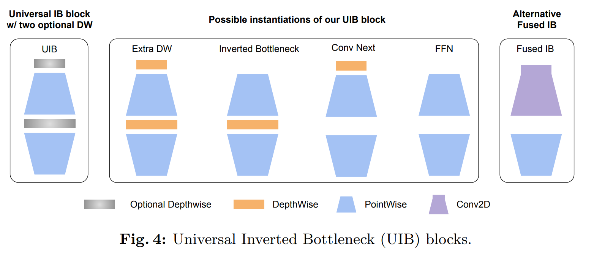
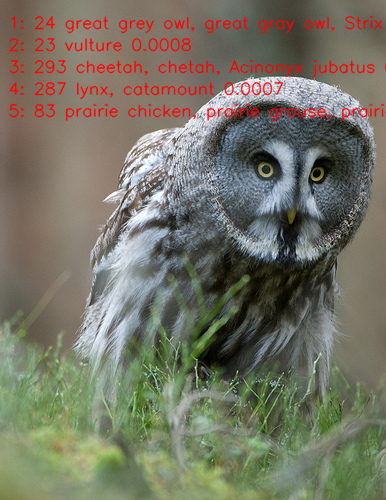

English | [简体中文](README_cn.md)

# MobileNetV4 image classification

MobileNetV4 is a family of image classifiers built around universal inverted bottlenecks.

Sources: [timm/models/MobileNetV4.py](https://github.com/huggingface/pytorch-image-models/blob/main/timm/models/MobileNetV4.py) · [MobileNetV4 -- Universal Models for the Mobile Ecosystem](https://arxiv.org/abs/2404.10518)

[中文说明](README_cn.md)

<a id="overview"></a>

## Overview

The sample ships one Python runtime for all targets. The `MobileNetV4Classifier` class runs a `preprocess → infer → postprocess` flow chained by `predict`: it resolves one exact artifact reference from the platform release manifest for the detected board, verifies the board identity, loads `hbm_runtime` lazily, and returns a typed Top-K result
([runtime/python/README.md](runtime/python/README.md)).

### Algorithm background

MobileNetV4 unifies the block design space of mobile CNNs in the
Universal Inverted Bottleneck (UIB): depending on which depthwise layers
are enabled, one block expresses an inverted bottleneck, a
ConvNeXt-style block, an FFN-style block, or the ExtraDW variant; a
mobile multi-query attention design adds attention where it pays off on
mobile accelerators ([paper](https://arxiv.org/abs/2404.10518),
[timm/models/MobileNetV4.py](https://github.com/huggingface/pytorch-image-models/blob/main/timm/models/MobileNetV4.py)).

Feature summary:

- **Universal Inverted Bottleneck**: unifies inverted bottleneck, ConvNeXt-style blocks, FFN-style blocks, and ExtraDW variants.
- **Mobile Multi-Query Attention**: an attention structure optimized for mobile accelerators.
- **Model variants**: this sample ships the Conv-Small and Conv-Medium deployment models.



*Universal Inverted Bottleneck blocks (Fig. 4 of the paper): the UIB
block with two optional
depthwise layers, its Extra-DW / Inverted Bottleneck / ConvNeXt / FFN
instantiations, and the alternative fused IB.*

<a id="directory"></a>
## Directory structure

```text
mobilenetv4/
├── conversion/  # Export and quantization configuration
├── evaluator/  # Evaluation commands and metrics
├── model/  # Model files and download scripts
├── runtime/  # Python inference
├── test_data/  # Example inputs
├── tests/  # Automated tests
├── README.md  # English instructions
├── README_cn.md  # Chinese instructions
└── requirements-host.txt  # Python dependencies
```

<a id="support-matrix"></a>
## Support matrix

| Target | Variant | Language | Status |
| --- | --- | --- | --- |
| x5 | small | python | supported |
| x5 | medium | python | supported |
| s100 | small | python | supported |
| s100 | medium | python | supported |
| s600 | medium | python | supported |
| s600 | small | python | supported |
| s100p | any | python, cpp | not-supported (no s100p asset row in the release manifest; selection is an explicit error, no fallback) |

<a id="prerequisites"></a>
## Prerequisites

Board Python execution needs the board image's matching `hbm_runtime`,
NumPy, and OpenCV-Python; the SDK is imported only when a model executes
(`--help`, `--list-models`, `--dry-run`, and host tests need no SDK).
Manifest reading also needs PyYAML. On a development host, install the
user-space dependencies from `requirements-host.txt`:

```bash
# cwd: repository root — success: "host dependencies: ok"
python3 -m venv .venv-mobilenetv4
source .venv-mobilenetv4/bin/activate
python3 -m pip install -r samples/vision/mobilenetv4/requirements-host.txt
python3 -c "import cv2, numpy, yaml; print('host dependencies: ok')"
```

<a id="quickstart"></a>
## Quick start

One complete path on an X5 board, commands run from the repository root.
Prerequisite: the board image with `hbm_runtime` and network access to the
manifest's model server.

```bash
# 1. Prepare the artifact (input: manifest row x5:mobilenetv4:MobileNetV4_conv_small_224x224_nv12.bin)
#    output: samples/vision/mobilenetv4/model/MobileNetV4_conv_small_224x224_nv12.bin
#    success: downloader exits 0 and prints the observed digest
bash samples/vision/mobilenetv4/model/download.sh x5 --variant small

# 2. Run classification (input: the artifact above plus the bundled test image)
#    output: Top-5 class ids, scores, labels on stdout
#    success: exit code 0 and a printed Top-5 list
python3 samples/vision/mobilenetv4/runtime/python/main.py \
  --target x5 \
  --asset-id x5:mobilenetv4:MobileNetV4_conv_small_224x224_nv12.bin \
  --model-path samples/vision/mobilenetv4/model/MobileNetV4_conv_small_224x224_nv12.bin \
  --test-img samples/vision/mobilenetv4/test_data/great_grey_owl.JPEG \
  --label-file datasets/imagenet/imagenet_classes.names
```

For S100/S600 use the matching `s:` reference (see `--list-models`) and the
same root `datasets/imagenet/` labels. Full commands:
[runtime/python/README.md](runtime/python/README.md).

<a id="expected-results"></a>
## Expected results

The Python run prints a stable Top-K (default 5) of class IDs, scores, and
labels and exits 0; Pass `--img-save-path` to save a visualization; otherwise results are printed to stdout. On X5 with the bundled `great_grey_owl.JPEG` the Top-1 matches the
image subject (a great grey owl); on S100/S600 with `zebra_cls.jpg` the
Top-5 includes `zebra`. Select a target and variant listed in the [Support matrix](#support-matrix), prepare that exact manifest artifact with the model downloader, and run the sample on the matching board.

<a id="performance"></a>
## Performance data

Published MobileNetV4 performance on `RDK X5` (x5-v1.1.3):

| Model | Size | Classes | Params (M) | Float Top-1 | Quant Top-1 | Latency (ms) | FPS |
| --- | --- | --- | --- | --- | --- | --- | --- |
| MobileNetV4-Conv-Medium | 224x224 | 1000 | 9.7 | 76.8% | 75.1% | 2.42 | 572+ |
| MobileNetV4-Conv-Small | 224x224 | 1000 | 3.8 | 70.8% | 68.8% | 1.18 | 1436+ |




*Reference inference result from the X5 release: the
bundled [great_grey_owl.JPEG](test_data/great_grey_owl.JPEG) ranks
`great grey owl` first, followed by ruffed grouse, partridge, meerkat,
and prairie chicken. This is the source-reported X5 runtime example.*

<a id="entry-points"></a>
## Entry points

- Model preparation: [model/README.md](model/README.md)
- Python runtime: [runtime/python/README.md](runtime/python/README.md)
- Conversion: [conversion/README.md](conversion/README.md)
- Evaluation: [evaluator/README.md](evaluator/README.md)

<a id="license"></a>
## License

Sample code follows the repository top-level LICENSE (Apache-2.0). The
source model is the upstream MobileNetV4 distribution; upstream model/weights
licensing is governed by that distribution (see the reference-implementation
link above). Published artifacts follow the platform release manifests; the
manifests carry no separate license field, and no additional license is
claimed here.
