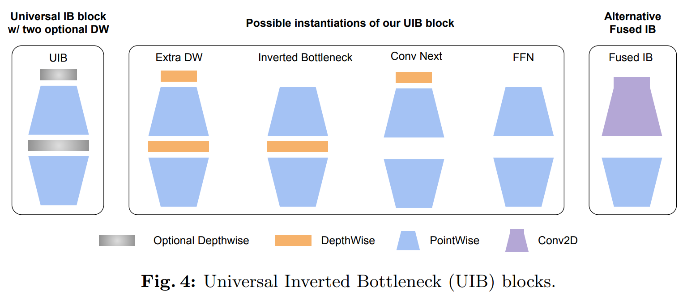
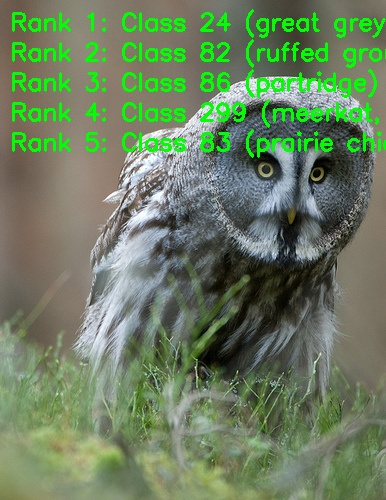

[English](./README.md) | 简体中文

# MobileNetV4 模型说明

本目录给出 MobileNetV4 sample 在 Model Zoo 中的完整使用说明，包括算法概览、模型转换、运行时推理、模型文件管理和评测说明。

## 算法介绍

MobileNetV4 是轻量级图像分类模型家族，引入 Universal Inverted Bottleneck 和 Mobile Multi-Query Attention，用于高效移动端和嵌入式部署。

- **论文**: [MobileNetV4 -- Universal Models for the Mobile Ecosystem](https://arxiv.org/abs/2404.10518)
- **参考实现**: [timm/models/MobileNetV4.py](https://github.com/huggingface/pytorch-image-models/blob/main/timm/models/MobileNetV4.py)

### 算法功能

MobileNetV4 支持以下任务：

- ImageNet 1000 类图像分类

### 算法特点

- **Universal Inverted Bottleneck**：统一 inverted bottleneck、ConvNeXt 风格模块、FFN 风格模块和 ExtraDW 变体。
- **Mobile Multi-Query Attention**：提供面向移动端加速器优化的注意力结构。
- **模型变体**：本 sample 提供 Conv-Small 和 Conv-Medium 两个部署模型。



## 目录结构

```text
.
|-- conversion
|   |-- MobileNetV4_medium.yaml
|   |-- MobileNetV4_small.yaml
|   |-- README.md
|   `-- README_cn.md
|-- evaluator
|   |-- README.md
|   `-- README_cn.md
|-- model
|   |-- download.sh
|   |-- README.md
|   `-- README_cn.md
|-- runtime
|   `-- python
|       |-- main.py
|       |-- mobilenetv4.py
|       |-- README.md
|       |-- README_cn.md
|       `-- run.sh
|-- test_data
|   |-- great_grey_owl.JPEG
|   |-- ImageNet_1k.json
|   |-- inference.png
|   `-- MobileNetV4_architecture.png
|-- README.md
`-- README_cn.md
```

## 快速体验

### Python

- Python 详细说明请参考 [runtime/python/README_cn.md](./runtime/python/README_cn.md)。
- 快速体验命令：

```bash
cd runtime/python
bash run.sh
```

## 模型转换

- 预编译 `.bin` 模型通过 [model](./model/README_cn.md) 目录提供。
- 转换说明请参考 [conversion/README_cn.md](./conversion/README_cn.md)。

## 模型推理

本 sample 当前维护的推理路径为 Python。

- Python 推理说明: [runtime/python/README_cn.md](./runtime/python/README_cn.md)

## 模型评估

评测说明、性能数据和验证结果请参考 [evaluator/README_cn.md](./evaluator/README_cn.md)。

## 性能数据

下表为 `RDK X5` 上发布的 MobileNetV4 性能数据。

| 模型 | 尺寸 | 类别数 | 参数量 (M) | 浮点 Top-1 | 量化 Top-1 | 延迟 (ms) | FPS |
| --- | --- | --- | --- | --- | --- | --- | --- |
| MobileNetV4-Conv-Medium | 224x224 | 1000 | 9.7 | 76.8% | 75.1% | 2.42 | 572+ |
| MobileNetV4-Conv-Small | 224x224 | 1000 | 3.8 | 70.8% | 68.8% | 1.18 | 1436+ |



## License

遵循 Model Zoo 顶层 License。
