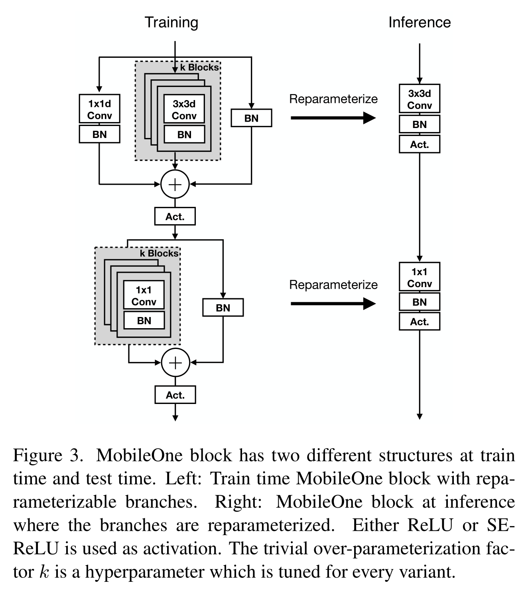
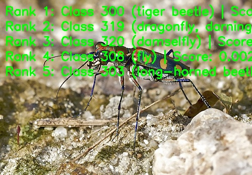

# MobileOne 图像分类

<a id="overview"></a>

## 概述

MobileOne 是面向低时延边缘部署的轻量级 CNN 骨干网络。模型通过结构重参数化，在训练阶段保留多分支表达能力，在推理阶段收敛为更简洁的部署结构。

- **论文**: [MobileOne: An Improved One millisecond Mobile Backbone](http://arxiv.org/abs/2206.04040)
- **参考实现**: [apple/ml-mobileone](https://github.com/apple/ml-mobileone)

核心特性：

- **结构重参数化**——训练期的多分支模块（k 个并行卷积分支、逐分支
  BN 与恒等分支，激活用 ReLU 或 SE-ReLU）在推理期融合为每个 block 单条
  卷积的部署友好结构。
- **低时延骨干**——面向移动与嵌入式部署，吞吐能力强。
- **变体缩放**——提供 `S0` 到 `S4` 多个发布变体，过参数化因子 `k`
  按变体调优。
- **分类输出**——产出 ImageNet-1k 标签的 Top-K 类别 ID 与置信度。



*图（上游论文 Fig. 3）：MobileOne block 有两种结构——训练期带可重参数
化分支（左），推理期把分支折叠为单个 3×3 / 1×1 卷积（右）。训练/推理
双结构也解释了
部署制品为何是已重参数化的 INT8 s0–s4 变体（224×224 NV12，见
[支持范围](#support-matrix)）。*

输入一张 BGR 图像，输出 ImageNet-1k Top-K 类别 ID、分数和可选标签。
`MobileOneClassifier` 类执行由 `predict` 串联的 `preprocess → infer → postprocess`
流程（标签读取、绘图和文件输出由 CLI 层负责，见
[runtime/python/README_cn.md](runtime/python/README_cn.md)）。

<a id="directory"></a>
## 目录结构

```text
mobileone/
├── conversion/  # 导出与量化配置
├── evaluator/  # 评估程序与指标
├── model/  # 模型文件与下载脚本
├── runtime/  # 推理程序
├── test_data/  # 示例输入
├── tests/  # 自动化测试
├── README.md  # 英文说明
├── README_cn.md  # 中文说明
└── requirements-host.txt  # 源码或数据文件
```

<a id="support-matrix"></a>
## 支持矩阵

| 目标 | 变体 | Python | C++ |
| --- | --- | --- | --- |
| x5 | s0 | supported | not-supported |
| x5 | s1 | supported | not-supported |
| x5 | s2 | supported | not-supported |
| x5 | s3 | supported | not-supported |
| x5 | s4 | supported | not-supported |
| s100 | s0 | not-supported | not-supported |
| s100 | s1 | not-supported | not-supported |
| s100 | s2 | not-supported | not-supported |
| s100 | s3 | not-supported | not-supported |
| s100 | s4 | not-supported | not-supported |
| s100p | s0 | not-supported | not-supported |
| s100p | s1 | not-supported | not-supported |
| s100p | s2 | not-supported | not-supported |
| s100p | s3 | not-supported | not-supported |
| s100p | s4 | not-supported | not-supported |
| s600 | s0 | not-supported | not-supported |
| s600 | s1 | not-supported | not-supported |
| s600 | s2 | not-supported | not-supported |
| s600 | s3 | not-supported | not-supported |
| s600 | s4 | not-supported | not-supported |

S 系列无对应制品，所有目标均无 C++ 实现。

CLI 小写变体 ID 映射到准确发布文件名；文件名大小写保持不变。

<a id="prerequisites"></a>
## 前提

使用完整仓库检出。X5 推理需要匹配的板端镜像与 `hbm_runtime`；主机
依赖按下方装入虚拟环境。SciPy 仅用于主机对照测试，板端推理不依赖
它。原生推理不需要 OE 工具链；重新转换的前提见
[conversion](conversion/README_cn.md) 文档。

```bash
# cwd: repository root
python3 -m venv .venv-mobileone
source .venv-mobileone/bin/activate
python3 -m pip install -r samples/vision/mobileone/requirements-host.txt
python3 -c "import cv2, numpy, yaml; print('host dependencies: ok')"
```

<a id="quickstart"></a>
## 快速体验

在 X5 上从仓库根目录执行。下载成功时退出码 0 并打印观测摘要；推理成功时
退出码 0 并打印五条结果。推理不会自动下载模型。

```bash
# cwd: repository root
bash samples/vision/mobileone/model/download.sh x5 s0
python3 samples/vision/mobileone/runtime/python/main.py \
  --target x5 --variant s0 \
  --test-img samples/vision/mobileone/test_data/tiger_beetle.JPEG \
  --label-file datasets/imagenet/imagenet_classes.names
```

<a id="expected-results"></a>
## 预期结果

默认变体为 `s0`；其余变体须显式指定。分数采用 softmax，完全平局时
按类别 ID 升序稳定排序。使用 `tiger_beetle.JPEG` 完成单图功能检查；
数据集精度按评测指南将每张图的真值类别 ID 与 Top-1 结果比较。仅指定
`--img-save-path` 才保存文件。

下图为 X5 发布的参考运行效果：demo 将 Top-5 排名叠画在随附测试图上，
rank 1 为 class 300（tiger beetle）。



<a id="performance"></a>
## 性能数据

已发布性能记录：完整列与计时条件见
[评估说明](evaluator/README_cn.md#reference-results)。单线程延迟与多线程 FPS 采用不同的并发方式，
二者不能直接互相取倒数。比较延迟与 FPS 时，应使用相同线程数、并发提交方式和 BPU 利用率。

<a id="entry-points"></a>
## 入口

[模型](model/README_cn.md) · [Python 运行时](runtime/python/README_cn.md) ·
[转换](conversion/README_cn.md) · [评估](evaluator/README_cn.md)

<a id="license"></a>
## 许可

源 Python 文件保留 Apache-2.0 出处。转换 YAML 原样保留其原始专有声明；
仓库许可不覆盖这些声明或上游权重许可。再分发转换材料或权重前请核对
适用声明。
