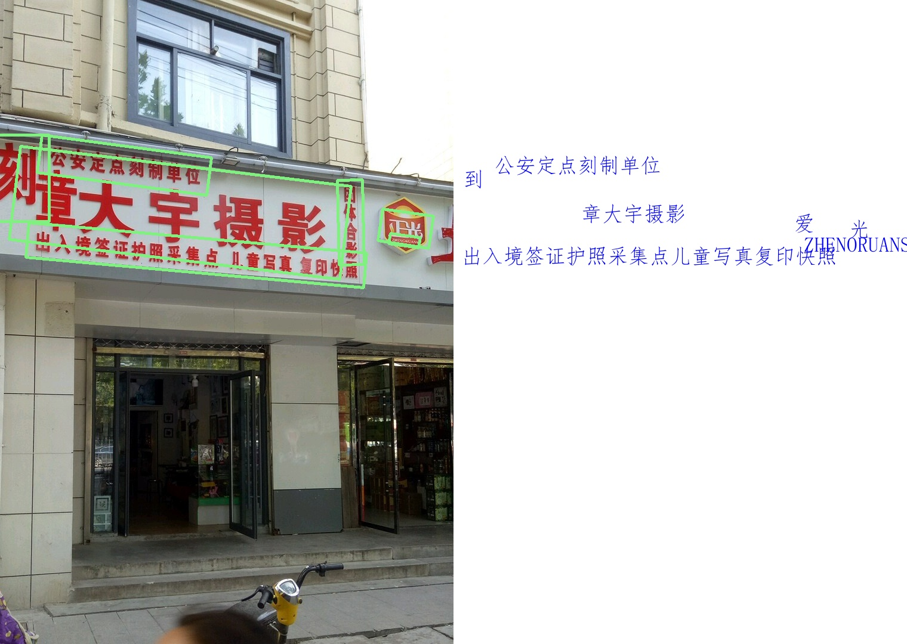

[English](./README.md) | 简体中文

# PaddleOCR 模型说明

本目录描述 PaddleOCR 在本 Model Zoo 中的完整使用流程，包括：算法介绍、模型转换、运行时推理（C++ 和 Python）、前后处理接口说明，以及模型评估步骤。

> 默认使用 **PP-OCRv6**（检测 + 识别），运行脚本会读取 `/sys/class/boardinfo/soc_name`，根据当前板卡自动选择对应的预编译模型。

---

## 算法介绍（Algorithm Overview）

PaddleOCR 是百度飞桨团队开源的超轻量中英文 OCR 系统，采用两阶段级联架构：

- **文本检测（Detection）**：使用 DB（Differentiable Binarization）算法，输出文本区域的分割概率图，经阈值化、轮廓提取和最小面积矩形拟合后得到多边形文本框。
- **文本识别（Recognition）**：使用 CRNN（Convolutional Recurrent Neural Network）架构，输出各时间步的类别概率（logits），通过 CTC 贪婪解码还原文字字符串。

### 算法特性

- **两阶段解耦**：检测与识别独立推理，便于灵活替换各阶段模型
- **DB 文本检测**：可微分二值化使模型在训练时直接学习二值化阈值，提升小文本检测精度
- **CRNN + CTC 识别**：序列建模结合 CTC 解码，天然支持不定长文本识别
- **中文支持**：词典包含常用汉字及符号，支持中英文混合场景
- **端侧高效**：已针对 RDK S100 / S600 BPU 完成 PP-OCRv6 量化与编译适配

### 原始资料

- DB 论文：[Real-time Scene Text Detection with Differentiable Binarization](https://arxiv.org/abs/1911.08947)
- CRNN 论文：[An End-to-End Trainable Neural Network for Image-based Sequence Recognition](https://arxiv.org/abs/1507.05717)
- PaddleOCR 项目：[PaddlePaddle/PaddleOCR](https://github.com/PaddlePaddle/PaddleOCR)

---

## 平台兼容性

本示例默认下载 **PP-OCRv6** 检测/识别模型，根据 `/sys/class/boardinfo/soc_name` 自动选择对应的预编译版本：

| 平台       | 是否支持 | 模型变体                                          |
|-----------|---------|--------------------------------------------------|
| RDK S100  | ✅ 支持 | `archive.d-robotics.cc/.../rdk_s100/paddle_ocr/`  |
| RDK S100P | ✅ 支持 | 复用 `rdk_s100/paddle_ocr/` 的预编译模型           |
| RDK S600  | ✅ 支持 | `archive.d-robotics.cc/.../rdk_s600/paddle_ocr/`  |

> 板卡读取 `soc_name` 失败或返回 `(null)` 时，脚本会回退到 S100 模型。
> 如需在自定义平台上运行 OCR，请使用对应的 OE 工具链重新量化编译模型，参考 [conversion/README.md](./conversion/README.md)。

---

## 目录结构（Directory Structure）

```bash
.
|-- conversion                              # 模型转换流程
|   |-- paddleocr_det_configs.yaml          # PP-OCRv6 检测模型量化配置
|   |-- paddleocr_rec_configs.yaml          # PP-OCRv6 识别模型量化配置
|   `-- README.md                           # 模型转换使用说明
|-- evaluator                               # 模型评估相关内容
|   `-- README.md                           # 模型评估说明
|-- model                                   # 模型文件及下载脚本
|   |-- download_model.sh                   # SOC 自适应 HBM 模型下载脚本
|   `-- README.md                           # 模型下载说明
|-- runtime                                 # 模型推理示例
|   |-- cpp                                 # C++ 推理工程
|   |   |-- inc                             # C++ 头文件
|   |   |   `-- paddle_ocr.hpp              # PaddleOCR 模型封装接口
|   |   |-- src                             # C++ 源码
|   |   |   |-- main.cpp                    # 推理入口程序
|   |   |   `-- paddle_ocr.cpp              # PaddleOCR 推理实现
|   |   |-- CMakeLists.txt                  # CMake 构建配置
|   |   |-- README.md                       # C++ 推理示例使用说明
|   |   `-- run.sh                          # C++ 示例运行脚本
|   `-- python                              # Python 推理示例
|       |-- README.md                       # Python 推理示例使用说明
|       |-- main.py                         # Python 推理入口脚本
|       |-- run.sh                          # Python 示例运行脚本
|       `-- paddle_ocr.py                   # PaddleOCR 推理与后处理实现
|-- test_data                               # 测试数据
|   |-- gt_2322.jpg                         # 示例测试图片（含中文文本）
|   |-- ppocrv6_dict.txt                    # PP-OCRv6 默认字符词典
|   |-- ppocrv6_tiny_dict.txt               # PP-OCRv6 Tiny 备用词典
|   |-- ppocr_keys_v1.txt                   # PP-OCRv3 历史词典（兼容保留）
|   `-- FangSong.ttf                        # 仿宋字体文件（用于结果可视化）
`-- README.md                               # PaddleOCR 示例整体说明与快速指引
```

---

## 快速体验（QuickStart）

为了便于用户快速上手体验，每个模型均提供了 `run.sh` 脚本，用户运行此脚本即可一键运行相应模型，此脚本主要进行如下操作：
- 检测系统环境是否满足要求，若不满足则自动安装相应包；
- 读取板卡 SOC 信息，自动选择 S100 或 S600 对应的 PP-OCRv6 模型；
- 检测推理所需的 hbm 模型文件是否存在，不存在则自动下载；
- 创建 build 目录，编译 C++ 项目（仅 C++ 项目）；
- 运行编译好的可执行文件或相应的 Python 脚本；

### C++

- 进入 `runtime` 目录下的 `cpp` 目录，运行 `run.sh` 脚本，即可快速体验

    ```bash
    cd runtime/cpp/
    ./run.sh
    ```

- 若想了解 C++ 代码的详细使用方法，或 step by step 运行模型请参考 `runtime/cpp/README.md`；

### Python

- 进入 `runtime` 目录下的 `python` 目录，运行 `run.sh` 脚本，即可快速体验

    ```bash
    cd runtime/python/
    ./run.sh
    ```

- 若想了解 Python 代码的详细使用方法，或 step by step 运行模型请参考 `runtime/python/README.md`；

---

## 模型转换（Model Conversion）

- ModelZoo 已提供适配完成的 PP-OCRv6 HBM 模型文件（S100 / S600），用户可直接运行 `model` 目录下的 `download_model.sh` 脚本下载并使用，如不关心模型转换流程，**可跳过本小节**。

- 如需自定义模型转换参数，或了解完整的模型转换流程，请参考 `conversion/README.md`。

---

## 模型推理（Runtime）

PaddleOCR 模型推理示例同时提供 C++ 和 Python 两种实现方式，分别面向不同的使用场景与开发需求。两种版本在模型能力与推理结果上保持一致，但在使用方式和工程形态上有所区别。

### C++ 版本

- 提供完整的工程化示例，适合集成到实际应用中；
- 包含模型封装类、参数解析、推理流程及构建方式说明；
- 默认模型路径在编译期根据 SOC 解析（S100/S600），可通过 `--det_model_path` / `--rec_model_path` 显式覆盖；
- 具体编译、运行方式及接口说明请参考 `runtime/cpp/README.md`；

### Python 版本

- 以脚本形式提供，适合快速验证模型效果与算法流程；
- 默认模型路径在运行时根据 SOC 解析（S100/S600），可通过 `--det-model-path` / `--rec-model-path` 显式覆盖；
- 示例中展示了模型加载、推理执行、后处理以及结果保存的完整过程；
- 具体使用方法、参数说明及接口说明请参考 `runtime/python/README.md`；

---

## 模型评估（Evaluator）

`evaluator/` 用于模型精度、性能及数值一致性评估，详细说明请参考该目录。

---

## 推理结果

推理完成后，将在运行目录下生成 `result.jpg` 结果图像：

- **左半部分**：原图上叠加检测到的文本框（绿色多边形轮廓），每个框对应一处检测到的文本区域
- **右半部分**：白色画布上使用仿宋字体渲染的识别文字，每条文字位置与左侧对应检测框中心对齐

C++ 推理结果示例：


Python 推理结果示例：



---

## License

遵循 Model Zoo 顶层 License。