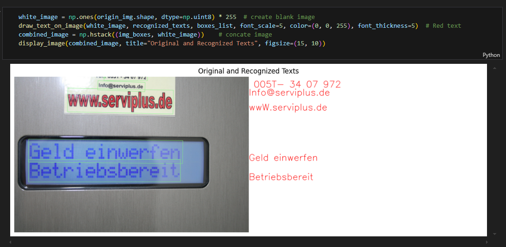
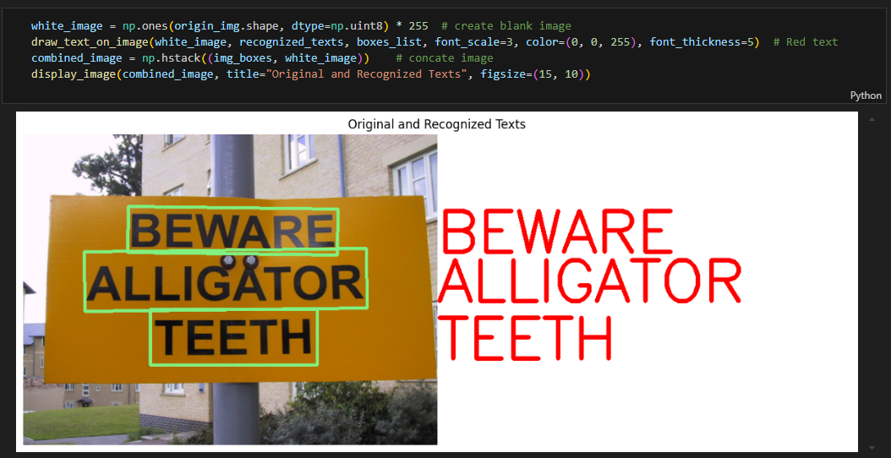

English | [简体中文](README_cn.md)

# PaddleOCR record evaluation

`evaluate.py` compares saved detector/recognizer records. It does not load
`hbm_runtime`, rerun a model, download a dataset, or define a new accuracy
protocol — it is the tool to reach for after a board run, once the image set
and its labels exist.

<a id="dataset"></a>
## Dataset

Not applicable in the bundled form: the sample ships demonstration images,
an example input set. Use labeled data for dataset accuracy evaluation. The
evaluator consumes two user-supplied record files describing predictions
and ground truth for the same images. Each input may be one JSON object, a
JSON array, or JSONL with one object per image; `image` is the preferred
identifier (`image_id` and `id` are accepted aliases; the line/index is
used when none is present). Every record must contain aligned `boxes` and
`texts` lists; a box is a polygon `[[x, y],...]`, and one extra OpenCV
contour nesting level (`[[[x, y],...]]`) is accepted.

Ground-truth example:

```json
{"image":"street-001.jpg","boxes":[[[20,30],[180,30],[180,70],[20,70]]],"texts":["RDK"]}
```

A Python JSON result becomes a prediction object after adding an
`image` field, or JSONL with one image per line:

```json
{"image":"street-001.jpg","target":"s100","boxes":[[[21,31],[179,31],[179,69],[21,69]]],"texts":["RDK"]}
```

<a id="directory"></a>
## Directory structure

```text
evaluator/
├── README.md  # English instructions
├── README_cn.md  # Chinese instructions
└── evaluate.py  # Python script
```

<a id="environment"></a>
## Environment

Host Python 3 with the standard library only — no board SDK, no OpenCV,
no model files. Run from any directory using the paths below.

<a id="command"></a>
## Command

```bash
python3 samples/vision/paddle_ocr/evaluator/evaluate.py \
  --ground-truth /data/labels.jsonl \
  --predictions /data/predictions.jsonl \
  --iou-threshold 0.5 \
  --output /data/paddleocr-evaluation.json
```

`--iou-threshold` defaults to `0.5`; `--output` is optional — the report
is always printed to stdout. For each image, matching walks ground-truth
boxes in input order and picks the highest-IoU unused prediction at or
above the threshold; equal-IoU candidates keep prediction-file order.

<a id="metrics"></a>
## Metrics

| Metric | Definition | Conditions |
| --- | --- | --- |
| detection precision / recall / F1 | matched vs. total counts per image set | IoU threshold as configured; polygon IoU computed on axis-aligned bounds, matching this sample's box-level outputs |
| unmatched counts | GT and predictions left without a match | per run |
| recognition `exact_rate` | exact string equality on IoU-matched regions | matched regions only |
| recognition `normalized_similarity` | 1 − Levenshtein / max(len), minimum denominator 1 | matched regions only |
| recognition status | `not_run` with zero values | when there are no matched regions |

An empty GT record is valid and produces no implicit score.

<a id="outputs"></a>
## Outputs

A JSON report (stdout, and `--output` when given) with total
ground-truth/prediction/match counts, unmatched counts, detection
precision/recall/F1, and the `recognition` object described above. Retain
both input record files and the report as evaluation evidence.

<a id="reference-results"></a>
## Reference results

The Python default and aspect-ratio pipelines (including the command-line
helpers) run on X5 and S100 and are compared through their stage tensors,
decoded into polygon boxes and recognized text; the S100 C++ build renders
the recognized results onto the output image.
Per-platform detector/recognizer latency and FPS are measured with the
`hrt_model_exec perf` commands for the det/rec artifacts in the
[conversion guide](../conversion/README.md).

### PP-OCRv3 reference throughput (ICDAR2019-ArT)

These measurements use ICDAR2019-ArT and describe the original published PP-OCRv3 models. SDK, firmware, thread count and clock settings were unspecified.

#### RDK X5 and RDK X5 Module

| Model(public) | size(pixels) | Parameter | BPU throughput |
| ------------ | ------- | ----- | ---------- |
| PP-OCRv3_det | 640x640 | 3.8 M | 158.12 FPS |
| PP-OCRv3_rec | 48x320  | 9.6 M | 245.68 FPS |



#### RDK X3 and RDK X3 Module original deployment measurements

This table describes the original X3 artifacts. See the [support matrix](../README.md#support-matrix) for the current sample’s board and model requirements.

| Model(public) | size(pixels) | Parameter | BPU throughput |
| ------------ | ------- | ----- | ---------- |
| PP-OCRv3_det | 640x640 | 3.8 M | 41.96 FPS |
| PP-OCRv3_rec | 48x320  | 9.6 M | 78.92 FPS |



<a id="boundaries"></a>
## Scope

The evaluator measures the records supplied by the user; it never turns
the bundled demonstration images into an accuracy claim. It performs no
inference and validates no artifacts — runtime/board fidelity evidence is
kept separately (see the table above). Recognition quality on a real
corpus requires a labeled corpus and a target-specific run, both supplied
by the user when those runs are performed.
