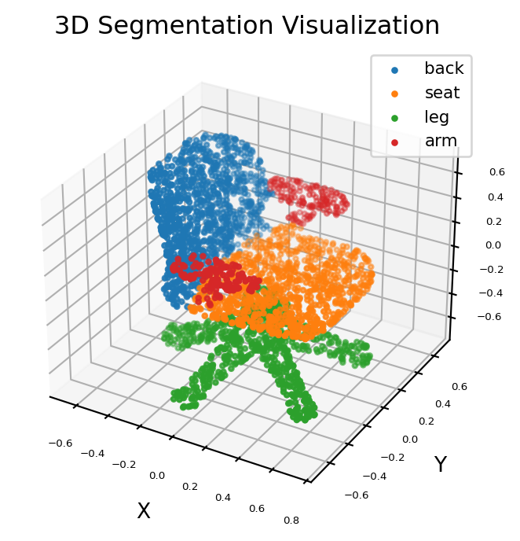

[English](README.md) | 简体中文

# PointNet 椅子点云部件分割

<a id="overview"></a>
## 算法与来源

PointNet 使用共享 MLP 和对称最大池化进行点云分割。本示例识别椅子的四种部件：靠背、座面、椅腿和扶手，输出保持输入点顺序。

参考：[论文](https://arxiv.org/abs/1612.00593), [官方实现](https://github.com/charlesq34/pointnet), [S100 PointNet 项目](https://gitee.com/chenguanzhong/rdk_-s100_-point-net_-official).

<a id="directory"></a>
## 目录结构

```text
pointnet/
├── conversion/  # 导出与量化配置
├── evaluator/  # 评估程序与指标
├── model/  # 模型文件与下载脚本
├── runtime/  # 推理程序
├── test_data/  # 示例输入
├── tests/  # 自动化测试
├── README.md  # 英文说明
└── README_cn.md  # 中文说明
```

板端推理
需要 S100 板端 SDK 和已发布 HBM；下方图像和性能均为源记录。

<a id="support-matrix"></a>
## 支持矩阵

| Target | 变体 | Python | C++ |
| --- | --- | --- | --- |
| s100 | chair，四类部件 | supported | not-supported |
| x5 / s100p / s600 | 无已发布制品 | not-supported | not-supported |

<a id="prerequisites"></a>
## 环境前提

使用 RDK S100 及其配套 `hbm_runtime`，不要用 PyPI 同名包替代板端 SDK。
入口要求 Python 3.10+、NumPy、PyYAML；绘图另需 matplotlib。固件/SDK 版本与内存/磁盘
预算由部署环境选定并以实际运行测量；请预留 HBM 和结果文件空间。
主机 help/list/dry-run 不需要模型或 SDK。

<a id="quickstart"></a>
## 快速体验

在 S100 的仓库根目录执行。下载是显式步骤，`predict` 不会下载模型。
输入 `test_data/chair.pts` 已随仓库提供。
```bash
# cwd: repository root
python3 -m pip install numpy PyYAML matplotlib
bash samples/vision/pointnet/model/download.sh --target s100
python3 samples/vision/pointnet/runtime/python/main.py --target s100
```

退出码 0 且生成 `outputs/pointnet/result.json` 表示命令完成。对照查看 `result.png` 和
`result_orig.png`；图轴沿用源可视化的 X/Z/Y 排列。运行时校验点数与编译模型一致，不静默采样或补点。

<a id="expected-results"></a>
## 预期结果

`labels.npy` 是 int32 `(N,)` 部件标签，顺序对应输入行；`result.json` 包含各类点数、归一化
信息、制品身份和实际 metadata。计数之和为 N，但不要求任意输入都出现全部四类。
图像看起来合理不能代替精度评估。



<a id="entry-points"></a>
## 入口索引

[模型准备](model/README_cn.md) · [Python 参数与 API](runtime/python/README_cn.md)
· [转换说明](conversion/README_cn.md) · [评估说明](evaluator/README_cn.md)。本例没有 C++ 实现。

<a id="license"></a>
## 许可

代码遵循仓库 [Apache-2.0](../../../LICENSE)。训练项目和模型权重保留各自条款；
发布清单未提供独立权重许可声明，不能把示例代码许可直接当作权重许可。
