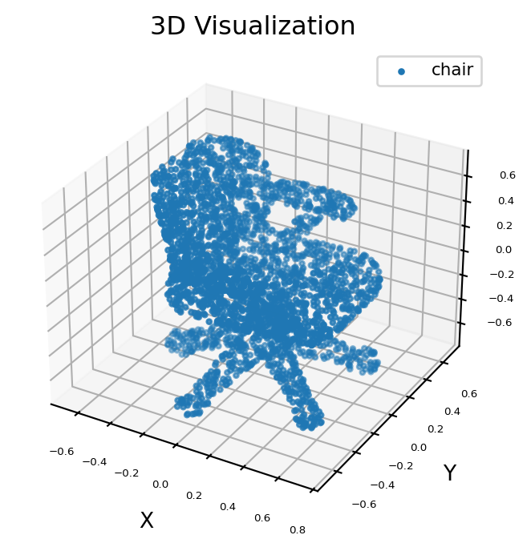

English | [简体中文](README_cn.md)

# PointNet validation and source-recorded results

<a id="dataset"></a>
## Input data

`../test_data/chair.pts` is a single delivered XYZ cloud, not a labeled evaluation
split. There is no dataset downloader, label array, split version or dataset-wide
accuracy evaluator in the source. Use the delivered file unchanged for the
functional smoke command; prepare external labeled data separately for real metrics.

<a id="directory"></a>
## Directory structure

```text
evaluator/
├── README.md  # English instructions
└── README_cn.md  # Chinese instructions
```

<a id="environment"></a>
## Environment

Run in the RDK S100 HBM/SDK environment. Use Python 3.10+, NumPy and PyYAML; plotting additionally requires matplotlib.

<a id="command"></a>
## Commands

```bash
# cwd: repository root; on S100 with the published HBM already prepared
python3 samples/vision/pointnet/runtime/python/main.py --target s100 --no-plot --output-dir outputs/pointnet-check
```

Smoke options: `--target s100` (parser default auto→s100), `--no-plot` (default
false), `--output-dir outputs/pointnet-check` (default outputs/pointnet).
Input defaults to the delivered chair; other options are in the
[complete runtime table](../runtime/python/README.md#parameters).

<a id="metrics"></a>
## Interpretation

A functional run should produce N labels in 0..3; counts sum to N. Inspect point
regions using the source figures below. Seeing all four colors is neither a
mandatory condition for every cloud nor an accuracy metric. Dataset mIoU and per-part IoU require point-level ground-truth labels. The source's “trans”
and “pred” quantization numbers lack a named metric and cannot be called mIoU.

<a id="outputs"></a>
## Outputs

`outputs/pointnet-check/labels.npy` stores point IDs and `result.json` stores counts,
normalization and metadata. Remove `--no-plot` to also write `result_orig.png` and
`result.png`. Dataset metrics require ground-truth point labels.




<a id="reference-results"></a>
## S100 reference performance

The S100 `hrt_model_exec` reference table
does not state latency units, exact invocation, SDK version, or artifact digest;
record these conditions when measuring a new model.

| Threads | Frames | Total Latency | Average Latency | FPS |
| --- | --- | --- | --- | --- |
| 1 | 100 | 143.63 | 1.43 | 689.61 |
| 2 | 100 | 216.20 | 2.16 | 914.32 |
| 4 | 100 | 429.76 | 4.30 | 910.70 |
| 8 | 100 | 839.86 | 8.35 | 910.84 |

The original conversion record also reports int16 “trans > 0.9999” and “pred > 0.98”;
see the [quantization results](../conversion/README.md#calibration).

<a id="boundaries"></a>
## Scope

No labeled dataset evaluator or BPU benchmark helper is bundled; reproducing
the source-recorded performance requires the artifact, environment and command
identity listed above. S100P/S600 have no published
PointNet asset and are not silently mapped to S100. Code follows
[Apache-2.0](../../../../LICENSE).
