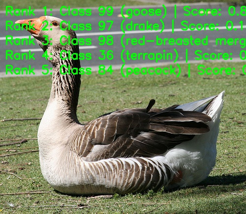

# RepVGG image classification

RepVGG folds training branches into a stack of 3×3 convolutions for inference.

[中文说明](README_cn.md)

<a id="overview"></a>

## Overview

RepVGG is a VGG-style convolutional network family that uses structural re-parameterization. During training it can use multi-branch structures, while during deployment it is converted into a plain stack of `3x3` convolution and ReLU layers for efficient inference.

- **Paper**: [RepVGG: Making VGG-style ConvNets Great Again](https://arxiv.org/abs/2101.03697)
- **Reference Implementation**: [DingXiaoH/RepVGG](https://github.com/DingXiaoH/RepVGG)

Feature highlights:

- **Plain inference structure** — after deployment conversion the network
  is a VGG-style stack of `3x3` convolution + ReLU layers.
- **Structural re-parameterization** — the training-time identity and 1×1
  branches are folded into the deployment-time convolutions.
- **Hardware efficiency** — plain conv + ReLU operators are friendly to
  edge inference.
- **Variant scaling** — published variants `A0`, `A1`, `A2`, `B0`,
  `B1g2`, and `B1g4`.


*Figure (upstream paper Fig. 2): (A) ResNet; (B) RepVGG training — the
3×3 blocks additionally carry identity and 1×1 branches, used only for
training; (C) RepVGG inference — the branches are folded into a plain
3×3 stack (5 stages, stride-2 downsampling at each stage start). The
deployed artifacts are the already-reparameterized INT8 a0/b0/b1g2/...
variants at 224×224 NV12
(see [Support matrix](#support-matrix)).*

One BGR image produces ImageNet-1k Top-K class IDs, scores and optional
labels. The `RepVGGClassifier` class runs a `preprocess → infer → postprocess` flow
chained by `predict` (labels, drawing and file output belong to the CLI
layer; see [runtime/python/README.md](runtime/python/README.md)).

<a id="directory"></a>
## Directory structure

```text
repvgg/
├── conversion/  # Export and quantization configuration
├── evaluator/  # Evaluation commands and metrics
├── model/  # Model files and download scripts
├── runtime/  # Python inference
├── test_data/  # Example inputs
├── tests/  # Automated tests
├── README.md  # English instructions
├── README_cn.md  # Chinese instructions
└── requirements-host.txt  # Python dependencies
```

<a id="support-matrix"></a>
## Support matrix

| Target | Variant | Python | C++ |
| --- | --- | --- | --- |
| x5 | a0 | supported | not-supported |
| x5 | a1 | supported | not-supported |
| x5 | a2 | supported | not-supported |
| x5 | b0 | supported | not-supported |
| x5 | b1g2 | supported | not-supported |
| x5 | b1g4 | supported | not-supported |
| s100 | a0 | not-supported | not-supported |
| s100 | a1 | not-supported | not-supported |
| s100 | a2 | not-supported | not-supported |
| s100 | b0 | not-supported | not-supported |
| s100 | b1g2 | not-supported | not-supported |
| s100 | b1g4 | not-supported | not-supported |
| s100p | a0 | not-supported | not-supported |
| s100p | a1 | not-supported | not-supported |
| s100p | a2 | not-supported | not-supported |
| s100p | b0 | not-supported | not-supported |
| s100p | b1g2 | not-supported | not-supported |
| s100p | b1g4 | not-supported | not-supported |
| s600 | a0 | not-supported | not-supported |
| s600 | a1 | not-supported | not-supported |
| s600 | a2 | not-supported | not-supported |
| s600 | b0 | not-supported | not-supported |
| s600 | b1g2 | not-supported | not-supported |
| s600 | b1g4 | not-supported | not-supported |

Use the Python CLI with a lowercase variant ID; it resolves to the exact case-sensitive published filename.

<a id="prerequisites"></a>
## Prerequisites

Use a full repository checkout. On X5 use the matching board image and its `hbm_runtime`; install host dependencies in a virtual environment as below. Host-side comparison tools use SciPy; board inference uses the dependencies in the matching runtime image.

Use a full repository checkout. On X5 use the matching board image and
its `hbm_runtime`; install the host dependencies in a virtual environment
as below. Host-side comparison tools use SciPy; board inference uses the dependencies in the matching runtime image. Native inference needs no OE toolchain; conversion
prerequisites are documented under [conversion](conversion/README.md).
```bash
# cwd: repository root
python3 -m venv .venv-repvgg
source .venv-repvgg/bin/activate
python3 -m pip install -r samples/vision/repvgg/requirements-host.txt
python3 -c "import cv2, numpy, yaml; print('host dependencies: ok')"
```

<a id="quickstart"></a>
## Quick start

From the repository root, prepare the X5 artifact with the model downloader, then run inference with the bundled image and the selected artifact reference.

```bash
# cwd: repository root
bash samples/vision/repvgg/model/download.sh x5 a0
python3 samples/vision/repvgg/runtime/python/main.py \
  --target x5 --variant a0 \
  --test-img samples/vision/repvgg/test_data/gooze.JPEG \
  --label-file datasets/imagenet/imagenet_classes.names
```

<a id="expected-results"></a>
## Expected results

The default variant is `a0`; the other variants are chosen explicitly. Softmax scores produce a stable Top-K, with exact ties ordered by ascending class ID. `gooze.JPEG` is a functional input, not dataset accuracy evidence. Pass `--img-save-path` to save an image; otherwise results are printed to stdout.

The screenshot below shows a reference run from the X5 release: the
demo overlay draws the top-5 ranks onto the bundled test image, with
rank 1 being class 99 (goose).



<a id="performance"></a>
## Performance data

Published performance records; full timing conditions and all columns
are listed under [evaluation](evaluator/README.md#reference-results).
Single-thread latency and multi-thread FPS are measured under different
concurrency and are not reciprocal quantities. Compare latency and FPS using
the same thread count, concurrent submission mode and BPU utilization.

<a id="entry-points"></a>
## Entry points

[Model](model/README.md) · [Python](runtime/python/README.md) · [Conversion](conversion/README.md) · [Evaluation](evaluator/README.md)

<a id="license"></a>
## License

Source Python headers retain Apache-2.0 provenance. Conversion YAMLs retain their original proprietary notices verbatim; Before redistribution, follow the original conversion YAML notices and applicable upstream weight license terms.
