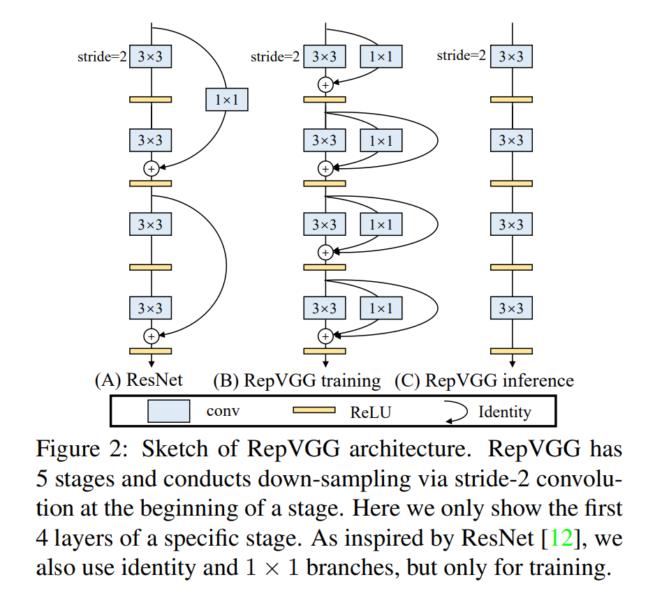

# RepVGG 图像分类

<a id="overview"></a>

## 概述

RepVGG 是一种 VGG 风格的卷积神经网络家族，核心思想是结构重参数化。训练阶段可以使用多分支结构，部署阶段转换为由 `3x3` 卷积和 ReLU 组成的直连结构，以提升推理效率。

- **论文**: [RepVGG: Making VGG-style ConvNets Great Again](https://arxiv.org/abs/2101.03697)
- **参考实现**: [DingXiaoH/RepVGG](https://github.com/DingXiaoH/RepVGG)

核心特性：

- **直连推理结构**——部署转换后网络即为 `3x3` 卷积 + ReLU 的
  VGG 风格直连堆叠。
- **结构重参数化**——训练期的恒等分支与 1×1 分支被折叠进部署期的
  卷积层。
- **硬件效率**——纯卷积 + ReLU 算子对边缘推理友好。
- **变体缩放**——提供 `A0`、`A1`、`A2`、`B0`、`B1g2`、`B1g4`
  六个变体。



*图（上游论文 Fig. 2）：(A) ResNet；(B) RepVGG 训练期——3×3 block 额外
携带仅训练期使用的恒等与 1×1 分支；(C) RepVGG 推理期——分支折叠成纯
3×3 堆叠（5 个 stage，stage 起始用 stride-2 下采样）。实际部署
制品是已重参数化的 INT8 a0/b0/b1g2/… 变体（224×224 NV12，见
[支持范围](#support-matrix)）。*

输入一张 BGR 图像，输出 ImageNet-1k Top-K 类别 ID、分数和可选标签。
`RepVGGClassifier` 类执行由 `predict` 串联的 `preprocess → infer → postprocess`
流程（标签读取、绘图和文件输出由 CLI 层负责，见
[runtime/python/README_cn.md](runtime/python/README_cn.md)）。

<a id="support-matrix"></a>
## 支持矩阵

| 目标 | 变体 | Python | C++ |
| --- | --- | --- | --- |
| x5 | a0 | supported | not-supported |
| x5 | a1 | supported | not-supported |
| x5 | a2 | supported | not-supported |
| x5 | b0 | supported | not-supported |
| x5 | b1g2 | supported | not-supported |
| x5 | b1g4 | supported | not-supported |
| s100 | a0 | not-supported | not-supported |
| s100 | a1 | not-supported | not-supported |
| s100 | a2 | not-supported | not-supported |
| s100 | b0 | not-supported | not-supported |
| s100 | b1g2 | not-supported | not-supported |
| s100 | b1g4 | not-supported | not-supported |
| s100p | a0 | not-supported | not-supported |
| s100p | a1 | not-supported | not-supported |
| s100p | a2 | not-supported | not-supported |
| s100p | b0 | not-supported | not-supported |
| s100p | b1g2 | not-supported | not-supported |
| s100p | b1g4 | not-supported | not-supported |
| s600 | a0 | not-supported | not-supported |
| s600 | a1 | not-supported | not-supported |
| s600 | a2 | not-supported | not-supported |
| s600 | b0 | not-supported | not-supported |
| s600 | b1g2 | not-supported | not-supported |
| s600 | b1g4 | not-supported | not-supported |

S 系列无对应制品，所有目标均无 C++ 实现。

CLI 小写变体 ID 映射到准确发布文件名；文件名大小写保持不变。

<a id="prerequisites"></a>
## 前提

使用完整仓库检出。X5 推理需要匹配的板端镜像与 `hbm_runtime`；主机
依赖按下方装入虚拟环境。SciPy 仅用于主机对照测试，板端推理不依赖
它。原生推理不需要 OE 工具链；重新转换的前提见
[conversion](conversion/README_cn.md) 文档。

```bash
# cwd: repository root
python3 -m venv .venv-repvgg
source .venv-repvgg/bin/activate
python3 -m pip install -r samples/vision/repvgg/requirements-host.txt
python3 -c "import cv2, numpy, yaml; print('host dependencies: ok')"
```

<a id="quickstart"></a>
## 快速体验

在 X5 上从仓库根目录执行。下载成功时退出码 0 并打印观测摘要；推理成功时
退出码 0 并打印五条结果。推理不会自动下载模型。

```bash
# cwd: repository root
bash samples/vision/repvgg/model/download.sh x5 a0
python3 samples/vision/repvgg/runtime/python/main.py \
  --target x5 --variant a0 \
  --test-img samples/vision/repvgg/test_data/gooze.JPEG \
  --label-file datasets/imagenet/imagenet_classes.names
```

<a id="expected-results"></a>
## 预期结果

默认变体为 `a0`；其余变体须显式指定。分数采用 softmax，完全平局时
按类别 ID 升序稳定排序。`gooze.JPEG` 用于功能检查；数据集精度在 ImageNet 验证集上度量。
仅指定 `--img-save-path` 才保存文件。

下图为 X5 发布的参考运行效果：demo 将 Top-5 排名叠画在随附测试图上，
rank 1 为 class 99（goose）。


<a id="performance"></a>
## 性能数据

已发布性能记录：完整列与计时条件见
[评估说明](evaluator/README_cn.md#reference-results)。单线程延迟与多线程 FPS 采用不同的并发方式，
二者不能直接互相取倒数。比较延迟与 FPS 时，应使用相同线程数、并发提交方式和 BPU 利用率。

<a id="directory"></a>
## 目录职责

`model/`：制品与下载；`runtime/python/`：原生 CLI、任务与运行器；
`conversion/`：六份 PTQ YAML；`evaluator/`：功能检查与已发布基准；
`test_data/`：`gooze.JPEG` 输入及随附资源；`tests/`：主机 unittest 套件。

<a id="entry-points"></a>
## 入口

[模型](model/README_cn.md) · [Python 运行时](runtime/python/README_cn.md) ·
[转换](conversion/README_cn.md) · [评估](evaluator/README_cn.md)

<a id="license"></a>
## 许可

源 Python 文件保留 Apache-2.0 出处。转换 YAML 原样保留其原始专有声明；
仓库许可不覆盖这些声明或上游权重许可。再分发转换材料或权重前请核对
适用声明。
