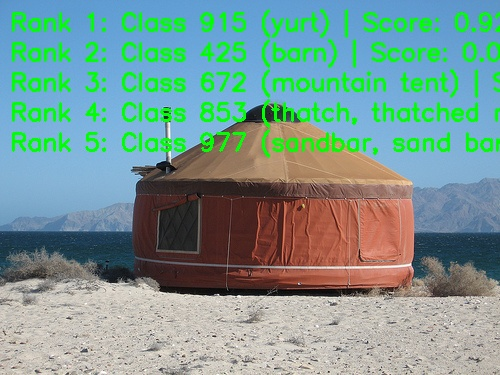

# RepViT image classification

<a id="overview"></a>

## Overview

RepViT revisits lightweight mobile CNN design from a ViT perspective. It keeps a pure CNN deployment structure while borrowing lightweight ViT design ideas, and improves inference efficiency through structural reparameterization.

- **Paper**: [RepViT: Revisiting Mobile CNN From ViT Perspective](http://arxiv.org/abs/2307.09283)
- **Reference Implementation**: [THU-MIG/RepViT](https://github.com/THU-MIG/RepViT)

Feature highlights:

- **ViT-inspired mobile CNN** — revisits the MobileNet-style
  architecture from a lightweight ViT perspective.
- **Structural reparameterization** — fuses training-time structural
  branches (3×3DW with a 1×1DW branch) into a single 3×3DW for
  deployment-time inference.
- **Separated mixers** — inside a single block, the token-mixer part
  (3×3 depthwise convolution, with SE in the SE variant) and the
  channel-mixer part (the 1×1 FFN) are decoupled and stacked one after
  the other, replacing the MobileNetV3 layout where both sit inside the
  inverted-bottleneck block — not two separate network blocks.
- **Efficient deployment** — m0.9, m1.0, and m1.1 RDK X5 deployment
  models with packed NV12 input.


*Figure (upstream paper Fig. 3): the four-stage overview. Stem: two
stacked stride-2 3×3 convolutions. In-stage RepViTBlock (yellow): a 3×3DW
token mixer with a parallel 1×1DW branch, both summed by a residual add,
followed by the FFN channel mixer. Downsample unit between stages
(orange): a RepViTBlock at the stage resolution, then a stride-2 3×3DW,
a 1×1, and an FFN — halving the resolution and mapping C_i to C_i+1.
RepViTSEBlock (green): the same structure with an SE module between the
token mixer and the FFN. Bottom: at inference the parallel 3×3DW + 1×1DW
branches fuse into a single 3×3DW.*


*Figure (upstream paper Fig. 4): (a) a MobileNetV3 block with optional
squeeze-and-excite; (b) structural reparameterization separates the
token mixer (3×3DW) and channel mixer (1×1) by relocating the depthwise
convolution and SE layer; (c) the multi-branch topology consolidates
into a single branch at inference. Together with the overview above this
explains why the deployed artifacts are the already-fused INT8
m0_9/m1_0/m1_1 variants at 224×224 NV12 (see [Support
matrix](#support-matrix)).*

One BGR image produces ImageNet-1k Top-K class IDs, scores and optional
labels. The `RepViTClassifier` class runs a `preprocess → infer → postprocess` flow
chained by `predict` (labels, drawing and file output belong to the CLI
layer; see [runtime/python/README.md](runtime/python/README.md)).

<a id="support-matrix"></a>
## Support matrix

| Target | Variant | Python | C++ |
| --- | --- | --- | --- |
| x5 | m0_9 | supported | not-supported |
| x5 | m1_0 | supported | not-supported |
| x5 | m1_1 | supported | not-supported |
| s100 | m0_9 | not-supported | not-supported |
| s100 | m1_0 | not-supported | not-supported |
| s100 | m1_1 | not-supported | not-supported |
| s100p | m0_9 | not-supported | not-supported |
| s100p | m1_0 | not-supported | not-supported |
| s100p | m1_1 | not-supported | not-supported |
| s600 | m0_9 | not-supported | not-supported |
| s600 | m1_0 | not-supported | not-supported |
| s600 | m1_1 | not-supported | not-supported |

Use the Python CLI with a lowercase variant ID; it resolves to the exact case-sensitive published filename.

<a id="prerequisites"></a>
## Prerequisites

Use a full repository checkout. On X5 use the matching board image and its `hbm_runtime`; install host dependencies in a virtual environment as below. Host-side comparison tools use SciPy; board inference uses the dependencies in the matching runtime image.

Use a full repository checkout. On X5 use the matching board image and
its `hbm_runtime`; install the host dependencies in a virtual environment
as below. Host-side comparison tools use SciPy; board inference uses the dependencies in the matching runtime image. Native inference needs no OE toolchain; conversion
prerequisites are documented under [conversion](conversion/README.md).
```bash
# cwd: repository root
python3 -m venv .venv-repvit
source .venv-repvit/bin/activate
python3 -m pip install -r samples/vision/repvit/requirements-host.txt
python3 -c "import cv2, numpy, yaml; print('host dependencies: ok')"
```

<a id="quickstart"></a>
## Quick start

From the repository root, prepare the X5 artifact with the model downloader, then run inference with the bundled image and the selected artifact reference.

```bash
# cwd: repository root
bash samples/vision/repvit/model/download.sh x5 m0_9
python3 samples/vision/repvit/runtime/python/main.py \
  --target x5 --variant m0_9 \
  --test-img samples/vision/repvit/test_data/yurt.JPEG \
  --label-file datasets/imagenet/imagenet_classes.names
```

<a id="expected-results"></a>
## Expected results

The default variant is `m0_9`; the other variants are chosen explicitly. Softmax scores produce a stable Top-K, with exact ties ordered by ascending class ID. `yurt.JPEG` is a functional input, not dataset accuracy evidence. Pass `--img-save-path` to save an image; otherwise results are printed to stdout.

The screenshot below shows a reference run from the X5 release: the
demo overlay draws the top-5 ranks onto the bundled test image, with
rank 1 being class 915 (yurt).



<a id="performance"></a>
## Performance data

Published performance records; full timing conditions and all columns
are listed under [evaluation](evaluator/README.md#reference-results).
Single-thread latency and multi-thread FPS are measured under different
concurrency and are not reciprocal quantities. Compare latency and FPS using
the same thread count, concurrent submission mode and BPU utilization.

<a id="directory"></a>
## Directory

`model/`: artifacts and download; `runtime/python/`: native CLI, task and runner; `conversion/`: 3 PTQ YAMLs; `evaluator/`: functional checks and published benchmarks; `test_data/`: `yurt.JPEG` input and accompanying resources; `tests/`: host unittest suite.

<a id="entry-points"></a>
## Entry points

[Model](model/README.md) · [Python](runtime/python/README.md) · [Conversion](conversion/README.md) · [Evaluation](evaluator/README.md)


<a id="license"></a>
## License

Source Python headers retain Apache-2.0 provenance. Conversion YAMLs retain their original proprietary notices verbatim; Before redistribution, follow the original conversion YAML notices and applicable upstream weight license terms.
