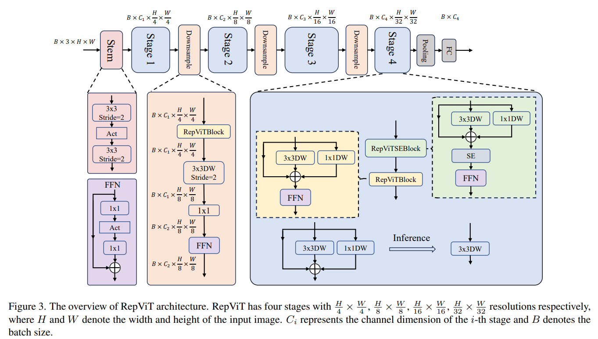
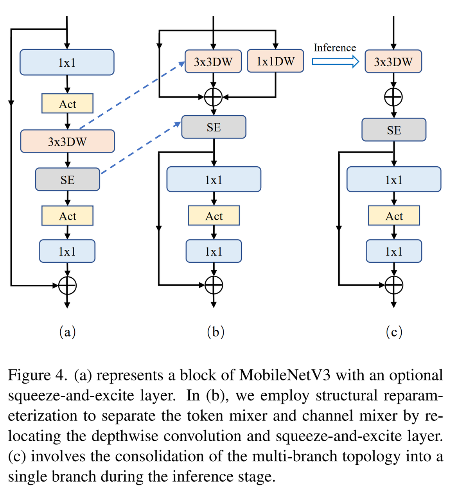
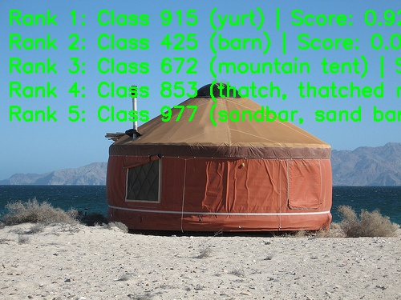

[English](./README.md) | 简体中文

# RepViT 模型说明

本目录给出 RepViT sample 在 Model Zoo 中的完整使用说明，包括算法概览、模型转换、运行时推理、模型文件管理和评测说明。

## 算法概述

RepViT 从轻量级 ViT 的角度重新审视移动端 CNN 设计。该模型保持纯 CNN 的部署结构，同时借鉴轻量级 ViT 的设计思路，并通过结构重参数化提升部署推理效率。

- **论文**：[RepViT: Revisiting Mobile CNN From ViT Perspective](http://arxiv.org/abs/2307.09283)
- **参考实现**：[THU-MIG/RepViT](https://github.com/THU-MIG/RepViT)

### 算法功能

RepViT 支持以下任务：

- ImageNet 1000 类图像分类

### 算法特点

- **ViT 视角的移动端 CNN**：从轻量级 ViT 视角重新设计 MobileNet 风格网络。
- **结构重参数化**：将训练期结构分支融合到部署期推理结构中。
- **Mixer 解耦设计**：将 token mixer 和 channel mixer 解耦，简化块结构。
- **高效部署**：提供 m0.9、m1.0、m1.1 三个 RDK X5 部署模型，输入格式为 packed NV12。





## 目录结构

```text
.
|-- conversion
|   |-- RepViT_m0_9_config.yaml
|   |-- RepViT_m1_0_config.yaml
|   |-- RepViT_m1_1_config.yaml
|   |-- README.md
|   `-- README_cn.md
|-- evaluator
|   |-- README.md
|   `-- README_cn.md
|-- model
|   |-- download.sh
|   |-- README.md
|   `-- README_cn.md
|-- runtime
|   `-- python
|       |-- main.py
|       |-- repvit.py
|       |-- README.md
|       |-- README_cn.md
|       `-- run.sh
|-- test_data
|   |-- ImageNet_1k.json
|   |-- inference.png
|   |-- RepViT_architecture.png
|   |-- RepViT_DW.png
|   `-- yurt.JPEG
|-- README.md
`-- README_cn.md
```

## 快速开始

### Python

- 详细 Python 使用方式请参考 [runtime/python/README_cn.md](./runtime/python/README_cn.md)。
- 快速体验：

```bash
cd runtime/python
bash run.sh
```

## 模型转换

- 预编译 `.bin` 模型文件由 [model](./model/README_cn.md) 目录提供。
- 转换说明见 [conversion/README_cn.md](./conversion/README_cn.md)。

## 运行时推理

本 sample 维护的推理路径为 Python。

- Python 运行说明：[runtime/python/README_cn.md](./runtime/python/README_cn.md)

## 模型评测

评测说明、性能数据和验证摘要见 [evaluator/README_cn.md](./evaluator/README_cn.md)。

## 性能数据

下表为 RepViT 在 `RDK X5` 上的公开性能数据。

| 模型 | 尺寸 | 类别数 | 参数量 (M) | Float Top-1 | Quant Top-1 | 延迟 (ms) | FPS |
| --- | --- | --- | --- | --- | --- | --- | --- |
| RepViT-m1.1 | 224x224 | 1000 | 8.2 | 77.73% | 77.50% | 2.32 | 590.42 |
| RepViT-m1.0 | 224x224 | 1000 | 6.8 | 76.75% | 76.50% | 1.97 | 692.29 |
| RepViT-m0.9 | 224x224 | 1000 | 5.1 | 76.32% | 75.75% | 1.65 | 902.69 |



## 许可证

遵循 Model Zoo 顶层 License。
