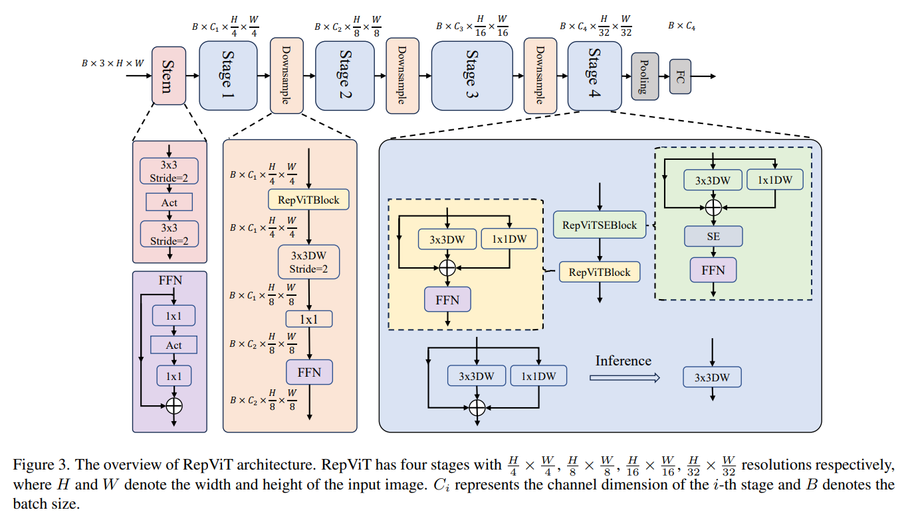
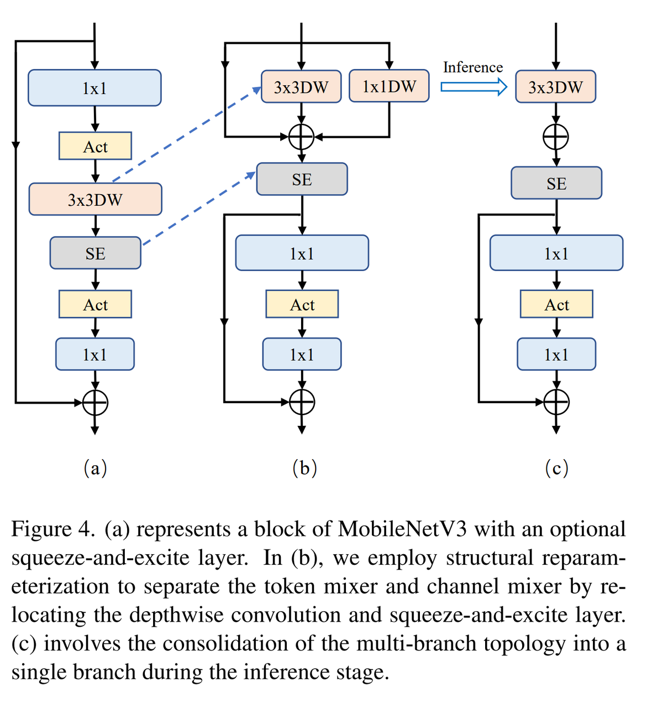

[English](README.md) | 简体中文

# RepViT 图像分类

RepViT 将 ViT 模块的设计应用于移动端卷积分类网络。

<a id="overview"></a>

## 概述

RepViT 从轻量级 ViT 的角度重新审视移动端 CNN 设计。该模型保持纯 CNN 的部署结构，同时借鉴轻量级 ViT 的设计思路，并通过结构重参数化提升部署推理效率。

- **论文**：[RepViT: Revisiting Mobile CNN From ViT Perspective](http://arxiv.org/abs/2307.09283)
- **参考实现**：[THU-MIG/RepViT](https://github.com/THU-MIG/RepViT)

核心特性：

- **ViT 视角的移动端 CNN**——从轻量级 ViT 视角重新审视
  MobileNet 式架构。
- **结构重参数化**——把训练期的结构分支（3×3DW 带 1×1DW 分支）融合为
  单条 3×3DW，加快部署期推理。
- **混合器分离**——在同一个 block 内部，token 混合部分（3×3 深度卷积，
  SE 变体另加 SE）与通道混合部分（1×1 FFN）解耦并先后堆叠，替代
  MobileNetV3 中两者同处倒瓶颈 block 内部的布局——并非两个独立的网络块。
- **高效部署**——提供 m0.9、m1.0、m1.1 三个 RDK X5 部署模型，使用
  打包 NV12 输入。



*图（上游论文 Fig. 3）：四级结构总览。stem：两层堆叠的 stride-2 3×3
卷积。stage 内 RepViTBlock（黄色）：3×3DW token 混合器与并行的 1×1DW
分支经残差相加，后接 FFN 通道混合器。stage 间下采样单元（橙色）：先在
本 stage 分辨率上过一个 RepViTBlock，再经 stride-2 3×3DW、1×1 和 FFN
——分辨率减半、通道 C_i 映射到 C_i+1。RepViTSEBlock（绿色）：相同结构
在 token 混合器与 FFN 之间加入 SE 模块。底部：推理期并行的 3×3DW +
1×1DW 分支融合为单个 3×3DW。*



*图（上游论文 Fig. 4）：(a) 带可选 squeeze-and-excite 的 MobileNetV3
block；(b) 结构重参数化通过挪动深度卷积与 SE 层，把 token 混合器
（3×3DW）与通道混合器（1×1）分离；(c) 推理期把多分支拓扑合并为单分支。
结合上图即可理解部署制品为何是已融合的 INT8 m0_9/m1_0/m1_1 变体
（224×224 NV12，见[支持范围](#support-matrix)）。*

输入一张 BGR 图像，输出 ImageNet-1k Top-K 类别 ID、分数和可选标签。
`RepViTClassifier` 类执行由 `predict` 串联的 `preprocess → infer → postprocess`
流程（标签读取、绘图和文件输出由 CLI 层负责，见
[runtime/python/README_cn.md](runtime/python/README_cn.md)）。

<a id="directory"></a>
## 目录结构

```text
repvit/
├── conversion/  # 导出与量化配置
├── evaluator/  # 评估程序与指标
├── model/  # 模型文件与下载脚本
├── runtime/  # 推理程序
├── test_data/  # 示例输入
├── tests/  # 自动化测试
├── README.md  # 英文说明
├── README_cn.md  # 中文说明
└── requirements-host.txt  # Python 依赖
```

<a id="support-matrix"></a>
## 支持矩阵

| 目标 | 变体 | Python | C++ |
| --- | --- | --- | --- |
| x5 | m0_9 | supported | not-supported |
| x5 | m1_0 | supported | not-supported |
| x5 | m1_1 | supported | not-supported |
| s100 | m0_9 | not-supported | not-supported |
| s100 | m1_0 | not-supported | not-supported |
| s100 | m1_1 | not-supported | not-supported |
| s100p | m0_9 | not-supported | not-supported |
| s100p | m1_0 | not-supported | not-supported |
| s100p | m1_1 | not-supported | not-supported |
| s600 | m0_9 | not-supported | not-supported |
| s600 | m1_0 | not-supported | not-supported |
| s600 | m1_1 | not-supported | not-supported |

S 系列无对应制品，所有目标均无 C++ 实现。

CLI 小写变体 ID 映射到准确发布文件名；文件名大小写保持不变。

<a id="prerequisites"></a>
## 前提

使用完整仓库检出。X5 推理需要匹配的板端镜像与 `hbm_runtime`；主机
依赖按下方装入虚拟环境。SciPy 仅用于主机对照测试，板端推理不依赖
它。原生推理不需要 OE 工具链；重新转换的前提见
[conversion](conversion/README_cn.md) 文档。

```bash
# cwd: repository root
python3 -m venv .venv-repvit
source .venv-repvit/bin/activate
python3 -m pip install -r samples/vision/repvit/requirements-host.txt
python3 -c "import cv2, numpy, yaml; print('host dependencies: ok')"
```

<a id="quickstart"></a>
## 快速体验

在 X5 上从仓库根目录执行。下载成功时退出码 0 并打印观测摘要；推理成功时
退出码 0 并打印五条结果。推理不会自动下载模型。

```bash
# cwd: repository root
bash samples/vision/repvit/model/download.sh x5 m0_9
python3 samples/vision/repvit/runtime/python/main.py \
  --target x5 --variant m0_9 \
  --test-img samples/vision/repvit/test_data/yurt.JPEG \
  --label-file datasets/imagenet/imagenet_classes.names
```

<a id="expected-results"></a>
## 预期结果

默认变体为 `m0_9`；其余变体须显式指定。分数采用 softmax，完全平局时
按类别 ID 升序稳定排序。`yurt.JPEG` 用于功能检查；数据集精度在 ImageNet 验证集上度量。
仅指定 `--img-save-path` 才保存文件。

下图为 X5 发布的参考运行效果：demo 将 Top-5 排名叠画在随附测试图上，
rank 1 为 class 915（yurt）。


<a id="performance"></a>
## 性能数据

已发布性能记录：完整列与计时条件见
[评估说明](evaluator/README_cn.md#reference-results)。单线程延迟与多线程 FPS 采用不同的并发方式，
二者不能直接互相取倒数。比较延迟与 FPS 时，应使用相同线程数、并发提交方式和 BPU 利用率。

<a id="entry-points"></a>
## 入口

[模型](model/README_cn.md) · [Python 运行时](runtime/python/README_cn.md) ·
[转换](conversion/README_cn.md) · [评估](evaluator/README_cn.md)

<a id="license"></a>
## 许可

Python 文件采用 Apache-2.0。转换 YAML 的许可见文件声明；
仓库许可不覆盖这些声明或上游权重许可。再分发转换材料或权重前请核对
适用声明。
