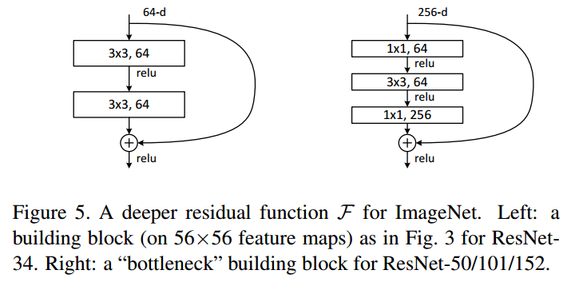
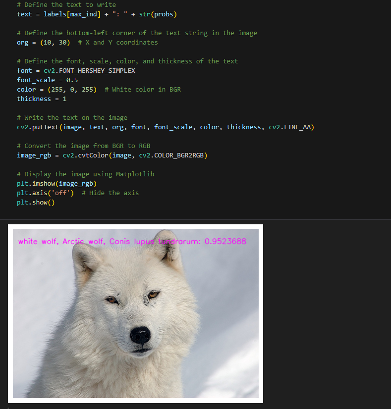

English | [简体中文](./README_cn.md)

# ResNet Model Description

This directory describes the standardized ResNet sample on `RDK X5`, including model conversion references, Python runtime inference, evaluation information, and reusable test assets.

## Algorithm Overview

ResNet is a convolutional neural network that introduces residual learning through shortcut connections, making it possible to train much deeper networks effectively.

- **Paper**: [Deep Residual Learning for Image Recognition](https://arxiv.org/abs/1512.03385)
- **Official Implementation**: [pytorch/vision/models/resnet.py](https://github.com/pytorch/vision/blob/main/torchvision/models/resnet.py)

### Algorithm Functionality

ResNet can complete the following task:

- ImageNet 1000-class image classification

### Algorithm Features

- **Residual Learning**: Residual blocks make identity mapping easy to learn and stabilize deep network optimization.
- **Shortcut Connections**: Skip connections mitigate the degradation problem in deep CNNs.
- **Classification Output**: The model outputs Top-K class IDs and confidence scores for ImageNet-1k labels.



## Directory Structure

```text
.
├── conversion
│   ├── README.md
│   └── README_cn.md
├── evaluator
│   ├── README.md
│   └── README_cn.md
├── model
│   ├── download.sh
│   ├── README.md
│   └── README_cn.md
├── runtime
│   └── python
│       ├── main.py
│       ├── README.md
│       ├── README_cn.md
│       ├── resnet.py
│       └── run.sh
├── test_data
│   ├── ImageNet_1k.json
│   ├── inference.png
│   ├── ResNet_architecture.png
│   ├── ResNet_architecture2.png
│   └── white_wolf.JPEG
├── README.md
└── README_cn.md
```

## QuickStart

### Python

- Go to [runtime/python/README.md](./runtime/python/README.md) for detailed Python usage.
- For a quick experience:

```bash
cd runtime/python
bash run.sh
```

## Model Conversion

- Prebuilt `.bin` model files are provided through the [model](./model/README.md) directory.
- If you need conversion references, please check [conversion/README.md](./conversion/README.md).

## Runtime Inference

The maintained inference path for this sample is Python.

- Python runtime guide: [runtime/python/README.md](./runtime/python/README.md)

## Evaluator

Evaluation notes, performance data, and validation summary are provided in [evaluator/README.md](./evaluator/README.md).

## Performance Data

The following table shows the published ResNet18 performance on `RDK X5`.

| Model | Size | Classes | Params (M) | Float Top-1 | Quant Top-1 | Latency (ms) | FPS |
| --- | --- | --- | --- | --- | --- | --- | --- |
| ResNet18 | 224x224 | 1000 | 11.2 | 71.5% | 70.5% | 2.95 | 449+ |



## License

Follows the Model Zoo top-level License.
