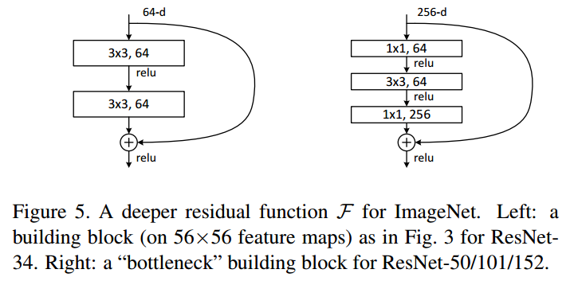
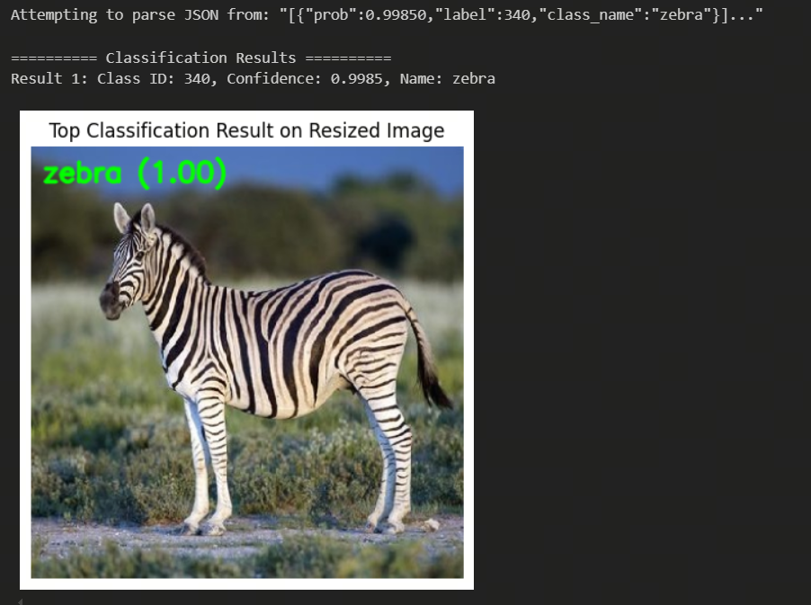
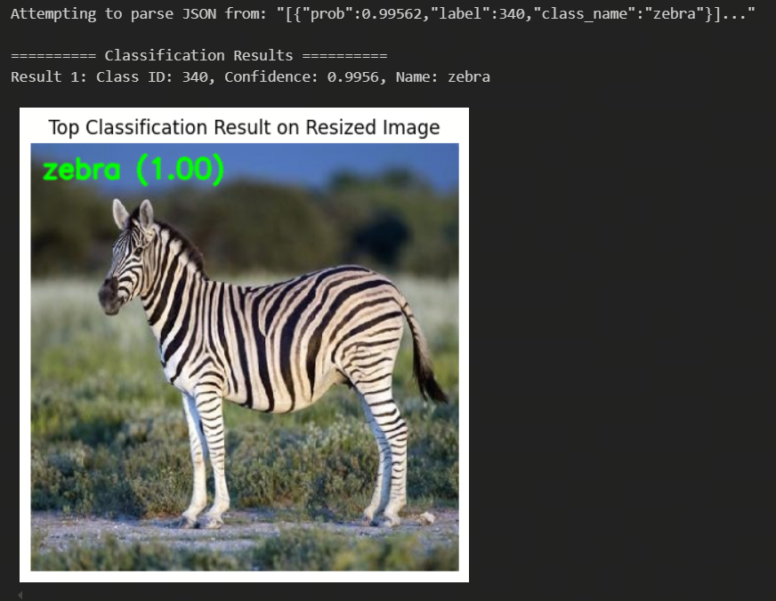
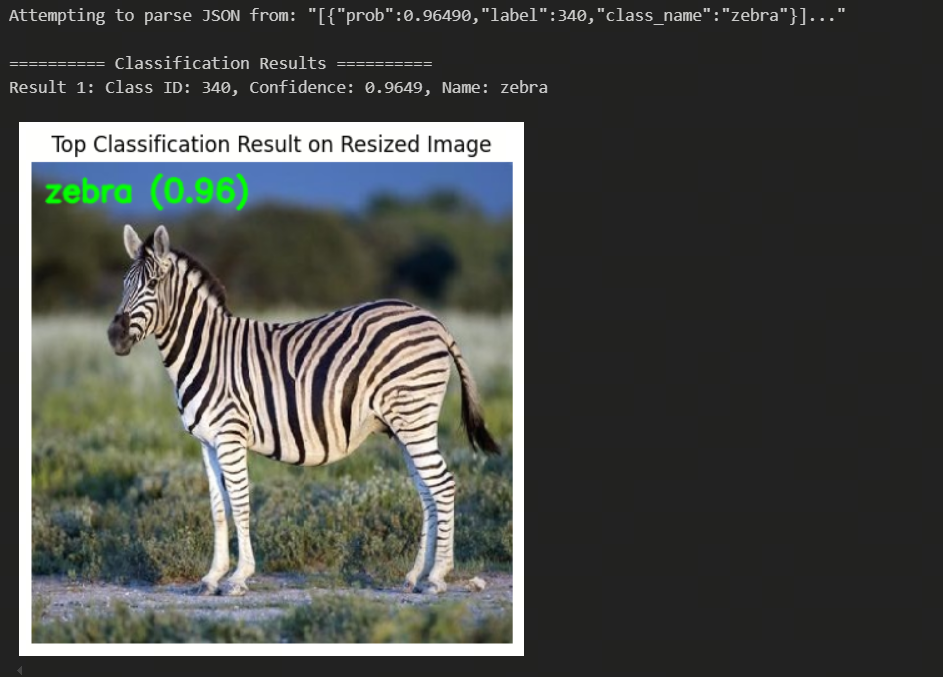
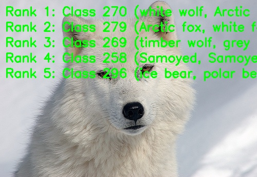

# ResNet image classification (ResNet18/50/152)

ImageNet-1k classification on RDK boards: one BGR image in, a stable Top-K
of `(class id, score, label)` out. The sample covers TorchVision ResNet18
on X5 plus S100/S600, and ResNet50/152 on S100/S600
([ResNet18 upstream](https://pytorch.org/vision/main/models/generated/torchvision.models.resnet18.html),
[ResNet50](https://pytorch.org/vision/main/models/generated/torchvision.models.resnet50.html),
[ResNet152](https://docs.pytorch.org/vision/main/models/generated/torchvision.models.resnet152.html));
it is the repository's single-model classification reference.
[中文说明](README_cn.md)

<a id="overview"></a>
## Overview

The maintained implementation is one Python flow (all targets) plus one
S-series C++ flow. Python resolves one exact artifact reference from the
platform release manifests, verifies the board identity, loads `hbm_runtime`
lazily, and runs a `preprocess → infer → postprocess` task assembled by
`predict` ([runtime/python/README.md](runtime/python/README.md)). The C++
flow uses the S-series `hbDNNInferV2` implementation
([runtime/cpp/README.md](runtime/cpp/README.md)).

### Algorithm background

ResNet was proposed by Kaiming He, Xiangyu Zhang, Shaoqing Ren, and Jian
Sun. Residual learning with shortcut connections lets each block learn a
residual instead of the full mapping, which stabilizes deep-network
optimization and avoids the degradation that plain layer stacks suffer as
depth grows ([paper](https://arxiv.org/abs/1512.03385),
[torchvision.models.resnet](https://github.com/pytorch/vision/blob/main/torchvision/models/resnet.py)).

Variant notes:

- **resnet18** — the lightweight residual variant; the S delivery positions it for quick classification validation.
- **resnet50** — bottleneck residual blocks (`1x1 → 3x3 → 1x1`) build a deeper network with controlled computation.
- **resnet152** — the 152-layer design trades more compute for representational capacity.



*The residual building block of ResNet-18/34 (left, two 3×3
convolutions) and the bottleneck building block of ResNet-50/101/152
(right, 1×1 → 3×3 → 1×1), Figure 5 of the ResNet paper.*

<a id="directory"></a>
## Directory structure

```text
resnet/
├── conversion/  # Export and quantization configuration
├── evaluator/  # Evaluation commands and metrics
├── model/  # Model files and download scripts
├── runtime/  # Python and native inference implementations
├── test_data/  # Example inputs
├── tests/  # Automated tests
├── README.md  # English instructions
├── README_cn.md  # Chinese instructions
└── requirements-host.txt  # Source or data file
```

<a id="support-matrix"></a>
## Support matrix

| Target | Variant | Language | Status |
| --- | --- | --- | --- |
| x5 | resnet18 | python | supported |
| s100 | resnet18 | python | supported |
| s100 | resnet18 | cpp | supported |
| s600 | resnet18 | python | supported |
| s600 | resnet18 | cpp | supported |
| s100 | resnet50 | python | supported |
| s600 | resnet50 | python | supported |
| s100 | resnet152 | python | supported |
| s600 | resnet152 | python | supported |
| s100p | any | python, cpp | not-supported (no ResNet asset row in the release manifest) |

<a id="prerequisites"></a>
## Prerequisites

Board Python execution needs the board image's matching `hbm_runtime`,
NumPy, and OpenCV-Python; the SDK is imported only when a model executes
(`--help`, `--list-models`, `--dry-run`, and host tests need no SDK).
Manifest reading also needs PyYAML. On a development host, install the
user-space dependencies from `requirements-host.txt`:

```bash
# cwd: repository root — success: "host dependencies: ok"
python3 -m venv .venv-resnet
source .venv-resnet/bin/activate
python3 -m pip install -r samples/vision/resnet/requirements-host.txt
python3 -c "import cv2, numpy, yaml; print('host dependencies: ok')"
```

The C++ build needs CMake, a C++17 compiler, OpenCV/gflags/fmt development
packages, and the Horizon DNN headers/libraries — see
[runtime/cpp/README.md](runtime/cpp/README.md). Model conversion runs in
the x86 OpenExplore environment, not on the board — see
[conversion/README.md](conversion/README.md).

<a id="quickstart"></a>
## Quick start

One complete path on an X5 board, commands run from the repository root.
Prerequisite: the board image with `hbm_runtime` and network access to the
manifest's model server.

```bash
# 1. Prepare the artifact (input: manifest row x5:resnet:resnet18_224x224_nv12.bin)
#    output: samples/vision/resnet/model/resnet18_224x224_nv12.bin
#    success: downloader exits 0 and prints the observed digest
bash samples/vision/resnet/model/download.sh x5

# 2. Run classification (input: the artifact above plus the bundled test image)
#    output: Top-5 class ids, scores, labels on stdout
#    success: exit code 0 and a printed Top-5 list
python3 samples/vision/resnet/runtime/python/main.py \
  --target x5 \
  --asset-id x5:resnet:resnet18_224x224_nv12.bin \
  --model-path samples/vision/resnet/model/resnet18_224x224_nv12.bin \
  --test-img samples/vision/resnet/test_data/white_wolf.JPEG \
  --label-file datasets/imagenet/imagenet_classes.names
```

For S100/S600 use the matching `s:resnet18:<target>/...` reference and the
the same root `datasets/imagenet/` labels; for the C++ flow use
`bash samples/vision/resnet/runtime/cpp/run.sh`. Full commands:
[runtime/python/README.md](runtime/python/README.md),
[runtime/cpp/README.md](runtime/cpp/README.md).

<a id="expected-results"></a>
## Expected results

The Python run prints a stable Top-K (default 5) of class IDs, scores, and
labels and exits 0; no output files are written unless `--img-save-path` is
given. The C++ binary prints the Top-K lines with the label file's
names. A board that cannot be identified, or a target without a
matching artifact, exits with an error instead of guessing.

Reference runs from the S release (one record per variant; the source does not state which
board produced them): each shows the S-runtime result for the
bundled [zebra_cls.jpg](test_data/zebra_cls.jpg) — zebra, class ID 340 —
with top-1 confidence 0.9985 (resnet18), 0.9956 (resnet50),
and 0.9649 (resnet152).





<a id="performance"></a>
## Performance data

Published ResNet18 record from the X5 source release (
x5-v1.1.3). The source does not state
the latency/FPS threading conditions; the same figure is preserved in the
[evaluator record](evaluator/README.md). The S release published no latency or accuracy figures for ResNet18/50/152.

| Model | Size | Classes | Params (M) | Float Top-1 | Quant Top-1 | Latency (ms) | FPS |
| --- | --- | --- | --- | --- | --- | --- | --- |
| ResNet18 | 224x224 | 1000 | 11.2 | 71.5% | 70.5% | 2.95 | 449+ |



*X5 release record (`test_data/inference.png`): the bundled
[white_wolf.JPEG](test_data/white_wolf.JPEG) ranks `white wolf` first,
followed by Arctic fox, timber wolf, Samoyed, and polar bear.*

<a id="entry-points"></a>
## Entry points

- Model preparation: [model/README.md](model/README.md)
- Python runtime: [runtime/python/README.md](runtime/python/README.md)
- C++ runtime (S100/S600): [runtime/cpp/README.md](runtime/cpp/README.md)
- Conversion: [conversion/README.md](conversion/README.md)
- Evaluation: [evaluator/README.md](evaluator/README.md)

<a id="license"></a>
## License

Sample code follows the repository top-level LICENSE (Apache-2.0). The
source models are the TorchVision ResNet18/50/152 distributions; upstream
model/weights licensing is governed by those distributions (see the
upstream links above).
Published artifacts follow the platform release manifests; the manifests
carry no separate license field, and no additional license is claimed here.

<a id="readable-example"></a>
## Readable example and custom models

[`runtime/python/main.py`](runtime/python/main.py) parses arguments, constructs
`ResNetClassifier`, calls `predict`, and displays results.
[`runtime/python/classify.py`](runtime/python/classify.py) contains model loading, `preprocess`, `infer`, `postprocess`, and `predict`.

The library accepts image paths or BGR arrays. For self-trained classifiers,
pass the compiled artifact path, board, input dimensions, class count, and
output policy to the constructor. See the
[Python runtime](runtime/python/README.md) for complete usage.
