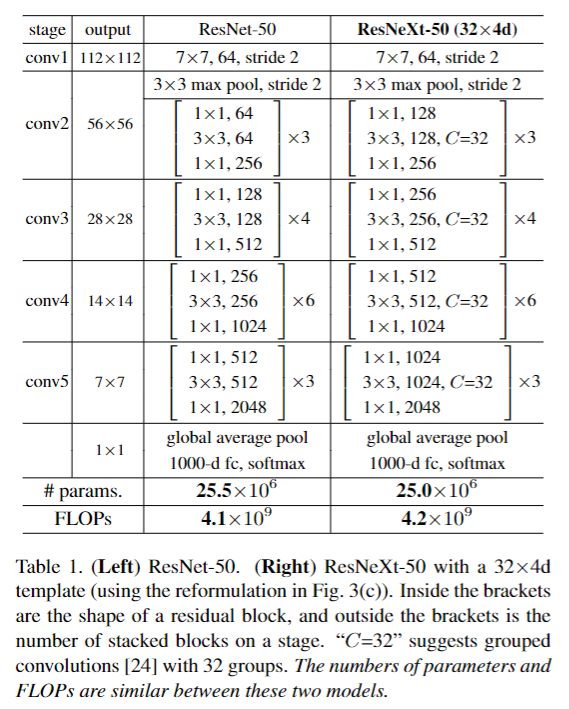
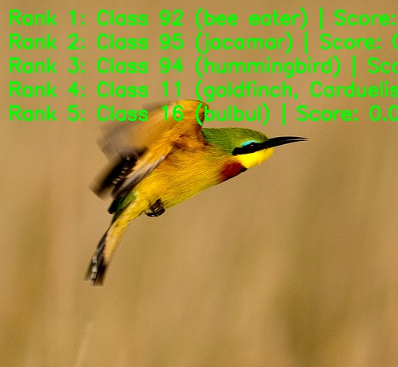

English | [简体中文](./README_cn.md)

# ResNeXt Model Description

This directory provides the complete usage guide for the ResNeXt sample in Model Zoo, including algorithm overview, model conversion, runtime inference, model file management, and evaluation notes.

## Algorithm Overview

ResNeXt extends the residual network family with a split-transform-merge design that increases cardinality instead of only scaling depth or width. It keeps a simple residual backbone while using grouped convolution to improve representation efficiency.

- **Paper**: [Aggregated Residual Transformations for Deep Neural Networks](https://arxiv.org/abs/1611.05431)
- **Reference Implementation**: [facebookresearch/ResNeXt](https://github.com/facebookresearch/ResNeXt)

### Algorithm Functionality

ResNeXt supports the following task:

- ImageNet 1000-class image classification

### Algorithm Features

- **Cardinality**: Improves representation power by increasing the number of parallel transformation paths.
- **Grouped Convolution**: Uses grouped convolution to balance accuracy and compute efficiency.
- **Residual Backbone**: Preserves the stable residual learning pattern for scalable CNN design.
- **Classification Output**: Produces Top-K class IDs and confidence scores for ImageNet-1k labels.



## Directory Structure

```text
.
|-- conversion
|   |-- README.md
|   |-- README_cn.md
|   `-- ResNeXt50_32x4d_config.yaml
|-- evaluator
|   |-- README.md
|   `-- README_cn.md
|-- model
|   |-- download.sh
|   |-- README.md
|   `-- README_cn.md
|-- runtime
|   `-- python
|       |-- main.py
|       |-- README.md
|       |-- README_cn.md
|       |-- resnext.py
|       `-- run.sh
|-- test_data
|   |-- bee_eater.JPEG
|   |-- ImageNet_1k.json
|   |-- inference.png
|   `-- ResNeXt_architecture.png
|-- README.md
`-- README_cn.md
```

## QuickStart

### Python

- Go to [runtime/python/README.md](./runtime/python/README.md) for detailed Python usage.
- For a quick experience:

```bash
cd runtime/python
bash run.sh
```

## Model Conversion

- Prebuilt `.bin` model files are provided through the [model](./model/README.md) directory.
- Conversion guidance is provided in [conversion/README.md](./conversion/README.md).

## Runtime Inference

The maintained inference path for this sample is Python.

- Python runtime guide: [runtime/python/README.md](./runtime/python/README.md)

## Evaluator

Evaluation notes, performance data, and validation summary are provided in [evaluator/README.md](./evaluator/README.md).

## Performance Data

The following table shows the published ResNeXt performance on `RDK X5`.

| Model | Size | Classes | Params (M) | Float Top-1 | Quant Top-1 | Latency (ms) | FPS |
| --- | --- | --- | --- | --- | --- | --- | --- |
| ResNeXt50_32x4d | 224x224 | 1000 | 24.99 | 76.25% | 76.00% | 5.89 | 189.61 |



## License

Follows the Model Zoo top-level License.
