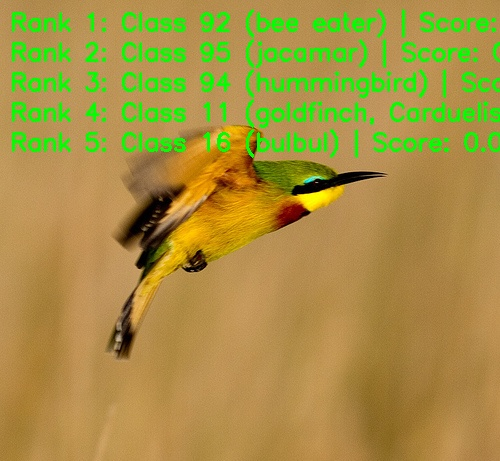

# ResNeXt image classification

<a id="overview"></a>

## Overview

ResNeXt extends the residual network family with a split-transform-merge design that increases cardinality instead of only scaling depth or width. It keeps a simple residual backbone while using grouped convolution to improve representation efficiency.

- **Paper**: [Aggregated Residual Transformations for Deep Neural Networks](https://arxiv.org/abs/1611.05431)
- **Reference Implementation**: [facebookresearch/ResNeXt](https://github.com/facebookresearch/ResNeXt)

Feature highlights:

- **Cardinality** — improves representation power by increasing the
  number of parallel transformation paths (the "32" in 32×4d: 32 groups)
  instead of only scaling depth or width.
- **Grouped convolution** — balances accuracy and compute efficiency
  while keeping parameters/FLOPs close to the ResNet counterpart.
- **Residual backbone** — preserves the stable residual learning pattern
  (split-transform-merge inside each block).
- **Classification output** — Top-K class IDs and confidence scores for
  ImageNet-1k labels.


*Figure (upstream paper Table 1): the stage-by-stage block table — each
ResNeXt bottleneck replaces the dense 1×1/3×3/1×1 transform with a
grouped 3×3 (C=32), keeping parameters (25.0 vs 25.5 M) and FLOPs
(4.2 vs 4.1 G) nearly unchanged versus ResNet-50. The figure depicts
the upstream training architecture, while the deployed artifact
is the INT8-quantized `50_32x4d` variant at 224×224 NV12 (see [Support
matrix](#support-matrix)).*

One BGR image produces ImageNet-1k Top-K class IDs, scores and optional
labels. The `ResNeXtClassifier` class runs a `preprocess → infer →
postprocess` flow chained by `predict` (labels, drawing and file output
belong to the CLI layer; see
[runtime/python/README.md](runtime/python/README.md)).

<a id="directory"></a>
## Directory structure

```text
resnext/
├── conversion/  # Export and quantization configuration
├── evaluator/  # Evaluation commands and metrics
├── model/  # Model files and download scripts
├── runtime/  # Python and native inference implementations
├── test_data/  # Example inputs
├── tests/  # Automated tests
├── README.md  # English instructions
├── README_cn.md  # Chinese instructions
└── requirements-host.txt  # Source or data file
```

<a id="support-matrix"></a>
## Support matrix

| Target | Variant | Python | C++ |
| --- | --- | --- | --- |
| x5 | 50_32x4d | supported | not-supported |
| s100 | 50_32x4d | not-supported | not-supported |
| s100p | 50_32x4d | not-supported | not-supported |
| s600 | 50_32x4d | not-supported | not-supported |

Use the Python CLI with a lowercase variant ID; it resolves to the exact case-sensitive published filename.

<a id="prerequisites"></a>
## Prerequisites

Use a full repository checkout. On X5 use the matching board image and its `hbm_runtime`; install host dependencies in a virtual environment as below. Host-side comparison tools use SciPy; board inference uses the dependencies in the matching runtime image.

Use a full repository checkout. On X5 use the matching board image and
its `hbm_runtime`; install the host dependencies in a virtual environment
as below. Host-side comparison tools use SciPy; board inference uses the dependencies in the matching runtime image. Native inference needs no OE toolchain; conversion
prerequisites are documented under [conversion](conversion/README.md).
```bash
# cwd: repository root
python3 -m venv .venv-resnext
source .venv-resnext/bin/activate
python3 -m pip install -r samples/vision/resnext/requirements-host.txt
python3 -c "import cv2, numpy, yaml; print('host dependencies: ok')"
```

<a id="quickstart"></a>
## Quick start

From the repository root, prepare the X5 artifact with the model downloader, then run inference with the bundled image and the selected artifact reference.

```bash
# cwd: repository root
bash samples/vision/resnext/model/download.sh x5 50_32x4d
python3 samples/vision/resnext/runtime/python/main.py \
  --target x5 --variant 50_32x4d \
  --test-img samples/vision/resnext/test_data/bee_eater.JPEG \
  --label-file datasets/imagenet/imagenet_classes.names
```

<a id="expected-results"></a>
## Expected results

The only published variant is `50_32x4d`, selected by default. Inference prints Top-5 IDs, softmax scores and labels. Exact ties use ascending class-ID order. The bundled image is a functional input. Pass `--img-save-path` to save an image; otherwise results are printed to stdout.

The screenshot below shows a reference run from the X5 release: the
demo overlay draws the top-5 ranks onto the bundled test image, with
rank 1 being class 92 (bee eater).



<a id="performance"></a>
## Performance data

Published performance records; full timing conditions and all columns
are listed under [evaluation](evaluator/README.md#reference-results).
Single-thread latency and multi-thread FPS are measured under different
concurrency and are not reciprocal quantities. Compare latency and FPS using
the same thread count, concurrent submission mode and BPU utilization.

<a id="entry-points"></a>
## Entry points

[Model](model/README.md) · [Python](runtime/python/README.md) · [Conversion](conversion/README.md) · [Evaluation](evaluator/README.md)

<a id="license"></a>
## License

Python code follows Apache-2.0. Follow the original conversion notices and applicable upstream model and weight license terms. Review the upstream model and weight license terms before redistribution.
