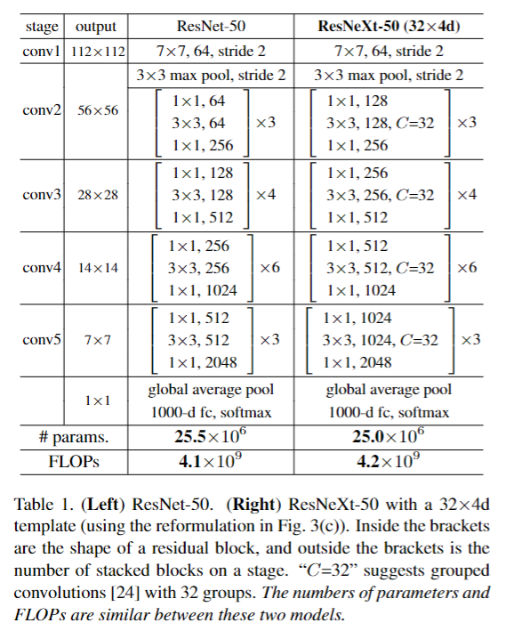

[English](README.md) | 简体中文

# ResNeXt 图像分类

ResNeXt 在 ResNet 的基础上采用组卷积与并行残差变换。

<a id="overview"></a>

## 概述

ResNeXt 在残差网络的基础上引入 split-transform-merge 设计，通过增加 cardinality 而不只是单纯增加网络深度或宽度，提升模型表达能力。该结构保留了简洁的残差主干，并通过组卷积提高表示效率。

- **论文地址**: [Aggregated Residual Transformations for Deep Neural Networks](https://arxiv.org/abs/1611.05431)
- **参考实现**: [facebookresearch/ResNeXt](https://github.com/facebookresearch/ResNeXt)

核心特性：

- **Cardinality（分支数）**——通过增加并行变换路径数（32×4d 中的
  "32"：32 组）提升表达能力，而不是只加深或加宽网络。
- **组卷积**——在保持参数量/FLOPs 与对应 ResNet 接近的同时平衡精度与
  计算效率。
- **残差主干**——保留稳定的残差学习模式（block 内
  split-transform-merge）。
- **分类输出**——产出 ImageNet-1k 标签的 Top-K 类别 ID 与置信度。



*图（上游论文 Table 1）：逐 stage 的 block 结构表——每个 ResNeXt
bottleneck 把稠密 1×1/3×3/1×1 变换替换为分组 3×3（C=32），参数量
（25.0 对 25.5 M）与 FLOPs（4.2 对 4.1 G）相对 ResNet-50 几乎不变。
图中为上游训练结构，实际
部署制品是 INT8 量化的 `50_32x4d` 变体（224×224 NV12，见
[支持范围](#support-matrix)）。*

输入一张 BGR 图像，输出 ImageNet-1k Top-K 类别 ID、分数和可选标签。`ResNeXtClassifier` 在 `classify.py` 中实现前处理、推理和后处理；标签读取、绘图和文件输出由 `cli.py` 负责。

<a id="directory"></a>
## 目录结构

```text
resnext/
├── conversion/  # 导出与量化配置
├── evaluator/  # 评估程序与指标
├── model/  # 模型文件与下载脚本
├── runtime/  # 推理程序
├── test_data/  # 示例输入
├── tests/  # 自动化测试
├── README.md  # 英文说明
├── README_cn.md  # 中文说明
└── requirements-host.txt  # Python 依赖
```

<a id="support-matrix"></a>
## 支持矩阵

| 目标 | 变体 | Python | C++ |
| --- | --- | --- | --- |
| x5 | 50_32x4d | supported | not-supported |
| s100 | 50_32x4d | not-supported | not-supported |
| s100p | 50_32x4d | not-supported | not-supported |
| s600 | 50_32x4d | not-supported | not-supported |

S 系列无对应制品，所有目标均无 C++ 实现。

CLI 小写变体 ID 映射到准确发布文件名；文件名大小写保持不变。

<a id="prerequisites"></a>
## 前提

使用完整仓库检出。X5 推理需要匹配的板端镜像与 `hbm_runtime`；主机
依赖按下方装入虚拟环境。SciPy 仅用于主机对照测试，板端推理不依赖
它。原生推理不需要 OE 工具链；重新转换的前提见
[conversion](conversion/README_cn.md) 文档。

```bash
# cwd: repository root
python3 -m venv .venv-resnext
source .venv-resnext/bin/activate
python3 -m pip install -r samples/vision/resnext/requirements-host.txt
python3 -c "import cv2, numpy, yaml; print('host dependencies: ok')"
```

<a id="quickstart"></a>
## 快速体验

在 X5 上从仓库根目录执行。下载成功时退出码 0 并打印观测摘要；推理成功时
退出码 0 并打印五条结果。推理不会自动下载模型。

```bash
# cwd: repository root
bash samples/vision/resnext/model/download.sh x5 50_32x4d
python3 samples/vision/resnext/runtime/python/main.py \
  --target x5 --variant 50_32x4d \
  --test-img samples/vision/resnext/test_data/bee_eater.JPEG \
  --label-file datasets/imagenet/imagenet_classes.names
```

<a id="expected-results"></a>
## 预期结果

唯一已发布变体为 `50_32x4d`，默认即选中。推理打印 Top-5 ID、softmax
分数与标签。完全平局按类别 ID 升序。随附图片仅作功能输入。仅指定
`--img-save-path` 才写文件。

下图为 X5 发布的参考运行效果：demo 将 Top-5 排名叠画在随附测试图上，
rank 1 为 class 92（bee eater）。


<a id="performance"></a>
## 性能数据

已发布性能记录：完整列与计时条件见
[评估说明](evaluator/README_cn.md#reference-results)。单线程延迟与多线程 FPS 采用不同的并发方式，
二者不能直接互相取倒数。比较延迟与 FPS 时，应使用相同线程数、并发提交方式和 BPU 利用率。

<a id="entry-points"></a>
## 入口

[模型](model/README_cn.md) · [Python 运行时](runtime/python/README_cn.md) ·
[转换](conversion/README_cn.md) · [评估](evaluator/README_cn.md)

<a id="license"></a>
## 许可

Python 代码遵循 Apache-2.0。转换材料保留各文件原声明；上游模型/权重
遵循其各自许可；再分发前请核对上游许可条款。
