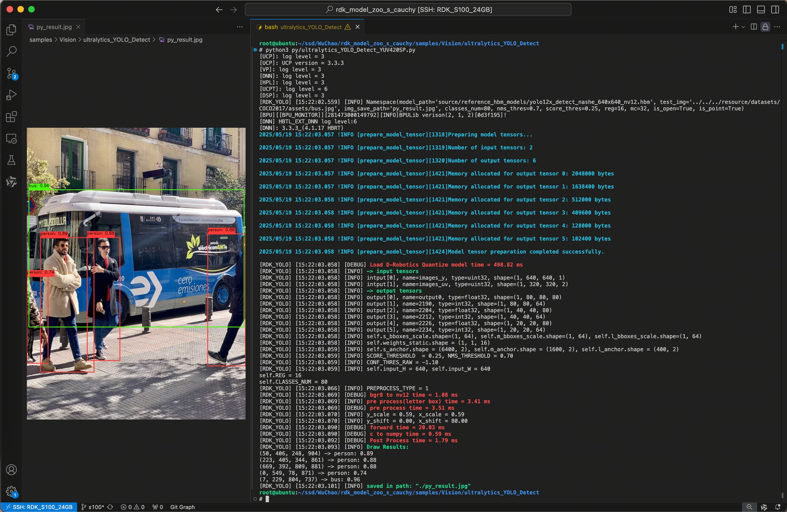
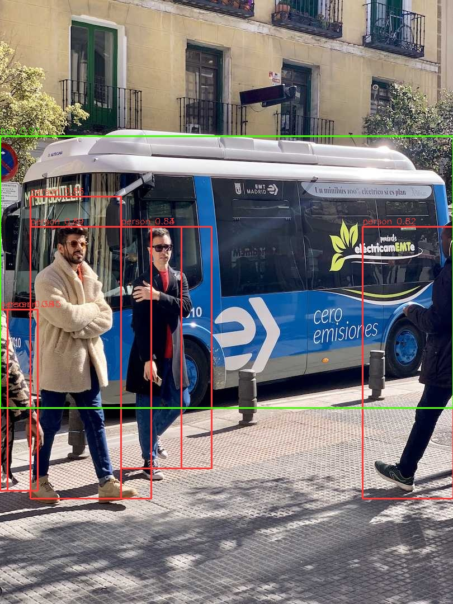
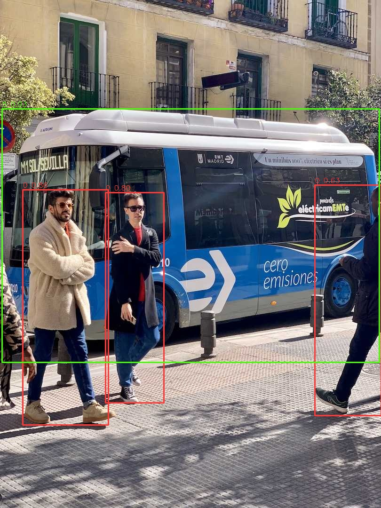

# Ultralytics YOLO — RDK X5 / S

[English](README.md)

<a id="overview"></a>

## 概览

本 Sample 为 RDK X5、S100、S100P、S600 提供目标检测、实例分割、姿态估计、分类及 YOLO26 旋转框任务。YOLO 检测头在多个尺度预测类别与框，CPU 端解码、筛选和还原原图坐标；分割、姿态、OBB 还输出各自的 mask、关键点和角度。模型源项目为 [Ultralytics](https://github.com/ultralytics/ultralytics)。

Python 按目标绑定输入、按模型系列选择任务协议，下载、绘图和评估共用。独立 YOLOv5、YOLOE 和 yolo26_depth 使用各自的模型与运行契约。

<a id="support-matrix"></a>
## 支持矩阵

状态按任务/语言区分。`supported` 表示有已发布制品和可运行实现；精度与性能数值另行记录在评估指南中。

| Scope | x5 | s100 | s100p | s600 |
|---|---|---|---|---|
| Python YOLOv8n / YOLO26n detect | supported | supported | supported | supported |
| Python other published scales/tasks | supported | supported | supported | supported |
| Python YOLOv9 seg c/e | supported | supported | supported | not-supported |
| Python YOLOv13 detect n/s/l/x | supported | not-supported | not-supported | not-supported |
| C++ detect/classify/pose/segment reference contracts | supported | supported | supported | supported |
| C++ OBB | not-supported | not-supported | not-supported | not-supported |

Python 发布组合详见 [模型清单](model/README_cn.md)：YOLOv5u/v10/12 为检测；YOLOv8/11 为 detect/seg/pose/cls；YOLOv9 分割仅 c/e，S600 无 t 检测及分割；YOLOv13 仅 X5。YOLO26 每个目标发布 25 个资产（五任务 × n/s/m/l/x）。C++ 支持范围及输入/head 契约见 [C++ 指南](runtime/cpp/README_cn.md)。

从[模型清单](model/README_cn.md)选择已发布的目标板卡、模型系列、任务和尺度组合。[评估指南](evaluator/README_cn.md)提供数据集计分流程和对应条件下的参考测量。

| 运行契约 | X5 | S100 / S100P / S600 |
|---|---|---|
| 制品 | `.bin` / bayese | `.hbm` / nashe、nashm、nashp |
| NV12 输入 | 一个 packed 缓冲区 | NHWC Y + UV |
| Python 检测 NMS 默认 | 0.70 | 0.45；YOLOv10 无 NMS |
| 分类 CLI resize | YOLO26 拉伸；其余 letterbox | 拉伸 |
| 分类文件名标记（不是输入覆盖） | YOLO26 224，其余 640 | 公开 URL 使用 224；S100/S100P v8/v11 保留 640 兼容 ID |

<a id="prerequisites"></a>
## 前置条件

需要完整仓库、Python 3、NumPy、OpenCV、SciPy、PyYAML；实际推理还需要匹配板端系统镜像提供的 `hbm_runtime`。显式准备依赖，并使用所选制品对应的板端镜像/SDK。按[模型清单](model/README_cn.md)选择目标、模型系列、任务和尺度组合。

推理、下载与主机转换环境分开：C++ 需要板端开发库，ONNX/量化编译需要训练与 OE 环境，详见各子目录。主机可使用 help/list/dry-run/download；板端推理需匹配目标制品。硬件身份来自 [平台注册表](../../../docs/release/platforms.json)。

<a id="quickstart"></a>
## 快速开始

从仓库根目录执行。先联网准备模型，再在匹配的 X5 上运行；输入图片已在仓库 test_data 中。

```bash
bash samples/vision/ultralytics_yolo/model/download_model.sh \
  --platform x5 --family yolov8 --task detect --model-size n
python samples/vision/ultralytics_yolo/runtime/python/main.py \
  --platform x5 --family yolov8 --task detect \
  --model-path samples/vision/ultralytics_yolo/model/yolov8n_detect_bayese_640x640_nv12.bin \
  --label-file datasets/coco/coco_classes.names \
  --test-img samples/vision/ultralytics_yolo/test_data/bus.jpg \
  --img-save-path /tmp/yolov8n-x5.jpg
```
其他目标换用对应的模型准备参数和路径，详见 [模型说明](model/README_cn.md)。显式 `--model-path` 不会自动下载；自定义文件名请明确 `--family`。`--target` 是 `--platform` 的别名；推理会校验板卡身份及目标匹配。

无板卡时可检查选择结果，不下载也不推理：

```bash
python samples/vision/ultralytics_yolo/runtime/python/main.py \
  --platform s100 --list-models
python samples/vision/ultralytics_yolo/runtime/python/main.py \
  --platform s600 --family yolo26 --task cls --dry-run
python samples/vision/ultralytics_yolo/runtime/python/main.py \
  --target x5 --task detect \
  --asset-id x5:ultralytics_yolo:yolov8n_detect_bayese_640x640_nv12.bin --dry-run
```
<a id="expected-results"></a>
## 预期结果

检测命令打印所选模型、输入协议及检测信息，并将绘制结果写入 `/tmp/yolov8n-x5.jpg`，成功时打印 `[Saved]`。框采用原图像素坐标；类别 ID 从 0 开始。分类打印 Top-K 而不写图片；分割、姿态、OBB 的结果字段见 [Python 文档](runtime/python/README_cn.md)。检测效果示例：



S 系列检测效果示例：



YOLO26 检测效果示例（类别 ID 与分数）：



<a id="directory"></a>
## 目录职责

```text
ultralytics_yolo/
├── model/          # published asset preparation
├── runtime/python/ # shared task APIs and CLI
├── runtime/cpp/    # detect/classify/pose/segment reference programs
├── conversion/    # export, calibration and X5/S compiler adapters
├── evaluator/     # dataset evaluation and batch CLI
├── test_data/     # input images, labels and example visualizations
└── tests/         # host regression checks
```
<a id="entry-points"></a>
## 操作与源码入口

- [model](model/README_cn.md) — 模型下载、清单、路径与摘要.
- [runtime/python](runtime/python/README_cn.md) — 任务 CLI、完整参数表、库接入与前/推/后处理.
- [runtime/cpp](runtime/cpp/README_cn.md) — 按任务构建、位置参数、生命周期与测量范围.
- [conversion](conversion/README_cn.md) — 源权重、导出、标定与目标编译.
- [evaluator](evaluator/README_cn.md) — COCO/ImageNet/DOTA、逐任务评估与参考测量.
- [test_data](test_data/README_cn.md) — 随仓输入图片、显示标签表与效果示例.

源码阅读顺序：`main.py` 处理参数/文件/显示，`yolo_dispatch.py` 选任务，runner/binding 负责 SDK 与张量，任务类处理前处理、推理、后处理。检测 DFL 与 YOLO26 direct LTRB 使用不同协议，详见 [检测契约](DETECTION_CONTRACT.md)。输入尺寸由元数据或显式回退解析。YOLO26 OBB 使用弧度，X5 类别内 NMS/裁剪与 S 路径有区别。

`--family yolov8|yolo11|yolo26|...` 选择检测、分割、姿态、分类与 OBB 任务。任务输出契约见各任务说明。

<a id="license"></a>
## 许可与来源

Sample 代码遵循仓库 [Apache-2.0 LICENSE](../../../LICENSE)，保留各文件原版权声明。模型权重和上游训练框架按其随附许可分别核对；仓库代码许可不自动授予所有权重同样的许可。制品地址和发布方摘要以清单为准，缺少发布方哈希时不能把本地摘要当作来源认证。

运行制品、目标和输出要求见[模型清单](model/README_cn.md)。

<a id="readable-example"></a>
## 可读范例与自定义模型

本 sample 是两个可读模型范例之一：完整 DFL 检测流程（初始化、`preprocess`、
`infer`、`postprocess`、`predict`）在
[`runtime/python/detect.py`](runtime/python/detect.py) 中可见；`main.py`
保持薄入口，构造分派到的任务模型并调用 `predict`。各协议保留自身任务类
（YOLO26 直接 LTRB、S 系 NMS-free YOLOv10、cls/seg/pose/obb）。自训练检测
模型经 conversion 流程编译后用 `--model-path`/`--family` 接入（自定义类别数
配 `--classes-num` 与标签文件）；predict 接受图片路径或 BGR 数组。显式
`--model-path` 视为自定义模型：未给 `--label-file` 时结果只显示类别 ID，
不静默套用官方 COCO/ImageNet/DOTA 标签；显式标签数与已绑定模型类别数不符
时在推理前报错。图片路径 predict 便利适用于 DFL 检测
（`detect.py`）；cls/seg/pose/obb 沿用既有数组接口。三条使用路径见
[docs/architecture/model-examples.md](../../../docs/architecture/model-examples.md)。
