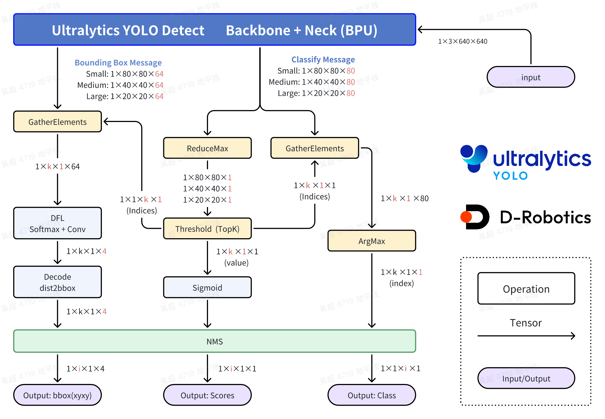
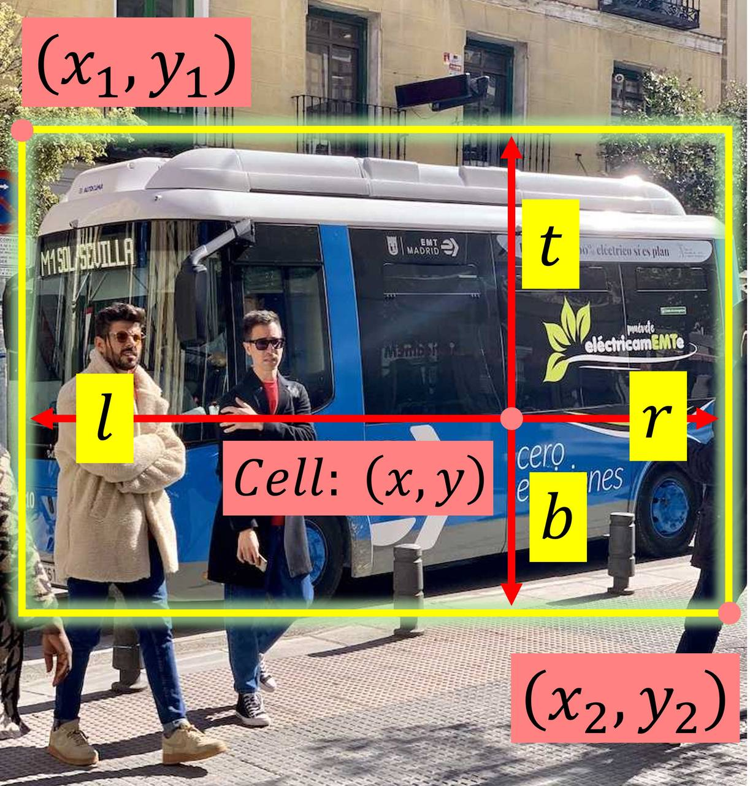
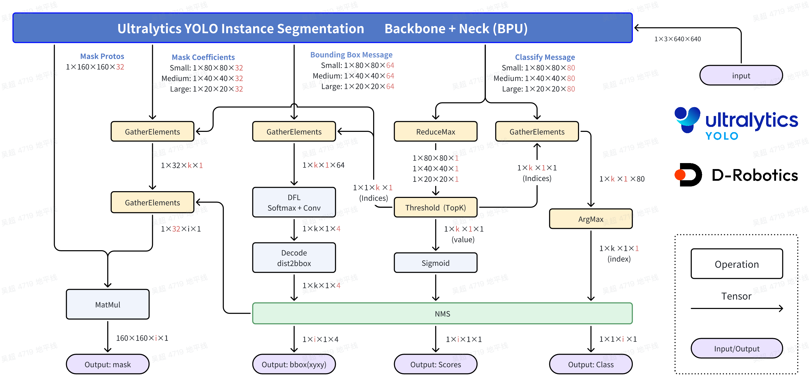
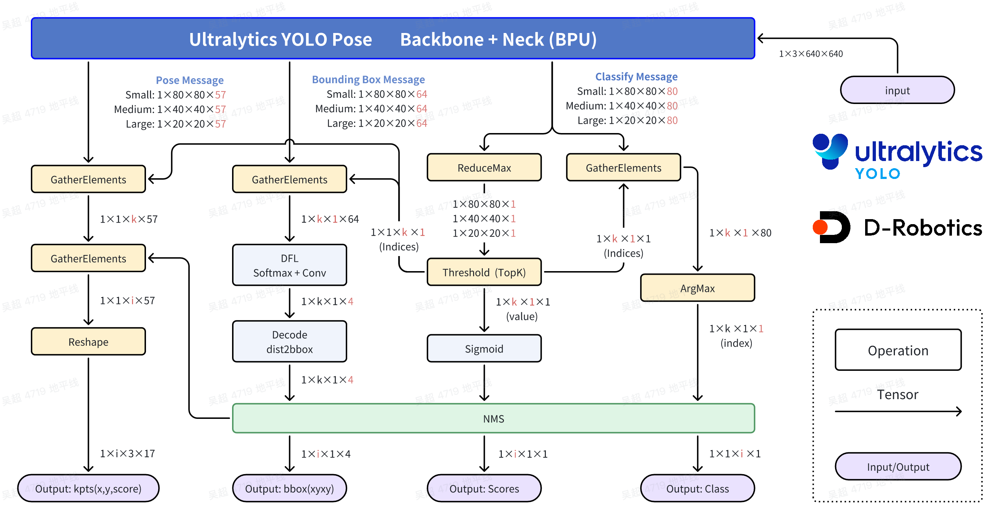

[English](README.md) | 简体中文

# Ultralytics YOLO 模型转换


本目录把 Ultralytics 浮点模型导出为 ONNX，再编译为共用 Python Sample
使用的目标 BPU 制品。导出和编译在主机执行，不能在板端运行。导出覆盖
YOLOv8/YOLO11 的 DFL 检测和 YOLO26 的直接 LTRB 检测；下文同时列出分类、分割、姿态和 OBB 导出入口。导出入口记录的是配方本身——每个新制品的验证须单独记录。

<a id="source-model"></a>

## 源模型与复现身份

输入为与所选任务匹配的本地 Ultralytics PyTorch `.pt` 权重。`/models/*.pt` 是操作者预先准备的路径，仓库不附带自定义权重。导出时记录权重 SHA-256、训练/导出环境版本、类别、输入尺寸和训练配置。[模型清单](../model/README_cn.md)列出的 `.bin/.hbm` 是运行制品，与转换输入权重分开。

<a id="directory"></a>
## 目录结构

```text
conversion/
├── imgs/  # imgs 相关文件
├── yolo26/  # yolo26 相关文件
├── CONVERSION_CONTRACT.md  # 说明文档
├── README.md  # 英文说明
├── README_cn.md  # 中文说明
├── config_x5.yaml  # 配置
├── export_monkey_patch.py  # Python 脚本
├── mapper.py  # Python 脚本
├── mapper_s.py  # Python 脚本
├── mapper_x5.py  # Python 脚本
├── requirements.txt  # 源码或数据文件
└── workflow.py  # Python 脚本
```

<a id="toolchain-targets"></a>
## 准备两个主机环境

第一步使用 Ultralytics 训练/导出环境，需提前准备 `ultralytics`、PyTorch
以及该权重所需的 ONNX 导出依赖。请先确认本地权重路径再调用脚本。脚本
直接调用 `ultralytics.YOLO`；已知的裸模型名可能解析为在线权重。
传入已经存在的绝对 `.pt` 路径以选择本地导出权重。可以在本目录运行，
也可以给权重和输出传绝对路径。

第二步使用对应的 D-Robotics OpenExplore 工具链环境。训练/导出环境推荐
Ubuntu 22.04 + Python 3.10（训练用 CUDA GPU，先确认
`torch.cuda.is_available()` 为 True）。`.pt` 权重应使用
`ultralytics/ultralytics` 仓库训练（仓库内 `pip install -e .` 安装），或直接
采用官方发布的预训练权重；训练过程无需改动程序，且不得修改模型
`forward` 方法。各目标编译入口：

| 目标 | 工具检查 | 制品 | 标定文件 | 编译配置中的输入约定 |
| --- | --- | --- | --- | --- |
| X5 | `hb_mapper --version` | `.bin` | 原始 float32 `.rgbchw` | `bayes-e`，运行时 `nv12` |
| S100 | `hb_compile --help` | `.hbm` | 除以 255 的 float32 `.npy` | `nash-e`，运行时 `nv12` |
| S100P | `hb_compile --help` | `.hbm` | 除以 255 的 float32 `.npy` | `nash-m`，运行时 `nv12` |
| S600 | `hb_compile --help` | `.hbm` | 除以 255 的 float32 `.npy` | `nash-p`，运行时 `nv12` |

Mapper 会检查工具链是否已加载、ONNX 是否只有一个静态
`tensor(float)` 四维输入，以及标定目录中是否有 JPG/JPEG/PNG。缺依赖时
只报错，不会静默安装。工具链环境和板端运行时镜像是两套环境，不要把
`hb_mapper` 或 `hb_compile` 安装步骤放入板端部署流程。

X5 的 mapper 也可以用 pip 包安装（hb_mapper 需 1.24.3 及以上）：

```bash
conda create -n rdk_env python=3.10 -y
conda activate rdk_env
pip install rdkx5-yolo-mapper
hb_mapper --version
# PyPI 下载慢时使用镜像：
pip install rdkx5-yolo-mapper -i https://mirrors.aliyun.com/pypi/simple/ --trusted-host mirrors.aliyun.com
```

下载中断留下不完整包时，重新执行安装即可。

X5 可在 x86 Linux 主机使用 OE 1.2.8 CPU 镜像。若发布
版本不同，以 D-Robotics 提供的镜像和 tag 为准；镜像来源为
[X5 工具链包](https://d-robotics-aitoolchain.oss-cn-beijing.aliyuncs.com/oe_x5/1.2.8/docker_openexplorer_ubuntu_20_x5_cpu_v1.2.8.tar.gz)：

```bash
wget https://d-robotics-aitoolchain.oss-cn-beijing.aliyuncs.com/oe_x5/1.2.8/docker_openexplorer_ubuntu_20_x5_cpu_v1.2.8.tar.gz
docker load -i docker_openexplorer_ubuntu_20_x5_cpu_v1.2.8.tar.gz
docker images
docker run -it --rm --network host --shm-size=15g \
  -v "$(pwd)":/workspace --workdir /workspace \
  openexplorer/ai_toolchain_ubuntu_20_x5_cpu:v1.2.8 /bin/bash
```

CPU 镜像即可完成模型转换；同一 OE 1.2.8 发布中的 GPU 镜像供带 GPU 依赖的
扩展环境选用：

```bash
wget https://d-robotics-aitoolchain.oss-cn-beijing.aliyuncs.com/oe_x5/1.2.8/docker_openexplorer_ubuntu_20_x5_gpu_v1.2.8.tar.gz
docker load -i docker_openexplorer_ubuntu_20_x5_gpu_v1.2.8.tar.gz
```

离线镜像也可从地瓜开发者社区获取：
<https://forum.d-robotics.cc/t/topic/35229>。新装 Docker 可用
`docker --version` 与 `docker run hello-world` 验证（安装见
[Docker 文档](https://docs.docker.com/engine/install/)）。

S 系列请从 [RDK S OE 工具链文档](https://developer.d-robotics.cc/rdk_doc/rdk_s/Advanced_development/toolchain_development/overview)
或[工具链下载页](https://toolchain.d-robotics.cc/)选择与 S100/S100P 或 S600
匹配的镜像，再加载和挂载：

```bash
docker load -i ai_toolchain_ubuntu_22_s100_<release>.tar
docker images
docker run -it --rm --network host --shm-size=15g \
  -v "$(pwd)":/workspace --workdir /workspace \
  <loaded-s100-or-s600-image>:<tag> /bin/bash
```

可参考 [S100/S100P 工具链页](https://developer.d-robotics.cc/rdk_s_doc/Advanced_development/toolchain_development/algorithm_toolchain/overview?v=4.0.5&p=RDK+S100)
和 [S600 工具链页](https://developer.d-robotics.cc/rdk_s_doc/Advanced_development/toolchain_development/algorithm_toolchain/overview?v=5.1.0&p=RDK+S600)。
`-v /workspace` 会把权重、ONNX、标定图片和输出目录暴露给容器；进入容器
后在 `/workspace` 运行下方 Mapper 命令。


工具链资源:

- [OE Docker environment](https://developer.d-robotics.cc/rdk_doc/rdk_s/Advanced_development/toolchain_development/overview#docker-%E9%95%9C%E5%83%8F)

<a id="export"></a>
## 导出 ONNX

先准备 Ultralytics 训练/导出环境：克隆
[ultralytics/ultralytics](https://github.com/ultralytics/ultralytics.git)，
按官方 [快速开始](https://docs.ultralytics.com/quickstart/)与
[训练文档](https://docs.ultralytics.com/modes/train/)操作（容器化环境见
[Docker 安装](https://docs.docker.com/engine/install/)）。官方预训练权重可直接下载，
例如 `wget https://github.com/ultralytics/assets/releases/download/v8.3.0/yolo11n.pt`；
主机 pip 安装可使用 [阿里云 PyPI 镜像](https://mirrors.aliyun.com/pypi/simple/)。

通用 Ultralytics 检测器通过 `--platform` 选择已核定的 opset 默认值：X5
使用 opset 11，S 系列使用 opset 19。`--opset` 与 `--optse` 两种拼写等价，
显式传入的值优先。

```bash
# YOLOv8/YOLO11 风格 DFL 检测器，导出给 X5。
python samples/vision/ultralytics_yolo/conversion/export_monkey_patch.py \
  --platform x5 --pt /models/yolo11n.pt --require-local --opset 11

# 同一模型系列，导出给 S600。
python samples/vision/ultralytics_yolo/conversion/export_monkey_patch.py \
  --platform s600 --pt /models/yolo11n.pt --require-local --opset 19
```

通用导出器通过 `ultralytics.YOLO` 加载权重，在模型头应用 Sample 的 BPU
monkey patch，然后调用 `model.export(format='onnx', simplify=False,
opset=...)`。Ultralytics 通常把 ONNX 写在权重旁边；启动 Mapper 前请确认
实际路径，Mapper 不会猜测或替换相似文件。

YOLO26 检测器使用单独的图导出器，因为它输出三个 NHWC 分类张量和三个
四通道直接 LTRB 张量。默认值为 X5 `opset=11, simplify=1`，S 系列
`opset=19, simplify=0`。

```bash
python samples/vision/ultralytics_yolo/conversion/export_monkey_patch.py \
  --family yolo26 --task detect --platform x5 \
  --pt /models/yolo26n.pt --require-local \
  --output /models/yolo26n_det_bpu.onnx

python samples/vision/ultralytics_yolo/conversion/export_monkey_patch.py \
  --family yolo26 --task detect --platform s600 \
  --pt /models/yolo26n.pt --require-local \
  --output /models/yolo26n_det_bpu.onnx
```

也可以直接运行 `yolo26/export_yolo26_detect_bpu.py`，参数为 `--weights`、
`--output`、`--imgsz`、`--platform`、`--opset`、`--simplify` 和可选的
`--require-local`。导出失败会返回错误。

所有 Python 示例从仓库根目录运行。通用导出器根据权重中的 head 类型应用 patch；`--task` 不能将检测权重变成分类/分割权重。YOLO26 由 `--family yolo26 --task...` 分发到任务专用脚本，默认分类输入 224，其他任务 640。导出配方如下：

```bash
python samples/vision/ultralytics_yolo/conversion/export_monkey_patch.py \
  --family yolo26 --task cls --platform x5 \
  --pt /models/yolo26n-cls.pt --imgsz 224 --output /models/yolo26n_cls_bpu.onnx
python samples/vision/ultralytics_yolo/conversion/export_monkey_patch.py \
  --family yolo26 --task seg --platform x5 \
  --pt /models/yolo26n-seg.pt --imgsz 640 --output /models/yolo26n_seg_bpu.onnx
python samples/vision/ultralytics_yolo/conversion/export_monkey_patch.py \
  --family yolo26 --task pose --platform x5 \
  --pt /models/yolo26n-pose.pt --imgsz 640 --output /models/yolo26n_pose_bpu.onnx
python samples/vision/ultralytics_yolo/conversion/export_monkey_patch.py \
  --family yolo26 --task obb --platform x5 \
  --pt /models/yolo26n-obb.pt --imgsz 640 --output /models/yolo26n_obb_bpu.onnx
```

YOLO26 的 cls/seg/pose/obb 导出器不支持 `--require-local`；请在运行前自行确认上述绝对路径存在，不能把该参数传给它们。

所有 YOLO26 任务导出器在导出后都会调用 `yolo26/batch_flex.py`：内部 attention
`Reshape` 目标允许 PTQ 校准以 batch 8 运行，图的输入输出仍是静态 batch 1。规则及
batch 8 制品所需证据见
[CONVERSION_CONTRACT.md](CONVERSION_CONTRACT.md#yolo26-task-export-and-calibration-batch)。

将生成的 ONNX 交给下面的 mapper，YOLO26 添加 `--family yolo26`。预期输入为静态 batch-one float32 NCHW；检测 DFL 与直接 LTRB 输出不可互换。分割附带 mask 系数/prototype，姿态附带关键点，OBB 附带角度；分类输出 logits，运行端进行 Softmax。检查对应导出脚本的输出说明和运行时绑定，不要仅按输出数量判断兼容性。

<a id="dataflow"></a>
## DFL 系列数据流：图的输出与运行时解码

下面的插图解释 DFL 系列部署流程，覆盖 DFL 检测协议（YOLOv5u/v8/v9/v10/11/12/13）
及其分割、姿态扩展。YOLO26 检测没有对应插图，其协议差异在本节末尾单独说明。

### 目标检测（DFL）



在标准处理流程中，会完整计算全部 8400 个 Bounding Box（bbox）的
scores、categories 和 xyxy 坐标，用于结合 GT 计算 loss。但部署阶段只需要
保留满足分数阈值的 bbox，因此没有必要对全部 8400 个 bbox 做完整计算。

这里的优化主要利用 Sigmoid 函数的单调性，在计算前先进行筛选。DFL 和特征
解码阶段同样采用"先筛选，再计算"的思路，从而节省大量计算量并降低推理
耗时。

- **分类部分：ReduceMax 操作**

ReduceMax 用于在指定维度上取最大值。在 YOLO 检测头中，该操作在 8400 个
Grid Cell 的 80 个类别分数中找最大值，操作维度为 C 维。该操作输出最大
值本身，而不是最大值对应的类别索引。

Sigmoid 函数具有单调性，因此 80 个分数在 Sigmoid 前后的相对大小关系
不变：

$$Sigmoid(x)=\frac{1}{1+e^{-x}}$$

$$Sigmoid(x_1) > Sigmoid(x_2) \Leftrightarrow x_1 > x_2$$

因此，模型输出最大值的位置就是最终 score 最大值的位置；对该输出值做
Sigmoid 才得到浮点模型的最大类别 score：
$\operatorname{Sigmoid}(\max \mathrm{logits}) = \max \operatorname{Sigmoid}(\mathrm{logits})$。
argmax 的先后排序在 Sigmoid 前后一致；但输出值本身仍是 logit，还不是
概率。

- **分类部分：Threshold(TopK) 操作**

Threshold(TopK) 用于筛选满足阈值要求的 Grid Cell，操作对象是 8400 个
Grid Cell，对 H/W 维度进行筛选；实现中可能将 H/W 展平，这只是便于实现
和表达，本质上没有区别。设某个 Grid Cell 某一类别的原始分数为 $x$，经过
Sigmoid 后的值为 $y$，阈值为 $C$，则该分数满足要求的充要条件为：

$$y=Sigmoid(x)=\frac{1}{1+e^{-x}}>C$$

进一步可得：

$$x > -ln\left(\frac{1}{C}-1\right)$$

该操作得到满足阈值的 Grid Cell 索引及其对应最大值。最大值经过 Sigmoid
后，即为该 Grid Cell 的类别 score。

- **分类部分：GatherElements 和 ArgMax 操作**

利用 Threshold(TopK) 得到的索引，GatherElements 取出满足要求的 Grid
Cell，ArgMax 判断 80 个类别中最大值所在的类别，从而得到每个合格 Grid
Cell 的类别。

- **Bounding Box 部分：GatherElements 操作**

利用同样的 Grid Cell 索引，GatherElements 取出对应 bbox 信息，得到形状为
`1×64×k×1` 的 bbox 特征。

- **Bounding Box 部分：DFL（SoftMax + Conv）**

每个 Grid Cell 使用 4 个数描述 bbox 位置。DFL 结构会对某条边相对 Grid
Cell（anchor）位置的 offset 给出 16 个估计值。对这 16 个估计值执行
SoftMax，再通过卷积计算期望值。这是 Anchor Free 的核心设计：每个 Grid
Cell 只负责预测一个 Bounding Box。以某条边的 offset 为例，设 16 个估计值
为 $l_p$，其中 $p=0,1,...,15$，offset 的计算公式为：

$$\hat{l} = \sum_{p=0}^{15}{\frac{p·e^{l_p}}{S}}, S =\sum_{p=0}^{15}{e^{l_p}}$$

- **Bounding Box 部分：Decode（dist2bbox / ltrb2xyxy）**

该操作将每个 Bounding Box 的 ltrb 描述解码为 xyxy 描述。ltrb 表示左、
上、右、下四条边相对 Grid Cell 中心的距离：



设输入尺寸 $Size=640$，bbox 预测分支第 $i$ 个特征图（$i=1, 2, 3$）对应的
下采样倍数为 $Stride(i)$。YOLOv8-Detect 中 $Stride(1)=8$、$Stride(2)=16$、
$Stride(3)=32$，对应特征图尺寸 $n_i = Size/Stride(i)$，即 $n_1 = 80$、
$n_2 = 40$、$n_3 = 20$，合计 $n_1^2+n_2^2+n_3^2=8400$ 个 Grid Cell。对
第 $i$ 层第 $x$ 列、第 $y$ 行的 Grid Cell（$x$ 沿水平方向计数，$y$ 沿
竖直方向计数；$x,y \in [0, n_i)\cap Z$，$Z$ 为整数集），ltrb 到 xyxy 的
转化关系为：

$$x_1 = (x+0.5-l)\times{Stride(i)},\quad y_1 = (y+0.5-t)\times{Stride(i)}$$

$$x_2 = (x+0.5+r)\times{Stride(i)},\quad y_2 = (y+0.5+b)\times{Stride(i)}$$

最终的检测结果包括类别（id）、分数（score）和位置（xyxy）。

**这些阶段在本 sample 中的执行位置。** 本仓库导出的图停在插图顶部绘制的
每层 stride 消息上——NHWC 分类 logits（80 类模型在 stride 8/16/32 分别为
`1×80×80×80`、`1×40×40×80`、`1×20×20×80`；自定义类别数改变 80）和 DFL
box logits（`...×64`）——而 ReduceMax / 阈值筛选 / gather / ArgMax、DFL
SoftMax 加期望 bin、dist2bbox 等阶段，以及在所选绑定需要时进行的按类别
NMS，都由 Python 后处理（`runtime/python/detect.py` 中的 `decode_dfl`；协议见
[`DETECTION_CONTRACT.md`](../DETECTION_CONTRACT.md)）完成。S 系列 YOLOv10
绑定是 NMS-free 例外：它复用同样的解码阶段并固定 `nms='none'`
（见[运行时 README](../runtime/python/README.md)）。运行时只接受
已反量化的浮点输出：整数张量或 SCALE 量化元数据在绑定期直接报错，
无需手动执行输出反量化。

### 实例分割（DFL 系列任务）



实例分割基于目标检测流程扩展而来。检测分支筛选出满足要求的 bbox 后，
两次 GatherElements 取出该 Grid Cell 的 32 个 mask 系数，再与 proto
分支输出做线性组合（加权求和，图中画为 MatMul；proto 为 `1×160×160×32`，
即 stride 4），生成实例 mask。因此检测部分的 ReduceMax、
Threshold(TopK)、GatherElements、DFL 和 Decode 优化仍然适用。运行时
在浮点 head 上的后处理中执行同样的系数–proto 组合（`segmentation_decode`）。

### 姿态估计（DFL 系列任务）



> **姿态 head 通道契约。** 姿态 head 每层导出 1 个类别通道（单类别人体
> 模型）加 `3 × 17 = 51` 个关键点通道（17 个 COCO 关键点）。

Ultralytics YOLO Pose 的关键点基于目标检测结果。COCO keypoint 定义如下：

```python
COCO_keypoint_indexes = {
    0: 'nose',
    1: 'left_eye',
    2: 'right_eye',
    3: 'left_ear',
    4: 'right_ear',
    5: 'left_shoulder',
    6: 'right_shoulder',
    7: 'left_elbow',
    8: 'right_elbow',
    9: 'left_wrist',
    10: 'right_wrist',
    11: 'left_hip',
    12: 'right_hip',
    13: 'left_knee',
    14: 'right_knee',
    15: 'left_ankle',
    16: 'right_ankle'
}
```

Pose 模型的目标检测部分与 Detect 模型一致，由 pose head 额外增加一个每
Grid Cell 的特征图。在已发布的 17 关键点 COCO 契约下，绑定要求每个
Grid Cell 提供 1 个类别通道加 `3 × 17 = 51` 个关键点通道：每个关键点包含
相对该层下采样倍率的 x、y 坐标以及一个可见性 score（`pose_decode.py` 绑定
`cls` 为 1 通道、`kpts` 为 `3 × nkpt`；已发布绑定固定 `nkpt = 17`，仅改变
形状声明不构成受支持的变体）。检测分支确定某个 Grid Cell 合格后，DFL 解码
按 `(raw_xy × 2 + anchor − 0.5) × stride` 计算关键点在模型输入坐标系中的
位置，其中 `anchor` 是该 Grid Cell 的半整数中心（`runtime/python/
utils.py_utils/postprocess.py` 的 `decode_kpts`）；随后 `inverse_points`
连同 `inverse_boxes` 把模型输入的 letterbox 几何还原回原图，Sigmoid 把
关键点可见性 logits 转成 score（`pose_decode.py`）。作为对照，YOLO26
直接 LTRB pose 分支使用 `(raw_xy + anchor) × stride`，没有 DFL 的 ×2
形式。运行时在后处理中解码这些 head（`pose_decode`）。

### YOLO26 直接 LTRB 的差异

上面两张框图只描述 **DFL 协议**，不描述 YOLO26。YOLO26 检测导出三个
NHWC 分类张量加三个**直接四通道 LTRB** 张量（`[1,Hs,Ws,4]`，不是
`[1,Hs,Ws,64]`）：四个通道已经是 cell 单位的左/上/右/下距离，DFL 的
SoftMax 加 16-bin 期望阶段在该协议中不存在。`ltrb2xyxy.jpg` 插图属于
DFL 协议的解码。YOLO26 解码器在 raw-logit 空间取最大类别，只对选中的
类别做 Sigmoid，用同样的 cell 中心网格几何转换四个距离，再应用共用的
按类别 NMS（`decode_ltrb`）。DFL 与直接 LTRB 制品不可互换，见上文导出
一节和 [`DETECTION_CONTRACT.md`](../DETECTION_CONTRACT.md)。

<a id="calibration"></a>
## 标定数据准备

在标定目录放入 20–50 张有代表性的输入图片。共用流程会把 BGR 转为 RGB，
缩放到静态 ONNX 宽高，HWC 转 NCHW，并写入 float32。X5 写入未除 255 的
RGB 张量 `*.rgbchw`；S 写入除以 255 后的 NumPy `*.npy`。这是编译器标定
格式；运行时的 NV12 打包仍由目标板输入绑定负责。

<a id="compile"></a>
## 编译

从仓库根目录运行调度入口（平台包装入口会传入相同的 platform 参数）：

```bash
# X5 -> hb_mapper makertbin、bayes-e、.bin
python samples/vision/ultralytics_yolo/conversion/mapper.py \
  --platform x5 \
  --onnx /models/yolo11n.onnx \
  --cal-images /datasets/calibration \
  --output-dir /models/compiled

# S100 -> hb_compile、nash-e、.hbm
python samples/vision/ultralytics_yolo/conversion/mapper.py \
  --platform s100 --march nash-e \
  --onnx /models/yolo11n.onnx \
  --cal-images /datasets/calibration \
  --output-dir /models/compiled

# S100P/S600 分别使用 nash-m/nash-p。
python samples/vision/ultralytics_yolo/conversion/mapper.py \
  --platform s600 --march nash-p \
  --onnx /models/yolo11n.onnx \
  --cal-images /datasets/calibration \
  --output-dir /models/compiled
```

<a id="validation"></a>
## 转换后验证

Mapper 成功后，把对应目标的制品复制到板端，用完整路径运行共用运行时。
例如上面的 S600 命令生成 `/models/compiled/yolo11n_nashp_640x640_nv12.hbm`：

```bash
# 在 S600 板卡上从仓库根目录运行
python samples/vision/ultralytics_yolo/runtime/python/main.py \
  --platform s600 --family yolo11 --task detect \
  --model-path /models/compiled/yolo11n_nashp_640x640_nv12.hbm \
  --test-img samples/vision/ultralytics_yolo/test_data/bus.jpg \
  --img-save-path /tmp/yolo11n-s600.jpg
```

X5 使用 `--platform x5` 和 `.bin` 文件名；其他 Nash 目标使用对应的
`--platform s100`/`s100p` 与 `.hbm` 文件名。编译成功不能跳过运行时的
输入/输出绑定，板端仍会在推理前检查制品元数据及 DFL 或直接 LTRB 契约。

不启动完整运行时的快速制品检查：

```bash
# X5（OE 环境内）
hb_model_info yolo11n_bayese_640x640_nv12.bin
# S 系列（板端）
hrt_model_exec model_info --model_file yolo11n_detect_nashm_640x640_nv12.hbm
hrt_model_exec perf --model_file yolo11n_detect_nashm_640x640_nv12.hbm --thread_num 1
```

宿主机上复制文件出现权限/属主异常时，检查文件属主或执行
`sudo chown -R`；Nash 不支持 `O3`，优化等级使用 `O0`/`O1`/`O2`。

通用导出器及 YOLO26 检测导出器可传 `--require-local` 要求权重已存在；省略该参数则保留 Ultralytics
解析已知裸模型名的能力。

通用 YOLO 和 YOLO26 mapper 调用同一个 `conversion/workflow.py`。其中
`mapper_x5.py`、`yolo26/mapper_x5.py` 选择 X5 配置；`mapper_s.py`、
`yolo26/mapper_s.py` 选择 Nash 配置并保留 `--march`。共用流程仍明确保留
以下目标差异：

* X5 执行 `hb_mapper makertbin --config config.yaml --model-type onnx`，
  使用 `bayes-e` 和原始 RGB/NCHW 标定；加入 Softmax int8 优化，
  `--quantized int16` 时追加 `set_all_nodes_int16`。
* S 执行 `hb_compile --config config.yaml`，使用选择的 Nash march、归一化
  NumPy 标定，并加入 `input_no_padding`、`output_no_padding`；
  `--quantized int16` 时加入 S 的 `quant_config` 模型/输出类型设置。

配置写在 `--ws` 指定目录下本次创建的唯一子目录中（`--ws` 是工作区父
目录）。成功后默认删除该子目录，`--save-cache` 会保留它。编译失败会保留
子目录中的配置、标定文件和日志以便排查。已有同名制品必须显式传
`--overwrite` 才会替换；不会删除用户提供的工作区父目录、输入模型、标定
图片目录或输出目录。

<a id="artifacts"></a>
## 输出名称和路径

当 ONNX 文件名为 `yolo11n`、输入为 640×640 时，默认输出目录是 ONNX 所在
目录，名称如下：

```text
X5:    yolo11n_bayese_640x640_nv12.bin
S100:  yolo11n_nashe_640x640_nv12.hbm
S100P: yolo11n_nashm_640x640_nv12.hbm
S600:  yolo11n_nashp_640x640_nv12.hbm
```

`--output-dir` 只改变最终制品和编译日志位置。X5 成功时可能留下
`hb_mapper_makertbin.log`，S 成功时可能留下 `hb_compile.log`。使用
`--save-cache` 时，在输出的唯一工作区子目录检查 `config.yaml`、标定目录
和 `bpu_model_output/`。

## 转换脚本与接口

转换入口为：

```text
export_monkey_patch.py
  ├─ 通用检测器 -> 共用补丁 + Ultralytics 导出
  └─ YOLO26 detect -> yolo26/export_yolo26_detect_bpu.py

mapper.py -> mapper_x5.py / mapper_s.py
          -> --family yolo26 时的 yolo26/mapper_x5.py / mapper_s.py
          -> workflow.py
             inspect_onnx -> calibration_images/select_calibration_images
             -> prepare_calibration -> render_config -> 编译 -> 移动制品/日志
```

Mapper dispatcher 接受各发布任务的 `--family` 值，并选择检测、分割、
姿态、分类或 OBB 对应的工作流。

YOLOv8/YOLO11 检测使用三层 DFL 输出契约；YOLO26 检测使用直接 LTRB，两者
不能互换。导出和编译自定义图后，运行时绑定检查会在板端推理前读取输入输出
形状和类型。检测协议见 [`DETECTION_CONTRACT.md`](../DETECTION_CONTRACT.md)。

## 故障排查

* **找不到 `hb_mapper` 或 `hb_compile`：** 加载对应 OpenExplore 环境，先
  执行表中的工具检查命令。板端镜像不是编译器环境。
* **ONNX 是动态尺寸、非 float32 或多输入：** 重新导出静态 batch-one、
  NCHW 图。输入契约不明确时 Mapper 会在写标定前停止。
* **没有标定图片：** 直接在 `--cal-images` 中放入 JPG/JPEG/PNG；其他后缀
  会忽略。`--cal-sample false` 保留全部图片，或调整 `--cal-sample-num`。
* **`--platform` 与 `--march` 冲突：** X5 不要传 Nash march；S100/S100P/S600
  分别配 `nash-e`/`nash-m`/`nash-p`。
* **已有制品：** 选择新的 `--output-dir`，或确认替换目的后显式传
  `--overwrite`。
* **编译失败：** 使用 `--save-cache` 重跑，检查唯一工作区的 `config.yaml`、
  标定文件和编译器日志。默认失败工作区也会保留。


## S100 YOLOv13 iMoonLab 导出与量化

此配方将 iMoonLab 检测头导出为六路 NHWC 张量，并编译为 S100 NV12 HBM。量化框输出需要对应的编译器 scale 元数据，选择 Runtime 解码器前先查看模型信息。本节命令在外部 iMoonLab clone 与匹配的 S OE 环境中执行。

### 编译环境

模型转换请在 x86 Linux 主机的 OpenExplore 环境中完成，不建议在板端安装编译工具链。

- OE 资源入口（docker+OE开发包）：<https://developer.d-robotics.cc/rdk_doc/rdk_s/Advanced_development/toolchain_development/overview>
- OE 工具链在线手册：<https://toolchain.d-robotics.cc/>

#### 1. 安装 Docker

```bash
sudo docker --version
sudo docker run --rm hello-world
```

#### 2. 获取并加载离线镜像

请访问 OE 资源入口，下载适配 RDK S100 系列的 CPU 版本 Docker 镜像。

```bash
sudo docker load -i ai_toolchain_ubuntu_22_s100_xxx.tar
```

#### 3. 启动容器

```bash
sudo docker run -it --rm \
  --network host \
  --shm-size=15g \
  -v "$(pwd)":/workspace \
  --workdir /workspace \
  <docker-image-name> /bin/bash
```

### 转换流程

#### 1. 准备训练环境与权重

YOLOv13 的 ONNX 导出需要在 iMoonLab/Ultralytics 训练环境中完成，源 `.pt` 权重应来自官方仓库训练流程或官方发布的预训练权重。

```bash
git clone https://github.com/iMoonLab/yolov13.git
cd yolov13
wget https://github.com/iMoonLab/yolov13/releases/download/yolov13/yolov13n.pt
```

训练请参考 Ultralytics 官方文档：

- <https://docs.ultralytics.com/modes/train/>

训练阶段无需修改程序，也无需修改 `forward`。

#### 2. 导出 ONNX

建议先卸载环境中通过 `pip` 或 `conda` 安装的 `ultralytics` 命令行包，确保你修改的是实际生效的源码目录。

```bash
conda list | grep ultralytics
pip list | grep ultralytics
conda uninstall ultralytics
pip uninstall ultralytics
```

如需确认当前环境加载的 `ultralytics` 路径，可执行：

```python
import ultralytics
print(ultralytics.__path__)
```

然后修改 `ultralytics/nn/modules/head.py` 中 `Detect` 类的 `forward`，把三个特征层的分类输出和框输出拆开，形成 6 个输出头：

```python
def forward(self, x):
    result = []
    for i in range(self.nl):
        result.append(self.cv3[i](x[i]).permute(0, 2, 3, 1).contiguous())
        result.append(self.cv2[i](x[i]).permute(0, 2, 3, 1).contiguous())
    return result
```

如果导出的输出顺序与参考模型相反，可交换 `cv2` 与 `cv3` 的追加顺序后重新导出：

```python
def forward(self, x):
    result = []
    for i in range(self.nl):
        result.append(self.cv2[i](x[i]).permute(0, 2, 3, 1).contiguous())
        result.append(self.cv3[i](x[i]).permute(0, 2, 3, 1).contiguous())
    return result
```

完成修改后执行导出：

```python
from ultralytics import YOLO
YOLO('yolov13n.pt').export(imgsz=640, format='onnx', simplify=False, opset=19)
```

如果遇到 `No module named onnxsim`，安装对应依赖即可。若导出的 ONNX IR 版本过高，可以继续使用 `simplify=False`。

#### 3. 准备校准数据

请准备 20 到 50 张覆盖目标场景的图片作为 PTQ 校准输入。也可以参考 OE 开发包中的相关示例生成校准数据。

### 转换参考

ONNX 导出
PTQ 配置生成

#### 4. 确认移除反量化节点名称

使用 Netron 打开导出的 ONNX：

- <https://netron.app/>

查看大小为 `[1, 80, 80, 64]`、`[1, 40, 40, 64]`、`[1, 20, 20, 64]` 的三个输出名称，并将它们对应地填写到 YAML 的 `remove_node_name` 中。一个常用经验是优先关注名称中对应 `64 = 4 * REG` 的 Dequantize 节点，但不同版本导出的节点名可能不同，不能直接硬套。


参考 YAML 片段如下：

```yaml
model_parameters:
  onnx_model: 'ultralytcs_YOLO.onnx'
  march: nash-e
  layer_out_dump: False
  working_dir: 'ultralytcs_YOLO_output'
  output_model_file_prefix: 'ultralytcs_YOLO'
  remove_node_name: "/model.32/cv2.0/cv2.2.2/Conv;/model.32/cv2.1/cv2.1.2/Conv;/model.32/cv2.2/cv2.2.2/Conv;"
```

#### 5. 编译 HBM

```bash
hb_compile --config config_yolov13_detect_nv12.yaml
```

当前目录中提供了以下参考日志，便于对照自己的模型导出与编译结果：

- `hb_compile_yolov13.txt`
- `hb_model_info_yolov13.txt`
- `hrt_model_exec_model_info_yolov13.txt`

### 异常处理

如果你自己编译出的模型输出顺序与参考模型不一致，通常是 `remove_node_name` 设置错误。可以通过快速生成 `bc` 模型并检查可移除节点信息：

```bash
hb_compile --fast-perf --march nash-e --skip compile --model yolov13n.onnx
hb_model_info yolov13n_quantized_model.bc
```

典型输出示例：

```bash
2025-06-24 03:17:30,044 INFO ############# Removable node info #############
2025-06-24 03:17:30,044 INFO Node Name                    Node Type
2025-06-24 03:17:30,045 INFO ---------------------------- ----------
2025-06-24 03:17:30,045 INFO /model.32/cv3.0/cv3.0.2/Conv Dequantize
2025-06-24 03:17:30,045 INFO /model.32/cv2.0/cv2.0.2/Conv Dequantize
2025-06-24 03:17:30,045 INFO /model.32/cv3.1/cv3.1.2/Conv Dequantize
2025-06-24 03:17:30,045 INFO /model.32/cv2.1/cv2.1.2/Conv Dequantize
2025-06-24 03:17:30,045 INFO /model.32/cv3.2/cv3.2.2/Conv Dequantize
2025-06-24 03:17:30,045 INFO /model.32/cv2.2/cv2.2.2/Conv Dequantize
```


在导出目录将以下完整 S100 配置保存为 `config_yolov13_detect_nv12.yaml`。按配置的 `cal_data_dir` 准备 RGB float32 校准张量，也可以将该路径改为已准备的数据目录。

```yaml
model_parameters:
  onnx_model: 'yolov13n.onnx'
  march: nash-e  # S100: nash-e, S100P: nash-m.
  layer_out_dump: False
  working_dir: 'bpu_outputs'
  output_model_file_prefix: 'yolo13n_detect_nashe_640x640_nv12'
  remove_node_name: "/model.32/cv2.0/cv2.2.2/Conv;/model.32/cv2.1/cv2.1.2/Conv;/model.32/cv2.2/cv2.2.2/Conv;"  # Depend on your onnx model.
  # Reference remove_node_name
  # YOLOv13n: /model.32/cv2.0/cv2.2.2/Conv;/model.32/cv2.1/cv2.1.2/Conv;/model.32/cv2.2/cv2.2.2/Conv;
  # YOLOv13s: /model.32/cv2.0/cv2.0.2/Conv;/model.32/cv2.1/cv2.1.2/Conv;/model.32/cv2.2/cv2.2.2/Conv;
  # YOLOv13l: /model.32/cv2.0/cv2.0.2/Conv;/model.32/cv2.1/cv2.1.2/Conv;/model.32/cv2.2/cv2.2.2/Conv;
  # YOLOv13x: /model.32/cv2.0/cv2.0.2/Conv;/model.32/cv2.1/cv2.1.2/Conv;/model.32/cv2.2/cv2.2.2/Conv;
input_parameters:
  input_name: ''
  input_type_rt: 'nv12'
  input_type_train: 'rgb'
  input_layout_train: 'NCHW;'
  input_shape: ''
  norm_type: 'data_scale'
  mean_value: ''
  scale_value: 0.003921568627451
calibration_parameters:
  cal_data_dir: '/open_explorer/calibration_data_rgb_f32_640'
  cal_data_type: 'float32'
  calibration_type: 'default'
  quant_config: {"op_config": {"softmax": {"qtype": "int8"}}}
compiler_parameters:
  extra_params: {'input_no_padding': True, 'output_no_padding': True}
  jobs: 8
  compile_mode: 'latency'
  debug: True
  advice: 1
  optimize_level: 'O2'
```

```bash
hb_compile --config config_yolov13_detect_nv12.yaml
hrt_model_exec model_info --model_file bpu_outputs/yolo13n_detect_nashe_640x640_nv12.hbm
```

<a id="known-gaps"></a>
## 额外准备

- 每个新制品都需完成自己的绑定检查、匹配板卡 smoke 运行和必要的数据集/参考数值比较；已发布制品的板测记录不能转用于新转换。
- 未随仓库提供已固定的数据集版本、校准图片集或全部源权重摘要；20–50 张是脚本建议。默认 `--cal-sample true --cal-sample-num 20`，`--cal-sample false` 使用全部符合扩展名的图片；复现时保存所选文件列表与摘要。
- `--quantized` 默认 int8，可选 int16；`--jobs` 默认 16，`--save-cache` 默认 false。不同工具链的优化选项见 `mapper.py --platform x5 --toolchain-help` 或对应 S 目标；选择器不代替工具链兼容性验证。
- 容器版本链接是环境示例；按实际使用的发布环境记录镜像标识及版本输出。
- 新制品按[转换后验证](#validation)完成绑定检查、匹配板卡 smoke 与数据集/参考数值比较。
