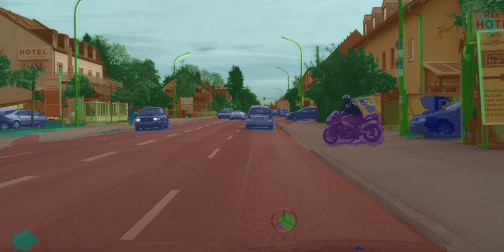

English | [简体中文](README_cn.md)

# UNetMobileNet semantic segmentation

<a id="overview"></a>
## Overview

UNetMobileNet combines a U-Net encoder/decoder with a lightweight MobileNet backbone for Cityscapes 19-class segmentation. Algorithm references: [U-Net paper](https://arxiv.org/abs/1505.04597), [MobileNet paper](https://arxiv.org/abs/1704.04861), [Cityscapes](https://www.cityscapes-dataset.com/). The source does not identify an exact training repository/checkpoint release.

This S-family sample differs from X5 UNet: two NV12 input planes at 2048×1024, INTER_AREA stretch, 19 classes, original-resolution output. Both Python and C++ separate preprocessing, raw forward and mask decoding; rendering lives outside predict.

<a id="directory"></a>
## Directory structure

```text
unetmobilenet/
├── conversion/  # Export and quantization configuration
├── evaluator/  # Evaluation commands and metrics
├── model/  # Model files and download scripts
├── runtime/  # Python and native inference implementations
├── test_data/  # Example inputs
├── tests/  # Automated tests
├── README.md  # English instructions
└── README_cn.md  # Chinese instructions
```

<a id="support-matrix"></a>
## Support and validation

| Target | Variant | Python | C++ |
| --- | --- | --- | --- |
| s100 | unet_mobilenet_1024x2048_nv12, S100 HBM | supported | supported |
| s600 | same model family, separate S600 HBM | supported | supported |
| x5 / s100p | no published asset | not-supported | not-supported |

SDK compilation/inference, dataset accuracy and performance run in the board environment; see the [Python](runtime/python/README.md) and [C++](runtime/cpp/README.md) guides.

<a id="prerequisites"></a>
## Prerequisites

S100 or S600 with its matching board image and hbm_runtime (Python) or DNN/UCP headers/libraries (C++). The source does not pin a minimum S OS/SDK version; none is invented here. Python 3.10+, NumPy, OpenCV-Python and PyYAML; C++17, CMake 3.16+ and OpenCV development libraries for native compilation. Runtimes never install packages or fetch weights. Model size and peak memory are unmeasured; full-resolution 19-channel int32 scores alone can occupy about 152 MiB, and float64 decoding needs additional memory.

<a id="quickstart"></a>
## Quick start

```bash
# cwd: repository root; run on the selected S100 board
bash samples/vision/unetmobilenet/model/download.sh --target s100
python3 samples/vision/unetmobilenet/runtime/python/main.py --target s100
# For S600, use --target s600 for BOTH preparation and inference.
# Host-only selection inspection, no SDK/model/download:
python3 samples/vision/unetmobilenet/runtime/python/main.py --dry-run --target s600
```

From the repository root, install general dependencies with `python3 -m pip install numpy opencv-python PyYAML`. On a recognized supported board, the zero-argument main.py command auto-selects its exact target. Unknown identities fail; S100P never falls back to S100.

<a id="expected-results"></a>
## Expected results

Python success returns 0 and writes result.jpg, unetmobilenet_mask.npy (original-size int32 IDs 0..18) and unetmobilenet_report.json in cwd. alpha_f=0.75 weights the original image, so 1 shows the original and 0 the mask colors. Actual classes depend on real inference; no fixed result is promised. The figure below is the retained source illustration, not a new board result.



<a id="entry-points"></a>
## Entry points

[Model](model/README.md) · [Python](runtime/python/README.md) · [C++](runtime/cpp/README.md) · [Conversion](conversion/README.md) · [Validation](evaluator/README.md).

<a id="license"></a>
## License

Code follows the repository [LICENSE](../../../LICENSE); source copyright notices are retained. The published manifest does not establish training-weight or Cityscapes redistribution rights; check those upstream terms separately.
