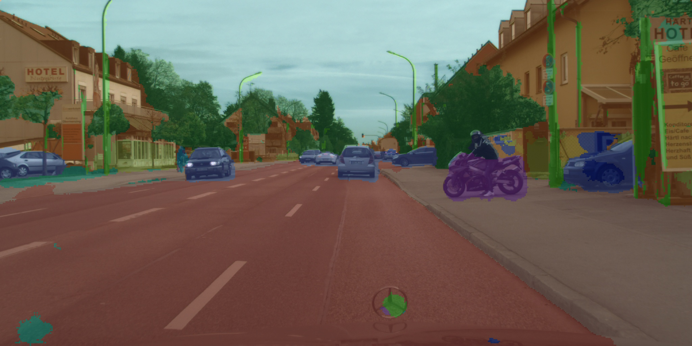

[English](README.md) | 简体中文

# UNetMobileNet 语义分割

<a id="overview"></a>
## 算法与来源

UNetMobileNet 结合 U-Net 编解码结构与 MobileNet 轻量骨干，执行 Cityscapes 19 类语义分割。保留的算法资料：[U-Net 论文](https://arxiv.org/abs/1505.04597)、[MobileNet 论文](https://arxiv.org/abs/1704.04861)、[Cityscapes](https://www.cityscapes-dataset.com/)。源文件未指明精确训练仓库／checkpoint 版本。

本 S 系列示例与 X5 UNet 不同：2048×1024 两平面 NV12 输入、INTER_AREA 拉伸、19 类、原图尺寸输出。Python/C++ 均分离前处理、原始 forward 和 mask 解码；绘图位于 predict 之外。

<a id="support-matrix"></a>
## 支持与验证

| Target | 变体 | Python | C++ |
| --- | --- | --- | --- |
| s100 | unet_mobilenet_1024x2048_nv12，S100 HBM | supported-not-run | supported-not-run |
| s600 | 同系列模型，独立 S600 HBM | supported-not-run | supported-not-run |
| x5 / s100p | 无发布制品 | not-supported | not-supported |

主机 fixture 验证阶段、选择与 CLI；纯 C++ 测试及假 SDK 接口验证解码和资源释放。真实 SDK 编译／推理、板测、数据集精度和性能均为 not-run。[源审计](../../../docs/releases/unified-migration/evidence/2026-09-26-b8-unetmobilenet-audit.json)。

<a id="prerequisites"></a>
## 环境前提

S100 或 S600 及其匹配的板端镜像；Python 使用 hbm_runtime，C++ 使用 DNN/UCP 头文件与库。源文档未钉住 S OS/SDK 最低版本，此处不虚构版本。Python 3.10+、NumPy、OpenCV-Python、PyYAML；原生编译需要 C++17、CMake 3.16+ 和 OpenCV 开发库。运行时不安装依赖或下载权重。模型大小和峰值内存尚未实测；若输出为全分辨率，19 通道 int32 分数本身约占 152 MiB，float64 解码还需额外内存。

<a id="quickstart"></a>
## 快速体验

```bash
# cwd: repository root; run on the selected S100 board
bash samples/vision/unetmobilenet/model/download.sh --target s100
python3 samples/vision/unetmobilenet/runtime/python/main.py --target s100
# For S600, use --target s600 for BOTH preparation and inference.
# Host-only selection inspection, no SDK/model/download:
python3 samples/vision/unetmobilenet/runtime/python/main.py --dry-run --target s600
```

在仓库根执行 `python3 -m pip install numpy opencv-python PyYAML` 安装通用依赖。已识别的受支持板卡可零参数运行 main.py，自动选择精确目标；未知身份报错，S100P 不回退到 S100。

<a id="expected-results"></a>
## 预期结果

Python 成功返回 0，在 cwd 输出 result.jpg、unetmobilenet_mask.npy（原图尺寸 int32 类别 0..18）与 unetmobilenet_report.json。alpha_f=0.75 是原图权重，1 为原图、0 为彩色 mask。实际类别取决于真实推理，不承诺固定结果。下图保留自源分支，不是本轮板测结果。



<a id="directory"></a>
## 目录职责

- model/：按目标显式下载到 s100/ 或 s600/。
- runtime/python/：阶段任务、绑定、共享 runner 适配、CLI 与绘图。
- runtime/cpp/：阶段实现、SDK 资源管理、纯张量解码、启动器与构建。
- conversion/：列出缺少的转换前提；源中无导出／编译实现。
- evaluator/：单图检查及数据集／性能边界；源中无数据集循环。
- test_data/：segmentation.png 输入及保留的历史 result.jpg。
- tests/：源行为对照、主机 fixture、CLI、原生数值／资源测试。

<a id="entry-points"></a>
## 入口索引

[模型](model/README_cn.md) · [Python](runtime/python/README_cn.md) · [C++](runtime/cpp/README_cn.md) · [转换](conversion/README_cn.md) · [验证](evaluator/README_cn.md)。[原 S 文档](../../../platforms/s/samples/vision/unetmobilenet/README.md) 保留旧 API 和自动准备行为的历史说明。

<a id="license"></a>
## 许可

代码遵循仓库 [LICENSE](../../../LICENSE)，保留源版权声明。发布清单不构成训练权重或 Cityscapes 数据的再分发授权，须另行核对上游许可。
