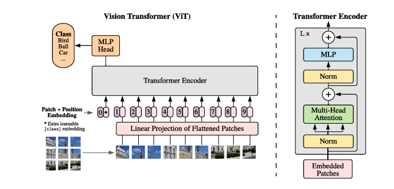

# ViT CIFAR-10 classification

<a id="overview"></a>
## Overview

ViT treats image patches as a sequence and uses self-attention for classification. This sample uses two S100 CIFAR-10 artifacts (10 classes), not ImageNet weights.

[Paper](https://arxiv.org/abs/2010.11929) · [Original ViT implementation](https://github.com/google-research/vision_transformer)



<a id="support-matrix"></a>
## Support matrix

| Target | Variant | Python | C++ |
| --- | --- | --- | --- |
| x5 | int8 | not-supported | not-supported |
| x5 | int16 | not-supported | not-supported |
| s100 | int8 | supported-not-run | not-supported |
| s100 | int16 | supported-not-run | not-supported |
| s100p | int8 | not-supported | not-supported |
| s100p | int16 | not-supported | not-supported |
| s600 | int8 | not-supported | not-supported |
| s600 | int16 | not-supported | not-supported |

Both variants are implemented but board not-run; C++ and other targets have no published runtime/artifacts. [Host evidence and limitations](../../../docs/releases/unified-migration/2026-09-22-b5-vision-review.md).

Source: `rdk_s @380e1a2bf42041af54be6f34935e50197cfadff9`.

<a id="prerequisites"></a>
## Prerequisites

Full checkout required. Host tested: Python 3.14.7, NumPy 2.5.3, OpenCV 4.14.0, PyYAML 6.0.3. S100 inference requires its board-provided `hbm_runtime`; exact board image/SDK/Python versions, minimum RAM and disk capacity remain unverified. Allow disk space for the checkout, selected HBM and outputs. OE is only needed for conversion.

```bash
# cwd: repository root
python3 -m venv .venv-vit
source .venv-vit/bin/activate
python3 -m pip install -r samples/vision/vit/requirements-host.txt
```

<a id="quickstart"></a>
## Quick start

On S100, prepare the model explicitly, then run. Success: exit 0 and five class IDs/scores/labels. Inference never downloads a model.

```bash
# cwd: repository root
bash samples/vision/vit/model/download.sh s100 int8
python3 samples/vision/vit/runtime/python/main.py --target s100 --variant int8 --test-img samples/vision/vit/test_data/airplane_0000.png --label-file samples/vision/vit/test_data/cifar10_classes.names --top-k 5
```

<a id="expected-results"></a>
## Expected results

The source describes airplane among the Top-5 for `airplane_0000.png`; this has not been reverified. No current numerical result is claimed. Default variant int8, resize 0, Top-K 5. Scores are softmax of ten raw logits, exact ties sorted by ascending ID; only `--img-save-path` writes a visualization.

<a id="performance"></a>
## Performance data

Historical CIFAR-10 accuracy is preserved in evaluator; no latency, throughput or new dataset result was measured.

<a id="directory"></a>
## Directory

```text
model/          # HBM download and artifact references
runtime/python/ # CLI, binding, runner and shared classification API
conversion/     # original YAML and historical hb_compile.log
evaluator/      # comparison instructions and historical accuracy
test_data/      # 10 CIFAR images, class dictionary and original illustrations
tests/          # SDK-free host/source regressions
```

<a id="entry-points"></a>
## Entry points

[Model](model/README.md) · [Python runtime](runtime/python/README.md) · [Conversion](conversion/README.md) · [Evaluation](evaluator/README.md)

The preserved legacy entry remains available. New integrations use ClassificationTask; `--model-variant` remains an alias for `--variant`. The local run.sh accepts legacy positional int8/int16.

<a id="license"></a>
## License

Code retains Apache-2.0 notices. Check repository LICENSE and upstream implementation/weight terms separately; publication is not an additional weight license.
