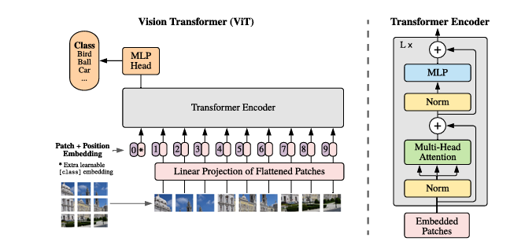

# ViT CIFAR-10 classification

<a id="overview"></a>
## Overview

ViT treats image patches as a sequence and uses self-attention for classification. This sample uses two S100 CIFAR-10 artifacts (10 classes), not ImageNet weights.

[Paper](https://arxiv.org/abs/2010.11929) · [Original ViT implementation](https://github.com/google-research/vision_transformer)



<a id="directory"></a>
## Directory structure

```text
vit/
├── conversion/  # Export and quantization configuration
├── evaluator/  # Evaluation commands and metrics
├── model/  # Model files and download scripts
├── runtime/  # Python and native inference implementations
├── test_data/  # Example inputs
├── tests/  # Automated tests
├── README.md  # English instructions
├── README_cn.md  # Chinese instructions
└── requirements-host.txt  # Source or data file
```

<a id="support-matrix"></a>
## Support matrix

| Target | Variant | Python | C++ |
| --- | --- | --- | --- |
| x5 | int8 | not-supported | not-supported |
| x5 | int16 | not-supported | not-supported |
| s100 | int8 | supported | not-supported |
| s100 | int16 | supported | not-supported |
| s100p | int8 | not-supported | not-supported |
| s100p | int16 | not-supported | not-supported |
| s600 | int8 | not-supported | not-supported |
| s600 | int16 | not-supported | not-supported |

Use the Python runtime with the S100 `int8` or `int16` artifact listed in the support matrix.

<a id="prerequisites"></a>
## Prerequisites

Full checkout required. S100 inference needs the board image's
`hbm_runtime`; the host-side dependencies install from
`requirements-host.txt` (see below). Allow disk space for the checkout,
the selected HBM and outputs. OE is only needed for conversion.

```bash
# cwd: repository root
python3 -m venv .venv-vit
source .venv-vit/bin/activate
python3 -m pip install -r samples/vision/vit/requirements-host.txt
```

<a id="quickstart"></a>
## Quick start

On S100, prepare the model explicitly, then run. Success: exit 0 and five class IDs/scores/labels. Prepare the target-specific artifact with the model downloader before inference.

```bash
# cwd: repository root
bash samples/vision/vit/model/download.sh s100 int8
python3 samples/vision/vit/runtime/python/main.py --target s100 --variant int8 --test-img samples/vision/vit/test_data/airplane_0000.png --label-file samples/vision/vit/test_data/cifar10_classes.names --top-k 5
```

<a id="expected-results"></a>
## Expected results

With the bundled `airplane_0000.png`, `airplane` appears among the Top-5.
Defaults: variant `int8`, resize 0, Top-K 5. Scores are the softmax of ten
raw logits, exact ties sorted by ascending ID; only `--img-save-path`
writes a visualization.

<a id="performance"></a>
## Performance data

Published CIFAR-10 accuracy records are listed under
[evaluation](evaluator/README.md#reference-results); latency and
throughput are not published for this model.

<a id="entry-points"></a>
## Entry points

[Model](model/README.md) · [Python runtime](runtime/python/README.md) ·
[Conversion](conversion/README.md) · [Evaluation](evaluator/README.md)

New integrations use the `ViTClassifier` class
([classify.py](runtime/python/classify.py); the shared `ClassificationTask`
flow stays importable from
[classification.py](../../../utils/py_utils/classification.py)); `--model-variant`
remains an alias for `--variant`, and the local `run.sh` accepts positional
int8/int16.

<a id="license"></a>
## License

Code retains Apache-2.0 notices. Check repository LICENSE and upstream implementation/weight terms separately; Review the upstream weight license terms before redistribution.
