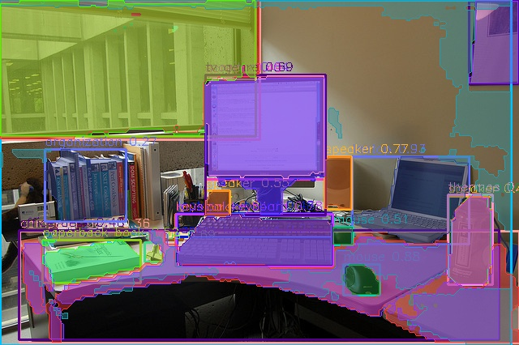
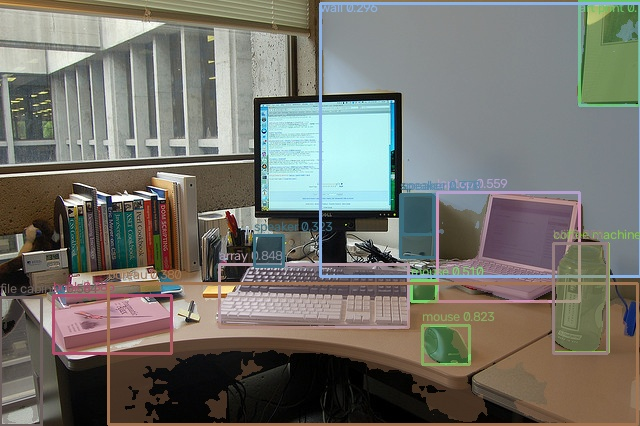

# YOLOE PF instance segmentation

<a id="overview"></a>
## Overview

YOLOE provides prompt-free (PF) instance segmentation over a fixed, ordered 4585-class vocabulary. Version 11 (E11) uses DFL16 box regression — the 64 box channels decode into a 16-bin distribution per LTRB side at strides 8/16/32 — followed by classwise NMS. Version 26 (E26) uses no DFL (reg_max=1): its box head directly emits one LTRB distance per side, and candidate selection keeps global Top-K scores without NMS. These exports do not accept arbitrary text or visual prompts.

Both versions compose instance masks the same way: each kept candidate carries 32 mask coefficients that are linearly combined with the model's 32-channel 160×160 prototype features, and the combined map is thresholded at the sigmoid midpoint.

The sample lives at `samples/vision/yoloe`.

Source attribution:

- Paper: [YOLOE: Real-Time Seeing Anything](https://arxiv.org/pdf/2503.07465v1); official repo: [um-assn/yoloe](https://github.com/um-assn/yoloe) (X5 source)
- Base detector lineage: [ultralytics/ultralytics](https://github.com/ultralytics/ultralytics) (S11 source)

<a id="directory"></a>
## Directory structure

```text
yoloe/
├── conversion/  # Export and quantization configuration
├── evaluator/  # Evaluation commands and metrics
├── model/  # Model files and download scripts
├── runtime/  # Python and native inference implementations
├── test_data/  # Example inputs
├── tests/  # Automated tests
├── README.md  # English instructions
└── README_cn.md  # Chinese instructions
```

Checkpoint export, conversion preparation and evaluation workflows are documented below. Float export checks cover graph structure; compiler and board runs follow the [conversion guide](conversion/README.md).

<a id="support-matrix"></a>
## Support Matrix

| Variant | x5 | s100 | s100p | s600 | Python | C++ |
| --- | --- | --- | --- | --- | --- | --- |
| 11s | supported | local float route only* | not-supported | not-supported | X5 published; S local float route* | supported |
| 11m / 11l | supported | not-supported | not-supported | not-supported | X5 | supported (X5 extension) |
| 26n/s/m/l/x | not-supported | local float route only* | local float route only* | not-supported | S local float route* | supported |

* Two output contracts exist on S and are kept separate: the published S11 HBM has mixed outputs and the published S26 HBM declares quantized outputs, while this Python entry consumes float outputs. To run S targets through this float-output entry, export and compile a local float model (see [conversion](conversion/README.md)) and select it explicitly with its SHA-256; no float S HBM is published. S600 has no source support and never falls back to S100.

Checkpoint export and calibration/configuration preparation are provided under [conversion](conversion/README.md). The board results below were measured with the published artifacts; a locally converted float model is measured after its own compile.

For native prerequisites, exact model selection, build/run commands and saved ROI results, see the [C++ workflow](runtime/cpp/README.md). The quick start below uses Python.

<a id="prerequisites"></a>
## Prerequisites

Python 3.10+, NumPy, OpenCV, SciPy and PyYAML. Real inference requires the matching board image’s `hbm_runtime`. Help, listing, dry-run and synthetic tensor tests work on a host.

Use an X5 image providing `hbm_runtime`; the sample does not pin a minimum X5 image version. S26 source records RDK OS 4.0.5-Beta, UCP 3.13.6, HBRT 4.7.5 and OE 3.7.0. Float32 class heads use about 154 MB per image, plus intermediates and masks; size the board memory budget from a real run on the target.

<a id="quickstart"></a>
## Quick Start

```bash
# cwd: repository root
bash samples/vision/yoloe/model/download.sh --target x5 --variant 11s
python3 samples/vision/yoloe/runtime/python/main.py --target x5 --variant 11s
```

Run on X5. Preparation saves the original artifact under `model/x5/` and checks its publisher SHA-256. Inference uses the bundled `office_desk.jpg`, exits 0, prints JSON counts/scores/classes and writes `test_data/result.jpg`. Inference never downloads. `runtime/python/run.sh` forwards the same arguments.

Host inspection:

```bash
# cwd: repository root
python3 samples/vision/yoloe/runtime/python/main.py --list-models
python3 samples/vision/yoloe/runtime/python/main.py --target s100 --variant 26n --dry-run
```

A dry-run resolves the selection and prints a JSON preview without loading a model or contacting a board. For an S target it reports the float-preparation requirement: export and compile a local float model with the [conversion guide](conversion/README.md), then select it by its SHA-256.

<a id="expected-results"></a>
## Expected Results

Results contain original-image xyxy float32 boxes, sigmoid float32 probabilities and int64 PF class IDs. X5 11 retains full-image bool masks `[N,H,W]`; S11/26 return uint8 0/1 ROI lists, distinguished by `mask_layout`. Empty boxes have shape `[0,4]`, scores/IDs `[0]`.

No fixed detection count is promised. The table below records the source's Runtime-only measurements (preprocessing/postprocessing excluded); end-to-end Python performance additionally includes host-side stages:

| Model (source-recorded) | Target | Runtime latency / FPS |
| --- | --- | --- |
| YOLOE-11s PF | X5 | 146.16 ms / 6.84 |
| YOLOE-11m PF | X5 | 177.14 ms / 5.65 |
| YOLOE-11l PF | X5 | 189.97 ms / 5.26 |
| YOLOE-26n PF | S100 | 4.943 ms / 200.74 |
| YOLOE-26s PF | S100 | 9.944 ms / 100.08 |
| YOLOE-26m PF | S100 | 11.765 ms / 84.55 |
| YOLOE-26l PF | S100 | 13.417 ms / 74.18 |
| YOLOE-26x PF | S100 | 22.013 ms / 45.31 |

X5 values are source single-thread libdnn Runtime records. S100 values are from 2026-09-08, 200 frames, warmup, thread_num=1/core_id=0, excluding preprocessing/postprocessing. No S100P Runtime measurement is published. See the [evaluation guide](evaluator/README.md) for complete conditions and accuracy limits.

The two illustrations below were published with the S source deliveries, each over the same bundled `office_desk.jpg`; both are kept byte-exact under distinct names, separate from the runtime-generated `test_data/result.jpg`:



Result illustration published with the S100 quantized YOLOE-11s PF HBM over the bundled `office_desk.jpg`. That source delivery runs on S100 only and its published runnable artifact is the quantized 11s PF HBM; the source does not record the exact run that produced the figure.



Example published with the S26 source delivery: recorded outputs of the published S100 quantized YOLOE-26n PF model over the bundled `office_desk.jpg`, with labels exported in PF checkpoint class-ID order, as stated by the source caption.

Both figures show source-published quantized S results over the bundled image; expected outputs of the float route come from running this sample, and accuracy metrics come from the [evaluator](evaluator/README.md).

<a id="entry-points"></a>
## Entry Points

- [Model](model/README.md) — Publication identity, preparation and checksums.
- [Conversion](conversion/README.md) — Checkpoint export, float-output checks, target-specific calibration, compiler commands and artifact records; includes the original X5 E11, S E11 and S E26 recipes — the S source recipes produce quantized outputs, while this preparation entry retains float-output nodes and compiled precision is read from the artifact metadata.
- [Evaluation](evaluator/README.md) — Explicit PF mapping, CPU/board backends, COCO metrics, provenance and historical benchmarks.
- [Python](runtime/python/README.md) — Options, protocols, library API and troubleshooting.
- [C++ runtime](runtime/cpp/README.md) — Reusable three-stage C++ library with owned NV12 inputs, float binding and E11/E26 decoding/masks; includes the SDK adapter, board/model/vocabulary preflight, publication selection, CLI and result records; SDK compilation and board runs follow the C++ workflow guide.
- [Test data](test_data/README.md) — Image/vocabulary provenance and source-recorded figures.

<a id="license"></a>
## License

Sample code retains source Apache-2.0 notices and the repository [LICENSE](../../../LICENSE). Model weights and upstream YOLOE/Ultralytics software retain their respective licenses; the repository code license does not automatically license the weights. Version references are in the source overviews above.
