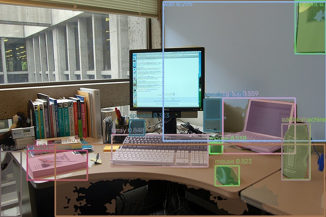

English | [简体中文](./README_cn.md)

# YOLOE-26 Segmentation (Prompt-Free)

Open-vocabulary detection and instance segmentation for **S100 and S100P**.
All five sizes (n/s/m/l/x) use batch 1, 640x640 NV12 input and the complete
4585-class PF vocabulary. Text/visual prompts, dynamic shapes and S600 are excluded.

## Quick Start

On the board, from this sample directory:

```bash
# Python: detect the board, download the matching n model, run the bundled image.
bash runtime/python/run.sh --size n --output result.jpg

# C++: download, build and run. Replace n with s, m, l or x.
bash runtime/cpp/run.sh n
```

Model loading does not install dependencies or modify system services.
Use the board's installed UCP/DNN SDK and `hbm_runtime`.
Downloaded artifacts are verified against the published SHA256 manifest.

## Models

| Board | March | Released sizes | Compilation | Board verification |
|---|---|---|---|---|
| S100 | nash-e | n/s/m/l/x | OE 3.7.0, INT8 KL | Python/C++ tested 2026-09-08 |
| S100P | nash-m | n/s/m/l/x | OE 3.7.0, INT8 KL | Pending |

Both families contain ten NHWC outputs. Class, box and mask-coefficient outputs
are INT32 and proto is INT8; CPU postprocessing applies the output quantization
parameters and respects tensor padding. The box head uses reg_max=1: no DFL.
End-to-end candidate selection uses top-k, without NMS.

Dataset accuracy has not been accepted. These are PTQ baselines, not accuracy-tuned
production models; a matching Python/C++ result is not evidence of unchanged mAP.

## Directory Layout

```text
conversion/       ONNX export and S100/S100P calibration/compilation
model/            Released HBM download entry
runtime/python/   Python image inference
runtime/cpp/      C++ UCP image inference
evaluator/        Runtime performance results and evaluation instructions
test_data/        Example image, vocabulary and illustrative result
```

- [Model downloads](model/README.md)
- [Conversion](conversion/README.md)
- [Python runtime](runtime/python/README.md)
- [C++ runtime](runtime/cpp/README.md)
- [Runtime performance](evaluator/README.md)



The image above uses recorded outputs from the released S100 n model, not a
dataset accuracy evaluation. Labels are exported from the PF checkpoint in class-ID order.
