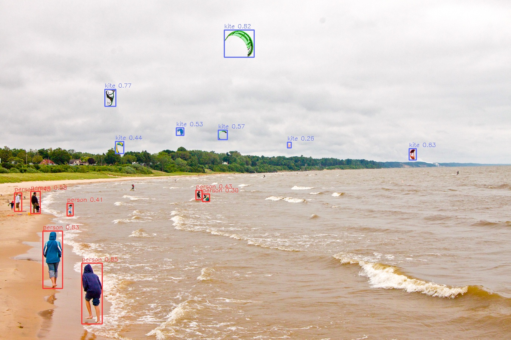

# YOLOv5 模型说明

本目录描述 YOLOv5 在本 Model Zoo 中的完整使用流程，包括：算法介绍、模型转换、运行时推理（Python/C++）、可复用的前后处理接口说明，以及模型评估步骤。

---

## 算法介绍（Algorithm Overview）

YOLOv5 是一种经典的单阶段目标检测算法（One-Stage Detector），具有以下特性：

- **轻量化、速度快**：适合实时场景与嵌入式平台部署
- **多尺度模型**：支持 n/s/m/l/x 等不同规模
- **结构清晰**：采用 CSPDarknet 作为 Backbone，FPN+PAN 作为特征融合结构
- **部署友好**：易导出 ONNX，生态成熟
- **适合端侧部署**：在移动 & IoT 芯片上广泛使用

### 算法功能
YOLOv5 能完成以下任务：

- 多类别目标检测
- 输出类别、置信度、边界框位置

### 原始资料
YOLOv5 无官方论文，其官方实现地址如下：
- YOLOv5 Repo: https://github.com/ultralytics/yolov5

---

## 目录结构（Directory Structure）

本目录包含：

```bash
.
|-- 3rdparty                            # 第三方依赖或算法相关资源
|-- conversion                          # 模型转换流程
|   `-- README.md                       # 模型转换使用说明
|-- evaluator                           # 模型评估相关内容
|   `-- README.md                       # 模型评估说明
|-- model                               # 模型文件及下载脚本
|   `-- download_model.sh               # HBM 模型下载脚本
|-- runtime                             # 模型推理示例
|   |-- cpp                             # C++ 推理工程
|   |   |-- inc                         # C++ 头文件
|   |   |   `-- yolov5.hpp              # YOLOv5 模型封装接口
|   |   |-- src                         # C++ 源码
|   |   |   |-- main.cc                 # 推理入口程序
|   |   |   `-- yolov5.cc               # YOLOv5 推理实现
|   |   |-- CMakeLists.txt              # CMake 构建配置
|   |   |-- README.md                   # C++ 推理示例使用说明
|   |   `-- run.sh                      # C++ 示例运行脚本
|   `-- python                          # Python 推理示例
|       |-- README.md                   # Python 推理示例使用说明
|       |-- main.py                     # Python 推理入口脚本
|       |-- run.sh                      # Python 示例运行脚本
|       `-- yolov5.py                   # YOLOv5 推理与后处理实现
|-- test_data                           # 推理结果
|   `-- result.jpg                      # 示例推理结果图像
`-- README.md                           # YOLOv5 示例整体说明与快速指引
```

---

## 快速体验（QuickStart）

为了便于用户快速上手体验，每个模型均提供了`run.sh`脚本，用户运行此脚本即可一键运行相应模型，此脚本主要进行如下操作：
- 检测系统环境是否满足要求，若不满足则自动安装相应包；
- 检测推理所需的hbm模型文件是否存在，不存在则自动下载；
- 创建build目录，编译c++项目（仅C++项目）；
- 运行编译好的可执行文件或相应的python脚本；

### C++

- 进入`runtime`目录下的`cpp`目录，运行`run.sh`脚本，即可快速体验
    ```bash
    cd runtime/cpp/
    ./run.sh
    ```
- 若想了解`c++`代码的详细使用方法，或step by step运行模型请参考`runtime/cpp/README.md`；

### python

 - 进入`runtime`目录下的`python`目录，运行`run.sh`脚本，即可快速体验
    ```bash
    cd runtime/python/
    ./run.sh
    ```
- 若想了解`python`代码的详细使用方法，或step by step运行模型请参考`runtime/python/README.md`；

---

## 模型转换（Model Conversion）

- ModelZoo 已提供适配完成的 HBM 模型文件，用户可直接运行`model` 目录下的`download_model.sh`脚本下载并使用，如不关心模型转换流程，**可跳过本小节**。

- 如需自定义模型转换参数，或了解完整的模型转换流程，请参考`conversion/README.md`。

---

## 模型推理（Runtime）

YOLOv5 模型推理示例同时提供 C++ 和 Python 两种实现方式，分别面向不同的使用场景与开发需求。两种版本在模型能力与推理结果上保持一致，但在使用方式和工程形态上有所区别。

### C++ 版本

    - 提供完整的工程化示例，适合集成到实际应用中;

    - 包含模型封装类、参数解析、推理流程及构建方式说明;

    - 具体编译、运行方式及接口说明请参考 `runtime/cpp/README.md`

    - 用户可根据自身需求选择对应的推理版本，并查阅相应目录下的 README 文件获取详细使用说明。


### Python 版本

    - 以脚本形式提供，适合快速验证模型效果与算法流程;

    - 示例中展示了模型加载、推理执行、后处理以及结果可视化的完整过程;

    - 具体使用方法、参数说明及接口说明请参考 `runtime/python/README.md`;

---

## 模型评估（Evaluator）

`evaluator/` 用于模型精度、性能及数值一致性评估，详细说明请参考该目录。

---

## 推理结果



---

## License
遵循 Model Zoo 顶层 License。
